This page is a journal of my monthly reading habits. I aim to read about 10-15% of a book per day.

## September 2021

### The Legacy

Life is good for Drizzt Do'Urden, better than it ever has been for the beleaguered dark elf. His dearest friend, the dwarf Bruenor, has reclaimed his throne, and his adventuring companions, Wulfgar and Catti-brie, are to be wed in the spring. Even the halfling Regis has returned. All the friends are united in the safety and prosperity of Mithril Hall, where streams of silver mithril run deep and dwarven hammers bang out the solemn rhythms of ancient and unending songs

## August 2021

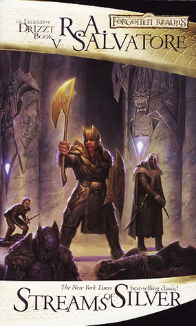

### Streams of Silver

Drizzt Do'Urden still struggles with his own inner voices, voices that call him back to the pitless depths of the Underdark. But louder still are the voices of his newfound friends Bruenor, Wulfgar, and Regis—and the call of a dream that, at long last, Bruenor has decided to fulfill.

### The Halfling's Gem

Regis has fallen into the hands of the assassin Artmis Entreri, who is taking him to Calimport to deliver him into the clutches of the vile Pasha Pook. But Drizzt and Wulfgar are close on their heels, determined to save Regis from his own folly as much as from his powerful enemies.

### Homeland

Drow ranger Drizzt Do'Urden, first introduced in The Icewind Dale Trilogy, quickly became one of the fantasy genre's standout characters. But Homeland first reveals the startling tale of how this one lone drow walked out of the shadowy depths of the Underdark, leaving behind a society of evil and a family who want him dead. It is here that the story of this amazing dark elf truly began.

### Exile

Drizzt Do'Urden has been exiled from his country and forced to wander the tunnel-mazes of the Underdark, which are haunted by the evil dark elves.

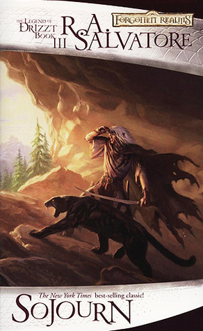

### Sojourn

Far above the merciless Underdark, Drizzt Do'Urden fights to survive the elements of Toril's harsh surface. The drow begins a sojourn through a world entirely unlike his own--even as he evades the dark elves of his past.

## July 2021

### Crystal Shard

Akar Kessel, weak-willed apprentice mage, starts events that find a magical device, the crystal shard. Dwarf Bruenor rescues barbarian Wulfgar from the ruins of Ten-Towns, for 5 years of service - and friendship. With help from renegade dark elf Drizzt, Wulfgar becomes a warrior with brawn and brains. Can the trio stave off the crystal shard forces?

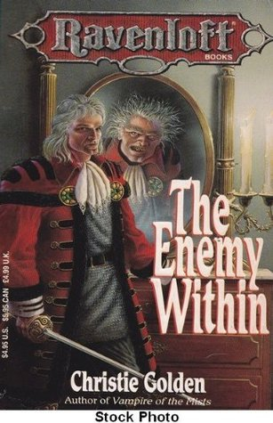

### The Enemy Within

Sir Tristan Hiregaard of Nova Vaasa appears outwardly to be a kind nobleman who would never harm anyone. But his sinister alter-ego, the evil crimelord Malken, finds no act too base when it comes to extending his vast criminal empire.

### Legend

He is DRUSS the Legend. His skill in battle has earned him a fearsome reputation throughout the world and the stories of his life are told everywhere. But the grizzled veteran has spurned a life of fame and fortune and has retreated to the solitude of his mountain lair to await his old enemy, Death.

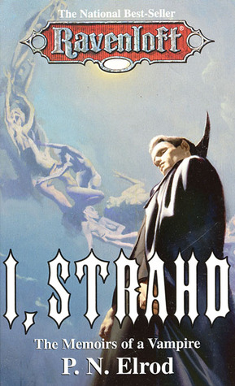

### I, Strahd: The Memoirs of a Vampire

The young and idealistic brother to the war-hardened Strahd von Zarovich loves beautiful Tatyana, but so does Strahd. To win her hand, Strahd will do anything--even enter a pact with death and seal it with his brother's blood. Chapter illus

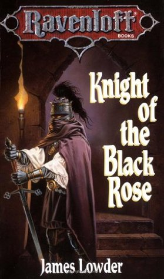

### Knight of the Black Rose

On the fabled world of Krynn, Lord Soth finally learns that there is a price to pay for his long history of evil deeds, a price even an undead warrior might find horrifying.
Dark powers transport Soth to Barovia, and there the death knight must face the dread minions of Count Strahn Von Zarovich, the vampire lord of the nightmare land. But with only a captive Vistani woman and an untrustworthy ghost for allies, Lord Soth soon discovers that he may have to join forces with the powerful vampire if he is ever to escape the realm of terror.

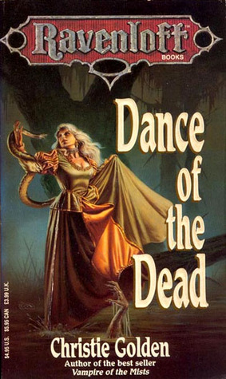

### Dance of the Dead

When the riverboat on which she works as a dancer docks at a zombie-plagued island known as Sourange, Larissa Snowmane must rely on the help of the swamp creatures to save her soul.

## June 2021

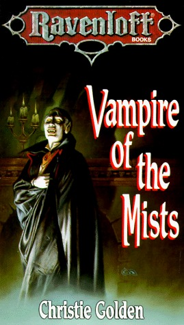

### Vampire of the Mists

Jander Sunstar is a gold elf, a native of magical Evermeet in the Forgotten Realms. He is also a five-hundred-year-old vampire.

Torn by rage and grief, Jander is transported into the nightmare realm of Ravenloft, where he gains the attention of the demiplane's master, Count Strahd Von Zarovich. But can Jander trust this elegant fellow vampire once he discovers that his own quest for revenge is linked to the dark heritage of the count's domain?

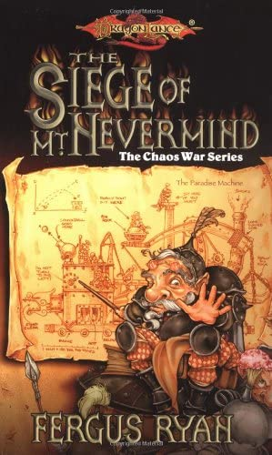

### The Siege of Mt. Nevermind

A miraculous machine . . . and a nightmare!
Innova, a young gnomish recluse finds himself in a terrible situation. Tried in a gnomish court for an unfortunate accident and sentenced to spend months at the bottom of Mt. Nevermind tuning gnomeflingers, young Innova makes an incredible discovery. The whole gnomish society is changed by one machine that, unlike any other gnomish invention, makes the entire mountain run like clockwork.

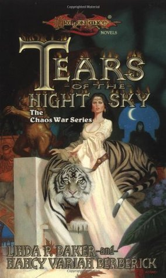

### Tears of the Night Sky

Crysania, high priestess of the Temple of Paladine, is blind to the beauty of the world but not to the joy of her faith. Lately, though, her communion with the god of light has become distant. Now a mysterious stone has come into her possession. Its power compels her to undertake a merilous quest, accompanied by a strange band of companions.

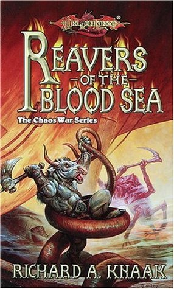

### Reavers of the Blood Sea

During the hottest summer in memory, minotaurs fight against the Knights of Takhisis, into whose hands their god Sargonnas has delivered them. In the midst of the conflict, the armies of Chaos plunge into the heart of Ansalon.

Now the minotaur warrior Aryx must unite his people and their enemy, the knights, against the monstrous servants of Chaos. If he succeeds, the two sides may forge a bond that will change Krynn for all time.

## May 2021

### The Puppet King

Torn asunder by the nightmares of a mad king, the elven realm of Silvanesti has nearly been restored to its former grandeur. But the elf Porthios, returning to his homeland, launches a rebellion against young Gilthias, his own nephew.Gilthias's troubles are multiplied by threats from green dragons and from the Knights of Takhisis. Now, with Porthios at his throat, Gilthias must choose between blood and honor.

### The Last Thane

For generations the baser clans of Thorbardin have raged against Hylar, ancestral rulers of the vast underground realm. Now, the finest Hylar army has marched away to face the Knights of Takhisis - and the dark dwarves see their opportunity. Besieged in the Life Tree that is their fortress city, the Hylar struggle to survive. Magic and madness threaten from all sides as Theiwar, Daergar and Klar press the onslaught with bloodthirsty frenzy.

### Developing Applications with Azure Active Directory

Explore tools for integrating resources and applications with Azure Active Directory for authentication and authorization.

## April 2021

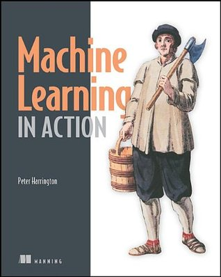

### Machine Learning in Action

Machine Learning in Action is a unique book that blends the foundational theories of machine learning with the practical realities of building tools for everyday data analysis. In it, the author uses the flexible Python programming language to show how to build programs that implement algorithms for data classification, forecasting, recommendations, and higher-level features like summarization and simplification.

### Draconian Measures

The regiment of draconian engineers featured in "The Doom Brigade" seek a safe haven for their precious cargo of young draconians. All they have to do is stay alive. Surely that shouldn't be too hard. But Commander Kang puzzles over a sinister mystery. Why are some of his men vanishing? Kang will have to use draconian measures to defeat his foes and save his race. They'd better be enough -- the fate of his entire race hangs in the balance.

## March 2021

### The Second Generation

Years have passed since the end of the War of the Lance. Peace on Krynn comes at a price. The forces of darkness are ever vigilant, searching for ways to erode the balance of power and take control. When subtle changes begin to permeate the fragile peace, new lives are drawn into the web of fate woven around all the races. The time has come to pass the sword -- or the staff -- to the children of the Lance.
They are the Second Generation.

### The Doom Brigade

The fearless draconians of the War of the Lance have retired from the field of battle to a pleasant valley in the Kharolis Mountains. Well, it would be pleasant, if it weren't for some dwarves, whose irritating feuding prevents the draconians from realizing their greatest hope -- the ability to continue their doomed race. When the dwarves discover a map leading to a fortune buried in the dwarven kingdom of Thorbardin, the draconians are swept up in a feverish race for treasure. Little do both sides realize that they are part of the strange and terrible destiny descending upon Krynn during the Summer of Flame.

## February 2021

### Dragons of Summer Flame

The War of the Lance is long over. The seasons come and go. The pendulum of the world swings. Now it is summer. A hot parched summer such as no one on Krynn has ever known before. The uneasy balance begins to shift.

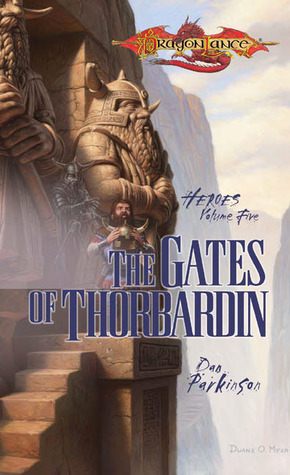

### The Gates of Thorbardin

Legends tell that beneath the mountain fortress of Skullcap lie the remains of the dark wizard Fistandantilus and the path to the gates of the ancient dwarven kingdom of Thorbardin. Buried somewhere along that perilous path is the magical helm of Grallen, son of King Duncan, tragic hero of the Dwarfgate War. Finding Grallen’s helm, it is prophesied, will herald the return of a united Thorbardin—but it will also open the gates of the realm to fresh horror and chaos.

### Designing Event-Driven Systems

Author Ben Stopford explains how service-based architectures and stream processing tools such as Apache Kafka® can help you build business-critical systems.

## January 2021

### The Legend of Huma

The book narrates the adventures of Huma Dragonbane, a Knight of the Crown, his meeting with Kaz the Minotaur, the discovering of the dragonlances, and the defeat of Takhisis during the Third Dragon Wars.

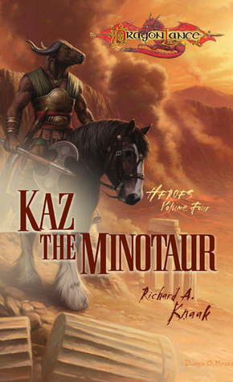

### Kaz the Minotaur

The book narrates the adventures of Huma Dragonbane, a Knight of the Crown, his meeting with Kaz the Minotaur, the discovering of the dragonlances, and the defeat of Takhisis during the Third Dragon Wars.

