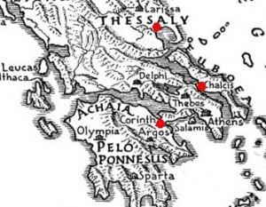

In our previous post discussing the intentions of the Roman proconsul Titus Quinctius Flamininus when he proclaimed the [Freedom of the Greeks](/flamininus-proclaims-freedom-greeks) at the Isthmian Games in 196 B.C., mention was given to strategic garrison points known as the 'fetters of Greece'.

This post will attempt to explain their location in Greece and more importantly, the significance during the reign of Philip V of Macedon.

## The Fetters of Greece, what were they?

The 'fetters of Greece' were garrison points used to control European Greece by the Macedonian king Philip V.

The term ‘fetters‘ refers to shackles, legcuffs or leg irons providing an eloquent analogy for the control Philip exterted over the Greeks.

## Where were they?

Polybius provides the location of these fortified locations as Chalcis, Corinth and Demetrius. They have been marked as red circles below.

As you can see by the referenced map above, they represent strategic positions throughout Greece. The Antigonids of Macedonia are likely to have kept them heavily garrisoned, effectively shackling the Greeks for their own security.

## Why were they important?

As mentioned earlier, the fetters allowed Philip to control (or shackle) European Greece:

> ...but the point which they all took pains to impress upon the senate was that as long as Chalcis, Corinth, and Demetrias remained in Macedonian hands it was impossible for the Greeks to have any thought of liberty. **(Polybius, Histories, 18.10)**

The locations were important to keep the disparate Greeks under Macedonian control:

> Philip's own expression when he pronounced these places to be the fetters of Greece, was, they said, only too true, since neither could the Peloponnesians breathe freely with a royal garrison established in Corinth, nor could the Locrians, Boeotians, and Phocians have any confidence while Philip occupied Chalcis and the rest of Euboea, nor again could the Thessalians and Magnesians ever enjoy liberty while the Macedonians held Demetrias. **(Polybius, Histories, 18.11)**

It is for these reasons that they became a visible representation of Macedonian domination and strong generator of anti-Macedonian sentiment.

When the Romans twice defeated the Macedonians in combat, they demanded the evacuation of the ‘fetters of Greece‘ but were rebuked by the Macedonian diplomats.

After the battle of Cynoscephalae in 197 B.C., the Macedonian phalanx was defeated for the first time and Philip evacuated Greece.

The fetters were left in Roman (and their Greek allies) control, although the Romans remained cautious about a potential Seleucid invasion and the appearance of replacing the Macedonians as tyrants in Greece.

At the Isthmian Games in 196 B.C., the Roman proconsul proclaimed the outcome of the second Macedonian war as freedom for the Greeks and that they would temporarily garrison the fetters until it was practical to hand control over to the Greeks.
