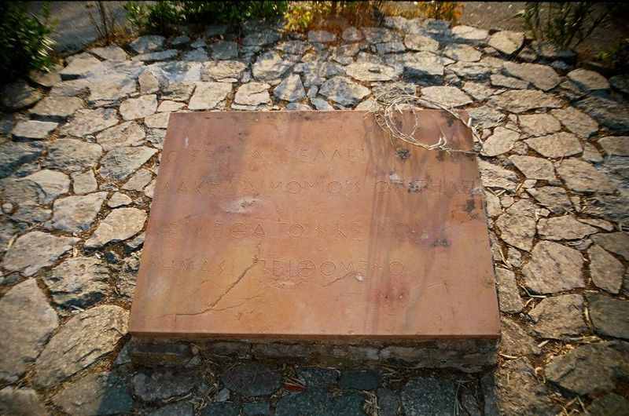
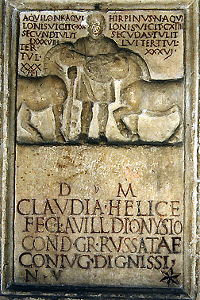
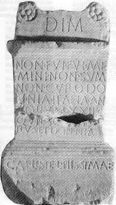
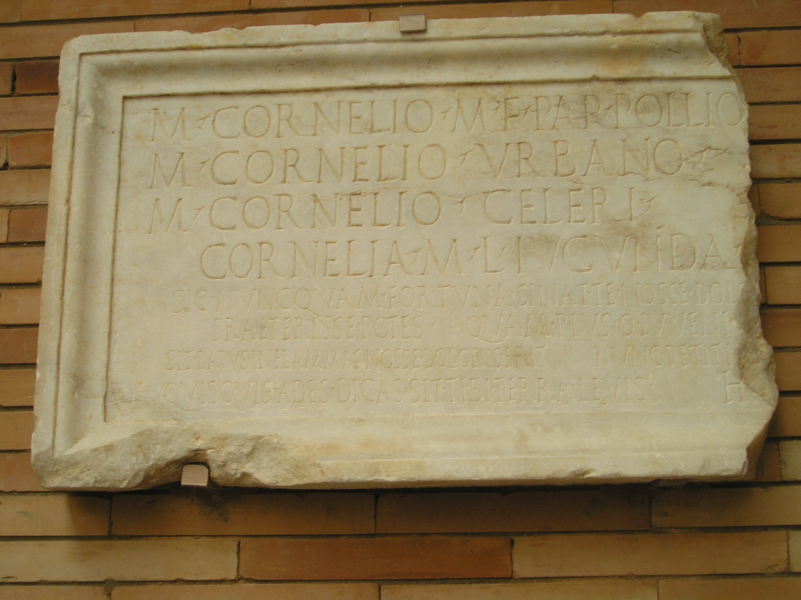
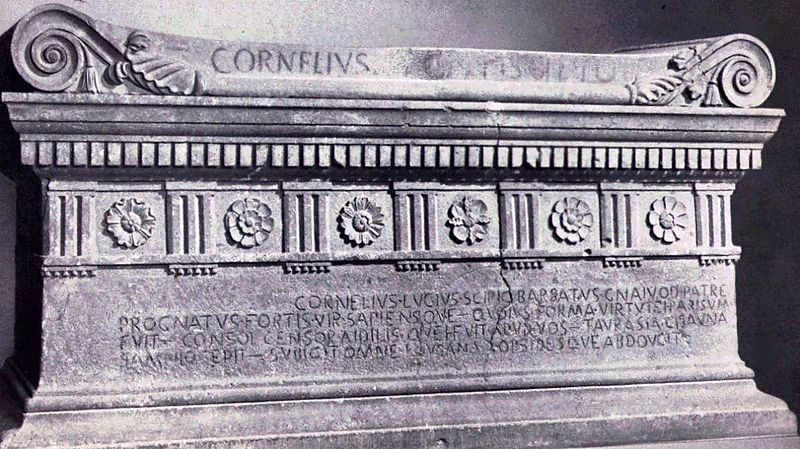
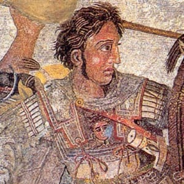
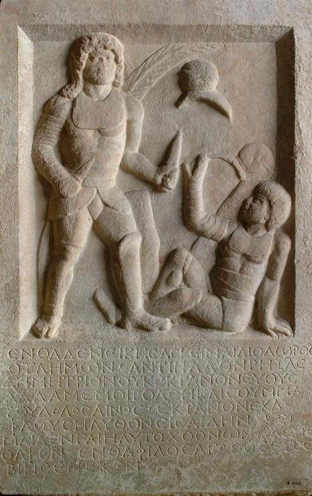

Epitaphs from Ancient Rome and Greece provide an abundance of primary source material.

It was the Roman orator Cicero who claimed **the life of the dead is placed in the memory of the living**. If this is the case, these epitaphs serve as visual reminders for remembrance of lives written by the deceased.

Sometimes humorous, here are my top 10 memorable epitaphs from the ancient world.

## #10 - Remembering the 300 Spartans

Who could forget the 300 Spartan warriors led by King Leonidas at the battle of Thermopylae?

A trip to the hot gates reveals the following epitaph for passers by:

> Go tell the Spartans, thou who passest by,
>
> That here, obedient to their laws, we lie.

Note: See [what the hot gates looks like today here](http://www.mikeanderson.biz/2009/05/hot-gates-today.html). I believe this epitaph can be found at the statue of Leonidas.

## #9 - This man trained winners

This epitaph proves that not much changes over the past few thousand years – proof that we are what we do?

A supremely proud man records his training ability and the results of his two most successful students. I’m sure there are people around today that would record a similar epitaph for their own abilities.

> Aquilo, ?grandfoal of Aquilo,
>
> won 130 races,
>
> placed 88 times,
>
> and showed 37 times.
>
> Hirpinus, ?foal of Aquilo,
>
> won 114 races,
>
> placed 56 times,
>
> and showed 36 times.
>
> To the gods of the afterlife:
>
> Claudia Helice
>
> erected this for Lucius Avillus Dionysius,
>
> trainer of the Red Team,
>
> her most worthy spouse.

Source: More information [here](http://penelope.uchicago.edu/Thayer/E/Gazetteer/Places/Europe/Italy/Lazio/Roma/Rome/museums/Musei_Capitolini/epitaphs/L.Avillus_Dionysius.html).

## #8 - Death of an Atheist

Encapsulating one of the arguments from our [Epicurean article on fearing death](/fear-of-death-and-epicurean-philosophy/), the owner of this epitaph certainly didn’t believe in an afterlife. It is Epicurean metaphysics in one line.

> I was not, I was, I am not, I don’t care.

## #7 - Oh, that heavy earth

Such mortal concerns for the afterlife or a [poster for the move buried](http://www.imdb.com/title/tt1462758/)?

> May the earth lie light upon thee.

## #6 - Decendants that disagreed?

Normally descendants in Ancient Rome boasted about their family lineage for present-day political gain. This epitaph contains the usual statements about offices held and achievements gained, but the first part has been erased. Could a descendant have disagreed with his claim of being the first Scipio?

> Cornelius Lucius Scipio Barbatus, sprung from Gnaeus his father, a man strong and wise, whose appearance was most in keeping with his virtue, who was consul, censor, and aedile among you – He captured Taurasia, Cisauna, Samnium - he subdued all Lucania and led off hostages.

Source: More information [here](http://en.wikipedia.org/wiki/Lucius_Cornelius_Scipio_Barbatus).

## #5 - Selling the Family Funeral Monument

I'm sure everyone knows at least someone like this, descendants that would sell their own ancestor’s tombstone!

> To the Shades of the Dead. Aulus Larcius,
>
> adiutor, made (this)
>
> monument
>
> for himself and for his fre
>
> edmen and freedwomen
>
> and their descendants.
>
> I forbid that this monument
>
> be sold; I forbid it
>
> be given away.

## #4 - The Deeds of Augustus

A superlative exhibition in propaganda, the inscription made for Caesar Augustus is way too long to list in here (for the entire epitaph, see here). It was distributed throughout the Roman empire to extol the achievements of their first emperor (as we call him).

I’m sure to the present day Romans it would have sounded like a long-winded politician rattle on about why they are so great.

Here is a sample:

> In my twentieth year [44 B.C.], acting on my own initiative and at my own charges, I raised an army wherewith I brought again liberty to the Republic oppressed by the dominance of a faction. Therefore did the Senate admit me to its own order by honorary decrees, in the consulship of Gaius Pansa and Aulus Hirtius. At the same time they gave unto me rank among the consulars in the expressing of my opinion [in the Senate]; and they gave unto me the imperium. It also voted that I, as propreetor, together with the consuls, should “see to it that the state suffered no harm.” In the same year, too, when both consuls had fallen in battle, the people made me consul and triumvir for the re-establishing of the Republic.

## #3 - Only death could defeat him

The rumoured epitaph for Alexander the Great, the man who invaded Persia and led his Macedonian army to the ends of the known world. His narcissistic personality shines brightly in the following epitaph:

> A tomb now suffices him for whom the world was not enough

## #2 - The Vengeful Dictator

If ever there was a person in Ancient Rome that you didn’t want to wrong, it was **Lucius Cornelius Sulla**. Famous for marching his own army upon Rome and using the practice of proscription (death warrants) on rival factions. His own epitaph highlights the volatility of the escalating civil wars in Republican Rome.

> No friend ever served me, and no enemy ever wronged me, whom I have not repaid in full.

## #1 - The Cheated Gladiator

In the top spot for the most amusing epitaphs in the ancient world is the Roman gladiator who met his fate on account of a poor referee. Perhaps things haven’t changed too much after all?

> After breaking my opponent Demetrius, I did not kill him immediately. Fate and the cunning treachery of the summa rudis [umpire] killed me.

Source: More information [here](https://io9.gizmodo.com/gladiators-tombstone-complains-about-bad-refs-1-800-yea-5813526?IR=T).
