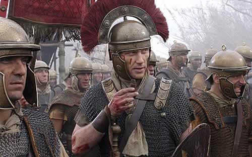

In the first episode of HBO’s acclaimed series Rome, we were lucky enough to see a form of punishment used within the Roman Army.

Lucius Vorenus (Kevin McKidd) is performing **animadversio fustium**, otherwise known as a major flogging of legionary Titus Pullo (Ray Stevenson). The offence was for directly disobeying orders in the opening scene.

At this point, I wondered what other punishments were used in the Roman army? And for what infringements? As I’ve discovered, there were a number of minor, major and collective punishments used in the Roman army.

## The minor punishments in the Roman Army

The Roman Centurion carried the vitis or vine staff which was a swagger stick about three feet in length originally made of grape vine. This made a handy weapon for a casual whack of a soldier for insubordination. This practice was known as castigato.

The next punishment hasn’t changed much over the last few millennia. What do you do with an employee who causes public damage or loses equipment? Dock their pay of course! This practice was known as pecunaria multo.

Similary, how do you further punish bad behaviour? Give them either extra work or give them the really bad work (such as the latrines!). Assigning extra duties was known as munerum indictio.

## The major punishments in the Roman Army

A major offence in any army included derelict guard duty, in the Roman army this could mean facing fustuarium, or in other words, being beaten, flogged or stoned to death by your comrades.

> If the fault is that of the picket, the patrol makes matters clear at once by calling the men who had accompanied him, for he is bound to do this; but if nothing of the kind has happened, the fault rests on him. A court-martial composed of all the tribunes at once meets to try him, and if he is found guilty he is punished (fustuarium). **(Polybius, Histories, 6.36.6-9)**

As we have seen in the scene mentioned earlier, legionary Titus Pullo faced a serious flogging before the entire unit to serve as an example to others. This was known as animadversio fustium.

Another option for the commander is militiae mutatio, this involves a soldier either losing rank or his coveted long-service privileges.

## The collective punishments of the Roman Army

Almost everyone has heard of the term decimation before, this practice involves dividing soldiers into groups of ten and drawing lots. The soldier that drew the unfortunate lot was killed by his remaining 9 comrades (either by stoning or clubbing). This practice was used on mutinous or cowardly units. Marcus Licinius Crassus had used this technique when his own legate engaged the enemy (Spartacus) against his wishes.

They say that the Roman army marches on it’s stomach, what better punishment is there than to feed the army like pack animals? Switching a unit’s diet from wheat to barley was known as **frumentum mutatum**.

> If any cohorts gave way in battle, he (Augustus) decimated them, and fed the rest on barley. **(Suetonius, Life of Augustus, 24.2)**

There is also the visual effect of separating the punished from the rest of the army. The practice known as **extra muros** meant that the unit pitches it’s tents outside the walls of the legionary camp.

Lastly, there is the disbandonment of an entire unit and loss of all pensions as the ultimate disgrace known as **misso ignominosa**.

> He dismissed the entire tenth legion in disgrace, because they were insubordinate, and others, too, that demanded their discharge in an insolent fashion, he disbanded without the rewards which would have been due for faithful service. **(Suetonius, Life of Augustus, 24.2)**

The purpose of severe discipline was to assure loyalty and obedience. The Roman army held together an empire for over half a millennia, so we can hardly argue with their methods, despite the severity.
