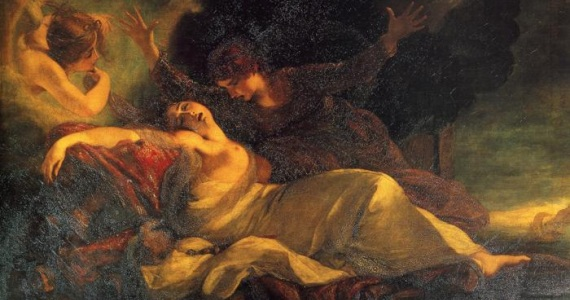
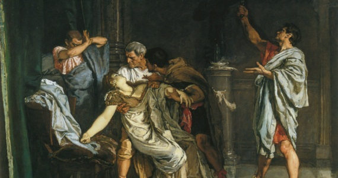
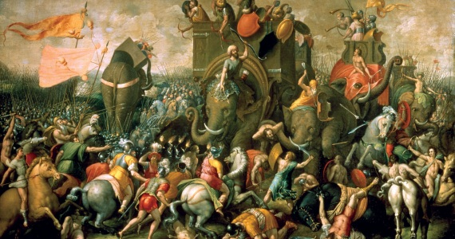
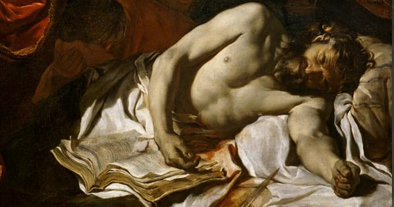
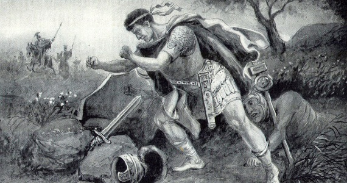
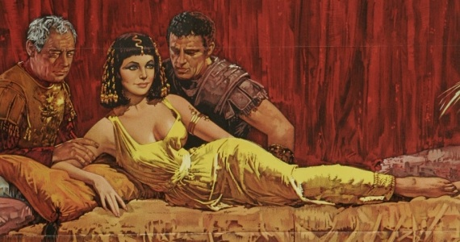
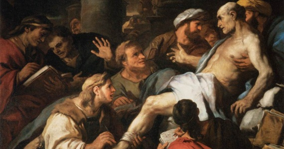
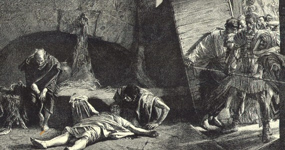
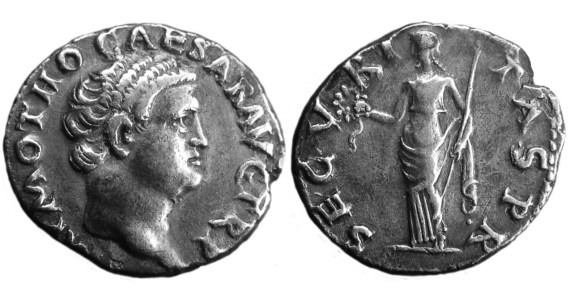

In the classical period (800 BC – AD 500), suicide held a different connotation than it does today. It was only at the Council of Arles in AD 452 that it was officially condemned as a sin by the Christians.

For the aristocracy of many cultures, it was a viable option to the humiliation of public trial and granted the individual dignity in death that befitted their social standing. Suicide could also be seen as the ultimate act of defiance against tyrants (Cato & Caesar) and allowed the natural flow of assets to pass to heirs (rather than the state).

It was not acceptable for all though. Soldiers, slaves and those accused of capital crimes were not permitted the same grace on suicide.

This article contains 10 of the more famous suicides from Ancient Rome & Greece.

## #1 Queen Dido of Carthage, Grief-Stricken Queen (C. 1180 BC)

Dido was the legendary Queen of Carthage and seducer of the Roman hero Aeneas, a Trojan fleeing the destruction of Troy. Aeneas was sent on a divine mission to found the Roman race.

### Why did she commit suicide?

After the goddess Venus sent her son (Cupid) to make Dido fall in love with Aeneas (for his own protection), Aeneas is reminded of his divine mission by the messenger of Jupiter (Mercury) and that he must set sail at once.

Upon learning of the intentions of Aeneas, Dido curses the Roman race and thus is borne the enmity between Rome and Carthage. Enmity that would lead to three Punic Wars and foretold of the coming of Hannibal Barca, the scourge of the Romans!

> Rise up from my dead bones, avenger! (Virgil, The Aeneid IV)

Distraught with despair, Dido resolves to kill herself.

### How did she die?

Surrounded by the belongings of Aeneas, Dido orders her sister to build a funeral pyre to burn them.

As the Trojan ships disembark, Aeneas gazes back and sees smoke rising from the pyre.

At this point, Dido falls upon the sword of Aeneas and finds herself in excruciating pain. The goddess Juno pities the plight of the Queen and sends Iris to hastily release Dido from her mortal life.

## #2 Lucretia, Suicide of Roman Matron (C. 508 BC)

Lucretia is another legendary figure in the history of Rome. As the daughter of a prominent Roman nobleman, she was the model of Roman feminine virtue, a chaste matron who spent her time weaving with maids.

### Why did she commit suicide?

During the regal period of Rome (753 BC – 509 BC), Rome was ruled by Kings. At the time of Lucretia, it was ruled by Lucius Tarquinius Superbus, better known as Tarquin the Proud.

Jealous of the virtue demonstrated by Lucretia, the third son of Tarquin raped Lucretia. Worse yet, he propositioned her to submit to his sexual advances or threatened that he would kill a slave and Lucretia together, implicating them in an affair.

The next day, Lucretia went to her father’s house and explained what happened. Lucretia called for vengeance and killed herself in their midst. This act of self-sacrifice spurred the Romans into action, they ran the Tarquins out of Rome and brought the regal period to an end.

> By this blood – most pure before the outrage wrought by the king’s son – I swear, and you, O gods, I call to witness that I will drive hence Lucius Tarquinius Superbus, together with his cursed wife and his whole blood, with fire and sword and every means in my power, and I will not suffer them or any one else to reign in Rome. (Livy, The History of Rome 1.59)

### How did she die?

As the leaders of the resistance discussed plans of action, Lucretia drew out her concealed dagger and stabbed herself in the heart.

## #3 Socrates, Suicide of a Philosopher (C. 399 BC)

Socrates was a Greek Philosopher (Athenian) who enflamed the enmity of his fellow citizens as he sought the true nature of wisdom.

### Why did he commit suicide?

Inspired by a divine mission to find people wiser than himself, Socrates questioned the conventional wisdom of the city’s elite including the politicians, artisans, writers and orators. Upon proving that they possess no such wisdom, a trial and subsequent judgement was brought against him, the final judgement being forced suicide.

### How did he die?

Surrounded by friends and relatives, Socrates drank poison known as Hemlock. This poison is a slow acting agent that eventually works its way up from the feet until it reaches the heart.

The passage of time it took to kill Socrates allowed him to deliver his final dialogue on the immortality of the soul.

## #4 Hannibal Barca, Suicide of a Colossus (C. 182 BC)

Hannibal Barca was a Carthaginian general who brought Rome to her knees and inflicted some of it’s heaviest military defeats during the second Punic War.

His strategic vision in military matters forced the Romans in the first five years of the second Punic War to do little more than protect their homeland.

Although ultimately defeated at the battle of Zama, a living Hannibal remained a frightful proposition for the Romans.

### Why did he commit suicide?

Roughly twenty years after the conclusion of the second Punic War, the Romans had finally cornered the defeated general ‘like a bird that has grown too old to fly‘.

Cornered and trapped, Hannibal resolved to kill himself:

> Let us now put an end to the great anxiety of the Romans, who have thought it too lengthy and too heavy a task to wait for the death of a hated old man. (Plutarch, The Life of Flamininus 36.1)

### How did he die?

At the age of 64, Hannibal poisoned himself.

## #5 Cato the Younger, Suicide of a Stoic (C. 46 BC)

Cato the Younger was a Roman politician, stoic philosopher and great-grandson of the famous Cato the Censor.

Possessing his family’s traits for moral integrity and general stubbornness, Cato found himself opposing Julius Caesar.

### Why did he commit suicide?

After the defeat of Pompey’s army at Pharsalus, Cato and Metellus Scipio escaped to the Roman province of Africa.

In a final stand, Cato’s larger army was defeated in the Battle of Thapsus by the legions of Julius Caesar. Unwilling to live in a world ruled by Caesar and become a pawn in larger plans, Cato resolved to kill himself before capture.

### How did he die?

In somewhat of a failed suicide, Cato tried to kill himself with a sword but failed due to an injured hand and only severely injured himself. As his servants rushed in, Cato pushed them away and ripped at the wound until he expired.

Upon hearing of his death, Caesar was rumoured to have said:

> Cato, I grudge you your death, as you would have grudged me the preservation of your life. (Plutarch, The Life of Cato the Younger 72)

## #6 Marcus Junius Brutus, Suicide of a Conspirator (C. 42 BC)

Marcus Junius Brutus was a Roman politician and philosopher persuaded to join in the conspiracy against Julius Caesar. He is best known for his participation in this assassination.

### Why did he commit suicide?

After the murder of Julius Caesar, Octavian (the future Augustus) manoeuvred himself into the consulship and declared the conspirators ‘enemies of the state‘.

As temporary exiles, Brutus and Cassius raised an army to fight against the armies of Octavian and Marc Antony. At the Battle of Philippi, the armies of Brutus and Cassius were defeated. Fleeing into the hills with his remaining troops, Brutus choose to commit suicide.

> By all means must we fly; not with our feet, however, but with our hands. (Plutarch, The Life of Brutus 52.3)

### How did he die?

Brutus fell upon his own sword.

## #7 Antony & Cleopatra, Suicide of Star-Crossed Lovers (C. 30 BC)

Marc Antony was a Roman general and politician under the command of Julius Caesar. After the assassination of Julius Caesar, Marc Antony led his armies (along with Octavian) victoriously against the conspirators and formed the second Triumvirate.

Queen Cleopatra VII was the last of the Ptolemaic line of royalty in Egypt. Famous for the seduction of Julius Caesar and after his death aligned herself with Marc Antony.

### Why did they commit suicide?

After the naval defeat at Actium by Octavian and his general Agrippa, Cleopatra and Antony fled back to Egypt.

As their armies deserted for the safety of Octavian (August, 30 BC), Antony blamed their desertion on Cleopatra and accused her of betrayal. Fearing his wrath, she sent messengers to tell Antony of her death. Upon hearing this, Marc Antony resolved to kill himself.

After the suicide of Antony, the helplessness of the situation and the cold reception she could expect from Octavian, Cleopatra decided to end her own life as well.

### How did they die?

Antony plunged his own sword into his stomach.

Some mystery concerns the suicide of Cleopatra, some suggest she was bitten by an asp on the breast while others mention the application of a toxic ointment.

## #8 Seneca the Younger, Suicide of a Philosopher (65 AD)

Seneca the Younger was a Roman stoic philosopher, tutor and advisor to the emperor Nero.

### Why did he commit suicide?

The death of Seneca was a forced-suicide ordered by Nero who implicated him in the Pisonian conspiracy.

### How did he die?

Seneca severed his own veins and allowed the blood to run free. Due to his age and poor diet, the blood ran slow and only extended his pain. Submerging himself into a warm bath, we are told that he suffocated to end this pain.

> He was then carried into a bath, with the steam of which he was suffocated, and he was burnt without any of the usual funeral rites. So he had directed in a codicil of his will, even when in the height of his wealth and power he was thinking of life’s close. (Tacitus, Annals 64)

## #9 Nero, Suicide of an Artist (86 AD)

Nero was the last of the Julio-Claudians to rule Rome. Adopted by his great-uncle Claudius, his rule is marked by matricide, financial problems and the great fire of Rome (which Nero is alleged to have started).

### Why did he commit suicide?

Nero faced a rebellion under the leadership of Servius Supicius Galba and after losing support from the Praetorian guard, he subsequently fled the city. After exhausting his options outside the city, he returned only to find no support within the walls and cried out ‘Have I neither friend nor foe?‘.

Finding refuge with an imperial freedman, he resolved to kill himself upon hearing that the Senate declared him a public enemy.

### How did he die?

As the sound of approaching horsemen could be heard, Nero lost the nerve to commit the act himself and forced his private secretary to perform the deed.

As the horsemen entered and Nero lay bleeding on the floor, it is rumoured that he cried out:

> What an artist dies in me!

(Nero thought he was somewhat of a musician, even though this was very un-Roman)

## #10 Otho, Suicide the Noble Way (69 AD)

After the death of Nero, Rome was to see four emperors in a single year as rival factions clashed for supremacy in Rome.

Marcus Salvius Otho was the second of these emperors and was even a former companion of Nero himself. After gaining support of the Praetorian guard, he overthrew Galba and was saluted Imperator.

### Why did he commit suicide?

After the Battle of Bedriacum against the armies of the third emperor (Vitellius), Otho still posessed a substantial army but nobly sacrificed his own life to stop further bloodshed:

> It is far more just to perish one for all, than many for one.

### How did he die?

After sleeping the night, Otho took out a dagger and stabbed himself in the heart.
