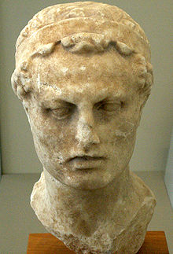
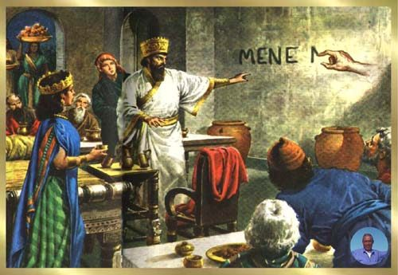
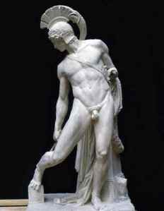
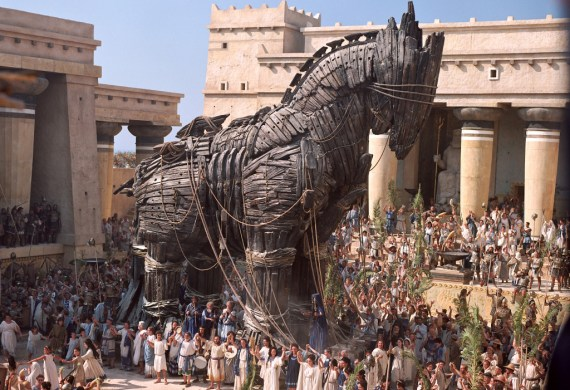
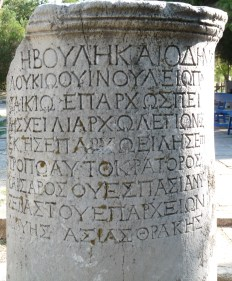
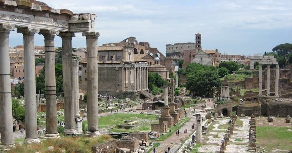
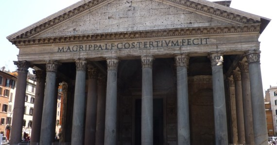
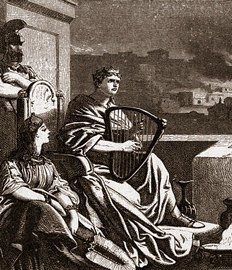
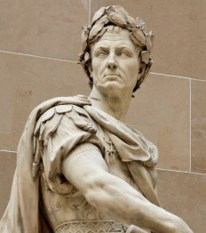

Idioms are a collection of words whom’s meaning is not easily discernible from them individually. Only through usage and context are they given a meaning that is different from the words themselves (e.g. it is raining cats and dogs).

These sayings are woven into our language and their origins are often unknown to the speaker. Some can even tell us about the historical past as demonstrated in the following 10 idioms from Hebrew, Greek and Roman origin.

## #1: "Drawing a line in the sand"

To **draw a line in the sand** has an origin in the conflict between Rome and the Hellenistic kings (the successors of Alexander the Great).

It means the marking of a decision point where one is to proceed no further without making it (generally irreversible).

The growing power of Rome in the second century BC had emboldened her politicians in a far more aggressive foreign policy. In 169 BC, the Roman envoy Gaius Popillius Laenas drew a line around the Seleucid monarch, King Antiochus IV Epiphanes, and stated:

> Before you cross this circle I want you to give me a reply for the Roman Senate.

Rome had demanded the withdrawal of Seleucid forces from Egyptian territory. A non-compliant response would have given Rome a casus belli, a reason for declaring war. Now that is power politics!

## #2: "The writing is on the wall"

**The writing is on the wall** has an origin in the Biblical Book of Daniel and literally is a portent of impending doom or misfortune.

In [chapter 5 of the book of Daniel](http://www.fillthevoid.org/Kjv/B27C005.htm), a supernatural hand writes a message upon the wall foretelling of the demise of Babylon.

> MENE; God hath numbered thy kingdom, and finished it.
>
> TEKEL; Thou art weighed in the balances, and art found wanting.
>
> PERES; Thy kingdom is divided, and given to the Medes and Persians.

In the popular Harry Potter franchise we can see a reference to this same phenomenon, is this not a portent of impending doom?

## #3: "Achilles Heel"

The story behind the **Achilles Heel** is well known compared to the other idioms mentioned so far.

It’s origins reside in Greek mythology whereby the Greek champion Achilles is defeated by a poisoned arrow that wounds him in the heel.

Achilles had a reputation of strength and invincibility, virtues given by his mother Thetis whom dipped him in the river Styx as a youth. Unfortunately when she did so, he was held by the heel which rendered a single weak spot not covered by the mystical power of the water.

Therefore, this idiom refers to the weakness of something despite an overall strength.

## #4: "Beware of Greeks bearing gifts"

Another famous idiom from the Homeric epics is to **beware of Greeks bearing gifts**. It refers to the giant wooden horse presented to the Trojans at the siege of Troy. It literally means to be wary of trusting your enemies at all times (especially if they appear to have good intentions).

It is the Roman poet Virgil who continues the story of the Trojans in his epic poem The Aeneid that brings us the quote:

> Do not trust the horse, Trojans! Whatever it is, I fear the Danaans, even when bringing gifts.

This phrase is closely related to another used in popular culture:

> Don't look a gift horse in the mouth.

## #5: "It's all Greek to me!"

This idiom refers to something being incomprehensible or undecipherable. The usage is broader that just language and can be applied to anything of a complicated nature.

The term **Greek** refers to the Greek language and it’s inability to be read by monks during the middle ages. The Latin being:

> Graecum est; non legitur
>
> it is Greek, [therefore] it cannot be read

Another common variation of this phrase is ‘double Dutch‘.

## #6: "When in Rome, do as the Romans do"

This idiom is a proverb that refers to the way a person should behave, that is, like those around you:

> if you were in Rome, live in the Roman way; if you are elsewhere, live as they do there

The saying has been attributed to Saint Ambrose, a Theologian of the 4th Century AD. The diversity of customs of the early Christians varied greatly between cities:

> When I go to Rome, I fast on Saturday, but in Milan I do not. Do you also follow the custom of whatever church you attend, if you do not want to give or receive scandal.

## #7: "All roads lead to Rome"

The saying **all roads lead to Rome** is a reference to the extensive system of roads built by the Romans, the greatest engineers of the ancient world.

These roads were considered to begin at the [Milliarium Aureum](http://en.wikipedia.org/wiki/Milliarium_Aureum) (golden milestone), a monument erected by Caesar Augustus and located in the central Forum in Rome. All distances in the Roman empire were measured from this point.

As a proverb, it means that there are many ways to reach the same goal.

## #8: "Rome wasn't built in a day"

The ancient biographer Suetonius told us that Augustus:

> found Rome a city of brick, and left it a city of marble

A marble city that befitted it’s place as capital of one of the greatest empires ever known and in the words of Edgar Allen Poe, ‘the grandeur that was Rome‘.

Obviously this grandeur took some time to build, from the establishment of the city by Romulus to the later emperors, we’re looking at a span of 1200 years.

When you say that **Rome wasn’t built in a day** you are pointing out that you shouldn’t expect great things to be done quickly.

## #9 "Fiddling while Rome burns"

To **fiddle while Rome burns** refers to the belief that the infamous Emperor Nero played the lyre (there were no fiddles yet) while Rome was burning.

Nero was rumoured to have started the fire to clear space for his Domus Aurea.

Idiomatically it means someone is doing nothing about a serious problem.

## #10 "Crossing the Rubicon"

To ‘cross the Rubicon‘ means making a decision where this no going back, a point of no return.

In 49 BC, Julius Caesar crossed the Rubicon river with his armies in the field, a violation of Roman law (only the elected magistrates of consul & praetor could hold imperium within Italy).

The violation of this law was a capital offence, punishable by death.

This saying is closely linked to a quote from Caesar himself:

> ālea iacta est
>
> the die has been cas
