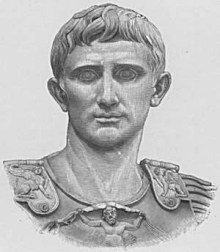
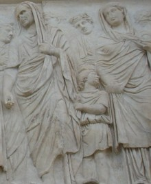
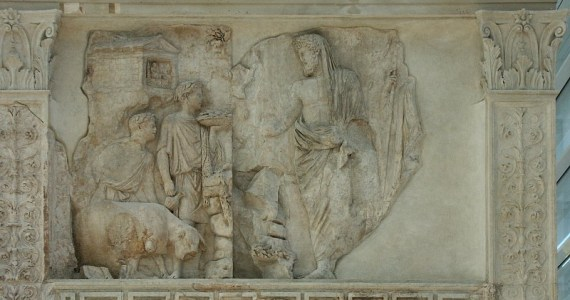
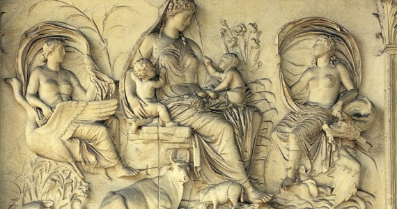
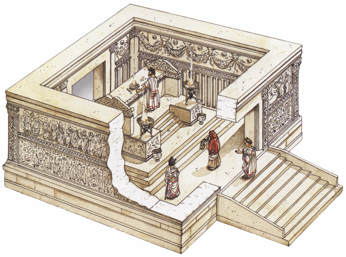

Eighteen years after the battle of Actium decisively brought the civil wars to a foregone conclusion, the Roman Senate consecrated an altar in honour of Augustan peace and placed it upon the field of Mars.

The patron was to be Augustus Caesar, the victor of the civil wars and the man who proclaimed to have brought a golden age to the people of Rome. A time of abundance, peace and prosperity, where conscience guided the actions of man, a return to the golden age of Saturn.

The Ara Pacis Augustae stands testament to this propaganda. It uses mythological, allegorical and historical scenes to symbolise peace and prosperity, primarily thanks to the activities of the first citizen.

**Update [4/2/2012]** – you can view a [3d tour of the Ara Pacis Augstae here](http://tourvirtuale.arapacis.it/eng/index.html).

## Augustan peace

The Roman Senate resolved to build an altar in honour of Augustan peace. The symbolism is significant; 'Augustan' is used as an adjective as if he is responsible, an altar of peace is placed upon a field of war and similar to the closing of the Temple of Janus, Augustus had literally brought peace to Rome through military victory.

Architecturally, the monument has two entrances, perhaps like the unknown layout of the Temple of Janus but of significance is that unlike the temple, there are no doors that can be closed. The peace of the Gods (pax deorum) requires constant piety.

## Processions and mediation

In the Roman epic The Aeneid, the shade of Anchises (father of the Trojan hero Aeneas) reveals a procession of future Romans culminating in the arrival of Augustus, the man 'who will bring back the golden years to the fields of Latium'. A welcome vision to those Romans battle weary from the civil wars.

In the upper register of the southern and northern walls surrounding the altar is another procession, this time led by Augustus himself fulfilling this prophecy. Clad in a veiled toga (a sign of religious respect), he leads other contemporaries such as senators, priests, women and children in a sacrificial procession. The image matches his rhetoric of merely the first among equals. It is in this context that we might view Augustus as a mediator between man and the Gods, a benefactor for the Roman people.

## Traditional values and dominion

Anchises also foretold the Roman divine mission, that is, 'to govern the peoples of the world', but Augustus had been dismayed by a moral decline and in particular, the self-serving ruling class, and resolved to correct this through legislation. The depiction of women and in particular, children in their natural state, is symbolic of this pro-family legislation.

The men wear togas representing Roman citizenship, even the male children wear them with the exception of the child tugging at the cloak of Marcus Agrippa. It has been suggested that this boy is a depiction of the children mentioned by Suetonius, hostages from foreign rulers, symbols of Roman dominion.

Augustus believed in the divine mission of the 'lords of the world, the nation clad in the toga', his golden age would see the return of traditional values to govern the empire.

## The glorious past and links to Augustus

At the western entrance of the altar are two mythological scenes linking Augustus to the legendary Roman past. In the upper right is a scene of Aeneas, the personification of piety, founder of Latium and ancestor of Augustus. The scene shows a bearded Aeneas performing a sacrifice to the Penates in a similar vein to Augustus on the southern frieze. The association is clear; Augustus is linked to Aeneas through blood, virtue and action, they are both pious and brought peace to Italy.

Upon the upper left is a damaged scene showing Romulus, Remus and the she-wolf. The association is clear again, Augustus styled himself as a second Romulus, a second founder of Rome.

The mythological symbolism of these friezes is commemoration, but more importantly, allusion to the moral authority upon which Augustus powers rests and the reason for the prosperity depicted elsewhere.

## Allegory at work

At the eastern entrance of the altar are the allegorical scenes of peace brought about by the activities of Augustus. Upon the upper right is a damaged scene which has been linked to a coin issue of the seated goddess Roma resting upon a pile of enemy armour. The symbolism is that Rome is at peace after war, but is still armed if needed.

Upon the upper left is a seated goddess in classical Greek-style drapery, her identity is unknown, but some suggest it could be Pax, the goddess of peace. Upon her lap are two babies, they are indicative of fertility and pro-family legislation. At her feet is the Earth in bloom and abundance, at her side are the personification of salt and fresh water. The symbolism is that Augustus has brought peace and the rewards of prosperity and fertility existed in all environments.

Neglected so far has been the lower register of the outer wall containing scrolling acanthus leaves intertwined with a variety of vegetation and animals, ornamentation alluding to the fertility and bounty of Augustan peace. Zanker suggests that the symmetry and order of these panels reflect the lawful age of Jupiter, that the Augustan vision of a golden age recognises the need for law and order, unlike Ovid's golden age that relies on conscience alone.

Upon the interior of the wall are festoons draped from oxen skulls, interlaced with fruits from all seasons and sacrificial bowls placed in the regions between skulls. The symbolism is clear, through piety and in particular, religious sacrifice, comes the lush fertility of all seasons, that is, permanent prosperity.

## Conclusion

The consummate master of his own image, Augustus would have distanced himself from this line in Virgil's eclogues:

> O Melibeous, it is a god who gave us this peace – for a god he shall ever be to me

Yet, it is in this context that we should view the Ara Pacis Augustae, the contemporary Roman associating the mythological, allegorical and historical with the image of Augustus, the man leading them to a golden age.

The altar exudes Augustan ideology, that is, a cultural renewal of Roman society inexorably linked to the prosperity of a golden age, a world at peace, under the dominion of the Roman people and the modern day Saturn, Augustus Caesar.
