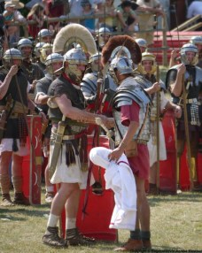
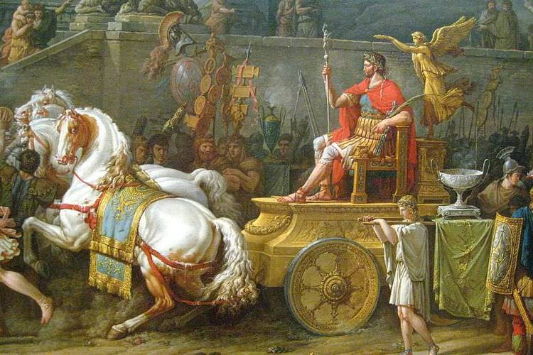

As a follow on from our previous post on the [Punishments in the Roman Army](/roman-army-punishments) is an examination of the rewards and commendations on offer. The carrots as opposed to the proverbial stick.

## Military Decorations

In **Polybius (6.39)** we find a great passage on how Rome rewarded her soldiers. Methods that Polybius believed to inspire the young men of the army:

> They also have an admirable method of encouraging the young soldiers to face danger.

Polybius states that after battle the victorious general calls forth an assembly of the troops and exalts those who served courageously in battle, speaking of their deeds and offering one of the following rewards:

- Blunt-headed, miniature spear (hasta pura) for ‘wounding an enemy’.
- A cup (infantry) or horse trappings (cavalry) for he who has ‘stripped and slain an enemy’.
- Gold necklet (torques).
- Armband (armilla).
- Gold, silver, or bronze sculpted disks (phalerae).
- Miniature Standard (vexillum)

These rewards were not given to any man like the explanation above might imply, but those who had served courageously within a battle AND at crucial times (e.g. the onset, critical junctures, etc). It would be ridiculous if every man was honoured for ‘wounding an enemy’.

The decorations were worn with pride during parades or at other times that required official dress. Many tombstones attest to the importance of these awards for the recipient (much like our modern day war medals).

Furthermore, those who received these rewards were often given a promotion and hence, a larger share of the spoil.

## Military Crowns

Technically these crowns are still decorations but they deserve their own category. Even Julius Caesar wore his civic crown with pride (or was it to cover his famous baldness?).

The crowns we know about are:

- **Grass or Siege crown (corona obsidionalis)** – awarded to a general who relieved a besieged garrison.
- **Civic Crown (corona civica)** – save the life of a fellow citizen.
- **Mural Crown (corona muralis)** – first man over a wall.
- **Rampart Crown (corona vallaris)** – first man over a rampart.
- **Naval Crown (corona navalis)** – first man to board an enemy ship.
- **Gold Crown (corona aurelia)** – legionaire who held his ground to end of battle.
- **Crown of the Preserver** – awarded to those who have shielded and saved any of the citizens or allies

Unfortunately those attempting to gain such rewards would have suffered a high mortality rate (e.g. first man over a wall) and it was rare for awards to be given posthumously making them even the more valuable.

## Rewards for Auxiliaries

There typically weren’t awards (decorations) for auxiliaries but something far more valuable, citizenship. For those auxiliaries that showed exceptional bravery 'may' be given early citizenship (the usual service time was 25 years). Citizenship was given in the form of a document inscribed in bronze, a military diploma.

## Parades for the Victorious General

There were two major parades given to victorious generals, an ovation and a triumph. These parades were bestowed on a victorious general at the behest of the Senate (during the republican period).

The first is called an ovation, whereby a general walks triumphantly into the city (not aboard the four horse chariot of the triumph). It is a less grandiose affair than the triumph as soldiers and the Senate do not normally participate.

The most famous ovation is that of Marcus Licinius Crassus, a member of the first triumvirate and victor over the rebel slave Spartacus. The victory over Spartacus being a key differentiator between being awarded an ovation and a triumph, that is, you have to defeat a worthy adversary. Slaves and pirates fall into the category of 'inferior' opponents.

The second (and more extravagent) is the triumph. A magnificent procession through the streets of Rome for the victorious general consisting of the Senate, soldiers, spoils of war (including conquered enemies) and the general himself, aboard a four horse chariot with a slave just behind him reciting that ‘he is still a mortal’. At the end of the procession, sacrifice is given to the gods and the general is forever known as a ‘man of triumph’, the highest award bestowed on a man of the military.
