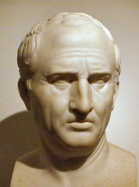
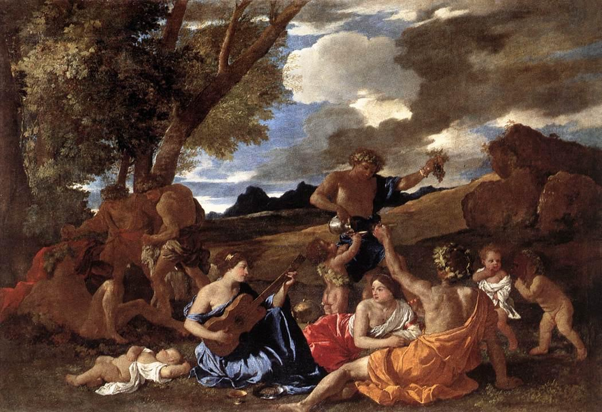
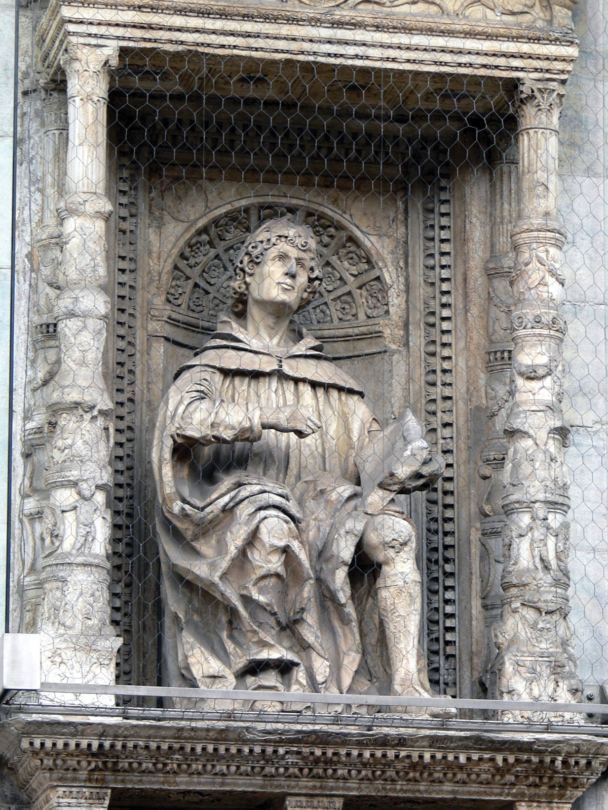

For the ancient Romans, there was a clear distinction between practices that could be defined as **religious** and those that were a **superstition**.

This article will define both concepts and then provide two examples of practices the Romans regarded as a superstition in the ancient world.

## Religion - Traditional, Formulaic and the Foundation of the State

According to the Roman orator Cicero, religio relates to the customs and traditions that came from 'forebears' and were 'pertaining to the cultus (worship) of the gods'. In other words, those who 'diligently' followed the ancestral customs were known to be religious. The word 'diligently' is significant as it relates to the 'correct' observance of these rituals.

The failure to correctly observe a ritual like an unfavourable chicken augury highlights how embedded religio was to the success of the Roman state:

'Caelius writes that Gaius Falminius, after neglecting the dictates of religion (religio) fell at the battle of Trasimene, which gave our state a great blow'

When Cicero writes that King Numa brought religion to Rome and in doing so, laid the foundations for their empire. It is this foundation that he regards as responsible for the empires success and what made the Romans superior to all other nations:

> 'if we want to compare out national characteristics with those of others … yet in our sense of religion, that is, reverence of the gods, we are greatly superior'

In the mind of Polybius, the civic and social aspects of these customs and traditions were what actually held the state together, that religio had achieved a place of 'pre-eminence' within the Roman people.

In summary, the term religio meant the correct observance of ancestral rituals, were primarily concerned with the cult worship of the gods, were inextricably bound the life of the state and in their own minds, what made them superior to other nations.

## Superstition - Foreign, Strange, Innovative & Divisive

In contrast, if religio is that which fosters traditional beliefs, superstitio is that which undermines that same traditional wisdom. On Plutarch's treatise concerning superstition, he records superstitio as the strange and foreign rituals that:

> 'distort and pollute their own tongues with absurd titles and foreign invocations, to do shame to, and sin against, the divine and national dignity of religion'

If tradition was the absolute truth for religio, then superstitio represented the opposite, that is, the innovative and the new. Just as the novus homo was treated with suspicion in political life, so too did the political machinery of Rome work to grant or deny legitimacy to foreign cults.

The accounts of the Bacchanalia in 186 BC and the incidents concerning the cult of Isis in the late republic represent a willingness by authorities to act against foreign cults that operated outside the framework of the state religion and social norms.

It was the 'superstitious and irresponsible excesses' that Tacitus records as dividing and unsettling the region of Egypt, a region that required the firm rule of the Romans. Plutarch regarded the superstitious as separated from 'the rest of mankind' and in this light, we can see how the Romans viewed superstitio as a dividing factor within the state.

In summary, the Romans viewed superstitio as the cult practices that were foreign, strange, innovative, and divisive; those that could bring harm to a state they were a part of.

## Judaism - a people living apart

In regards to Judaism, Tacitus writes that 'among the Jews all things are profane that we hold sacred; [and] on the other hand, they regard as permissible what seems to us immoral' revealing that they were viewed as both strange and foreign, both features of **superstitio**.

Specifically, the refusal to eat pork, the practice of circumcision, and the observance of the Sabbath were strange customs to the Romans, the Greek writer Plutarch left bewildered by the refusal of the Jews to fight on the Sabbath. The laws they governed themselves under, the commandments, clearly marked them as a people living apart from the customs of other peoples.

The only saving grace for these customs being their ancestral nature, that at least was something the Romans could respect and tolerate until the revolts in the first and second century BC taught them the dangers of these foreign monotheistic cults.

In summary, Judaism was regarded as foreign and contrary to the customs of other people; they lived as a people apart, and were to the Romans, the **superstitious**.

## Christianity - a most mischevious superstition

In regards to Christians, Tacitus calls them out as a 'most mischievous superstition' and possessing a 'hatred of all mankind'. This testimony is corroborated by Suetonius who labels them a 'new and most mischievous superstition'. When Pliny the Younger commenced his investigations into Christian activities in Bithynia, he is dismayed at the neglect of the temple gods and general lack of sacrificial meat.

If traditional Roman religion assured the pax deorum, the peace of the gods, it is possible to understand how Tacitus could label them as an 'enemy of mankind'. When Pliny interrogated two female slaves on the nature of Christian activities, he finds it strange but harmless enough, they met on a fixed day, sang hymns to Christ, swore a solemn oath and partook of food of the 'ordinary and innocent' kind. It was nothing more than an 'excessive and depraved superstition' to Pliny.

Yet what became an affront to Roman religious sensibilities was the unwillingness of the Christians, or better yet, 'obstinate refusal to acknowledge the gods of the community ... [they] were inviting hostility which they may otherwise might be avoided'. They were labelled as anti-social for not participating in the civic religion at all:

> 'You do not go to our shows, you take no part in our processions, you are not present at our public banquets, you shrink in horror from our sacred games'

The arrogance and self-righteousness of the martyrs only served to provoke Romans attitudes further:

> 'If you vainly suppose that I will swear by the genius of Caesar, as you say, and pretend that you are ignorant of who I am, listen plainly: I am a Christian'

The Christians were, like the Jews, operating apart from the customs of the Roman people, their cult practices were secretive and new, they were an affront to the very foundations of the Roman state, they were the 'superstitious'.
