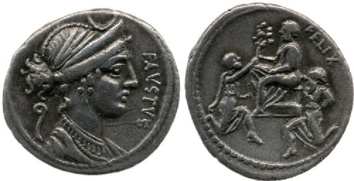
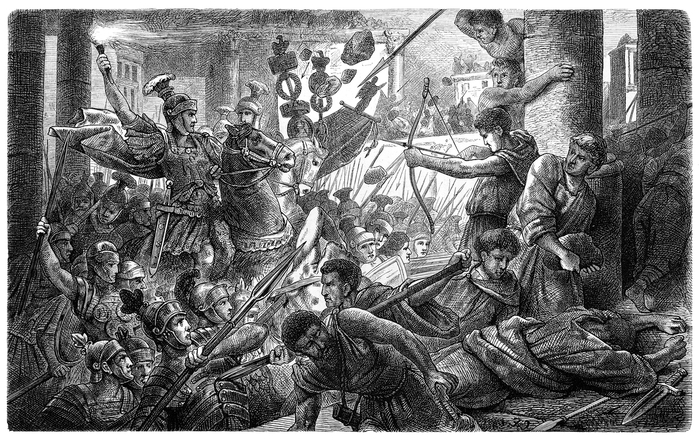

The career of Lucius Cornelius Sulla remains an enigma on the political landscape of the Roman Republic. An aristocrat that achieved the ultimate power of the dictatorship and yet abdicated at the height of power (Julius Caesar later labelled him a fool for doing so).

On one hand, Sulla's exemplary career has been overshadowed by the brutality and illegality of his actions that undermined the authority of the Senate.

On the other hand, Sulla's legislative reforms were aimed at restoring that same authority, depriving the tribunate of its power and making his own career a political impossibility.

## Ascent to the Consulship (138 BC - 88 BC)

The ascension to power for Sulla began like many other aristocratic careers, descending from an impoverished yet noble family, Sulla began to climb the cursus honorom through the office of quaestor and served under his future rival, Gaius Marius.

After personally securing the capture of Jugurtha and claiming credit undue to his position, Sulla quarrelled with Marius and attached himself to the other serving consul achieving military distinction in the Alps.

Upon returning to Rome, Sulla campaigned unsuccessfully for the praetorship, only to achieve office the following year amid accusations of bribery.

Possessing imperium in the social war, Sulla excelled as a military leader, establishing the loyalty of his troops and the ire of his rivals.

At this point in time, the spoils of his victories culminated in the consulship of 88 BC, affording him one of the highest offices of state and the authority attached to it.

## Marching on Rome (88 BC)

Sulla's career at this point in time had been prolific but not unprecedented and a command in the East had presented itself as an opportunity to achieve further distinction.

As consul, Sulla was constitutionally placed to undertake the command but encountered resistance at the hands of the populares faction. They proposed assigning the command to Gaius Marius, a proposal both impractical and 'improper' on military grounds (Sulla had achieved many well-fought victories and Marius was now in his seventieth year).

Unable to arrive at a political solution, the conflict escalated and Sulla arrived at an impasse, taking the unprecedented step of marching on Rome at the head of six legions.

The significance of these illegal actions meant that any general with enough loyal soldiers could impose his will on the state, no longer was the Senate in control of its generals. Satisfied with his actions, Sulla ignored the trial brought against him and sailed for the east.

## Marching on Rome and the Dictatorship (82 BC)

Following the war with Mithridates, a treaty was formed and Sulla turned his attention back to Rome, whom after a brutal period of civil war had fallen into the hands of a rival faction.

Once again, Sulla marched upon Rome at the head of an army and took the city by force. As a further show of brutality, the practice of proscription was introduced and his political opponents put to death.

Furthermore, Sulla took another step and revived the office of dictator for the period of his life, absolving him of his past acts and granting him power absolute.

## Restoring the authority to the Roman Senate (81 BC)

The polarising aspect about Sulla's career relates to the legislation he introduced, laws designed to save the Republic and make the Senate an effective governing body once more.

The first steps were to increase the numbers in the Senate, whom had been reduced by civil war and increased its number to six hundred. The political result of these changes meant the Senate was now populated with people whom owed their allegiance to the dictator.

Suspicious of the office of censor, Sulla introduced legislation that enabled automatic recruitment from the office of quaestor, indirectly resulting in the people electing senators.

However, more troublesome for the Senate had been the office of the tribune and Sulla brought in legislation to cripple the office of talent and power. In terms of talent, Sulla made the office a political dead-end to dissuade ambitious politicians from seeking the position. In terms of power, Sulla restricted their veto and ensured the Senate must ratify their legislation.

The culmination of these laws was an attempt to restore the authority of the Senate and weaken the position of its opponents.

## Making his own career a political impossibility (81 BC)

The next series of legislation introduced by Sulla indicates that he was acutely aware of the danger that his own career presented to the republic.

To make his own career a political impossibility, Sulla introduced reforms that placed age restrictions on the cursus honorum and against holding the same office within a ten-year period. An attempt to restrain ambitious young men from obtaining high office and political power too quickly.

Acutely aware of the danger of provincial governors, Sulla hoped that annuality and the authority of the Senate to assign provincial commands would curtail this threat. Not content with these actions alone, Sulla introduced a treason law against these governors preventing them from starting a war or leaving the province on their own authority.

The hypocrisy of these laws is that Sulla's own career violated them, but it was an attempt to maintain authority within the Senate.

## Abdication and legacy (80-78 BC)

The legacy that Sulla's career leaves behind are the new levels of violence that it achieved, not only against Rome's own armies, but the fateful decision to march upon the city and impose his own will by force, an action that brought the Republic one step closer to imperial rule.

Sulla recognised the dangers of his own career and attempted to legislate against it, but in the words of Julius Caesar, alea jacta es, ‘the die has been cast', future generals would always ask, ‘If Sulla could, why can't I?'

Upon Sulla's funeral epitaph (see other epitaphs in this post), it indicated that ‘he had not been outdone … by any of his enemies in doing harm', unfortunately for the Republic, we must regard it as an enemy. Sulla brought far more harm unto it (the Republic), despite his attempts to legislate for it's survival.
