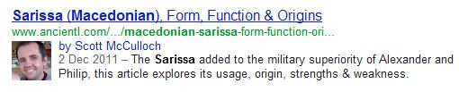
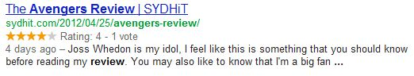

The [AIRC Unlisted Conference](http://romanculture.org/page/our-focus) recently featured a [video on Search Engine Optimisation (SEO) in Digital Archaeology](https://web.archive.org/web/20121120201858/http://www.youtube.com/watch?v=fr-i_JOt-oM). This naturally sparked my interest as someone who is interested in both archaeology and search engine optimisation.

## AIRC unlisted conference, my background & digital archaeology

As a [career computer scientist](/about), I’ve been building websites and applications for over a decade and picked up a few techniques along the way. Over the past few years I’ve been undertaking my third degree, something that engages the other side of my brain, specifically a degree in ancient history and philosophy (@ [Macquarie University, Sydney](http://www.mq.edu.au/)). The ultimate aim being to combine these two passions together someday.

Digital archaeology has come a long way over the years, initiatives such as distanced learning and 3D modelling ([Rome Reborn I am looking at you](http://www.romereborn.virginia.edu/)) have become integral to re-telling the stories of our past. As someone who lives in the southern hemisphere, it has meant being able to learn about and experience European history that I might not have had the chance to.

## SEO primer for digital content

**Search Engine Optimisation** refers to the process of optimising digital content so it can be readily found on popular search engines. When we talk about digital content we refer to all manner of digital information such as websites, videos, images, podcasts and many more.

Initially, all of this digital content was able to describe itself in properties attached to each object. It could say, this is what I am called (title), this is a bit more about me (description) and you might want to find me using these (keywords). Furthermore, the content itself is auto-describing, the text in an article is taken into account for the search engine index.

Through an early rudimentary search engine, these properties worked fine and allowed someone to find content fairly easily in a small managed environment. The problem came when the amount of information grew exponentially and people began to manipulate the system by stuffing popular (and not relevant) search phrases into these properties.

Many search engines including Google attempted to rectify this by a single guiding principle:

> Not all content is created equal

If content is to be ranked, Google sought a solution to rank content. A simple way to do this was to add up how many sites linked to a particular piece of content. These links counted as votes towards the popularity of content. This allowed higher quality content to appear higher in search results as a result of natural selection.

Over time, people abused the linking technique (and still do), so whole websites were also given a ranking on quality. Links from higher quality websites would count for more.

There are a few other factors (url, age of domain, link text, alt description on images, etc), but these are the main tenets for search engine optimisation. On-page optimisation involves ensuring your content has those properties described (title, description). Note: keywords are no longer used in the majority of search engines and can be skipped.

Offsite optimisation involves building compelling content that people will want to link to and fostering a community through social networks and partnerships with people that are relevant to your industry.

## Stepping into the future

There are a [few comments that I made on the video](http://www.youtube.com/watch?v=fr-i_JOt-oM) from the Unlisted conference about the potential for the future organisation of digital content.

The first main point I want to make here concerns structured data. Previously in this article, we’ve talked about describing our content (title, description) and how it makes content more accessible. There are steps in the industry to make this even more descriptive through initiatives like schema.org that involves all the main search engine players including Google, Microsoft, Yahoo and Yandex. The goal of the initiative to describe content better and in turn allow the search engines to display better targeted content in better formats.

Let’s look at some examples, you may or may not have noticed this on google already, look at the following image:

You will see my photo (as an author) and the associated article. This was done by applying extra properties to the content that tells Google who I am.

Now let’s look at another example, this time for reviews:

This content has described itself further; it is a review with 1 vote and a rating of 4. This is not the most exciting example, but it does show that search engines have the ability to interpret data differently and render according to its format.

Now, let’s look at some of the schema examples and see where they fit in with archaeology. The first that comes to mind is the heritage listing. Imagine being able to search all of the world’s heritage listings from the front Google page. If we described our content better using the schema details, this might be possible in the future. Furthermore, there is also a people schema, we could have something similar for historical figures.

The importance of this initiative is that involves multiple parties working together allowing us to arrive at a standard format (and that’s why I am excited by it).

The second point I would like to make revolves around the **ranking of authors**. I’ve shown you previously how I appear as an author in the Google search results using structured data. I think in the future you will see authors become important for ranking (like websites are now). Higher ranking authors will have higher ranking content.

## Action plan for your own digital content today

If you want to make your content more visible to the wider community today, the best plan is self education. There are plenty of guides out there, but if you are a wordpress user, consider [this guide by Yoast](http://yoast.com/articles/wordpress-seo/) and also [check out his plugin](http://yoast.com/wordpress/seo/).

If you are more serious about SEO, there is also a [service from semoz](http://www.seomoz.org/) which is great and a [blog with lots of great information](http://www.seomoz.org/blog).

Most of the theory involves researching of keywords and then producing content that matches them. So, bearing that in mind, if you have picked a particular keyword or phrase you want to target, try the following steps to optimise your content:

- Page Title
- Description
- Page Url (some content management systems do not allow this to be customised though)
- The content itself (body of story)
- Alternative Text for Images
- Text inside links

There is much more to this area that I have described, but it is an ever-expanding field and as more archaeological content goes online it will become more important than ever to organise the information correctly.
