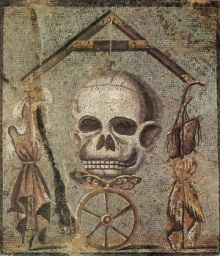
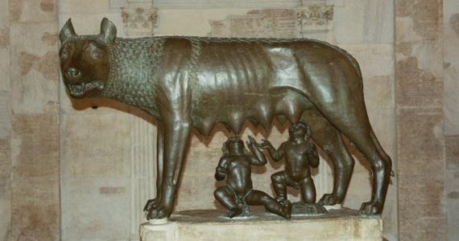
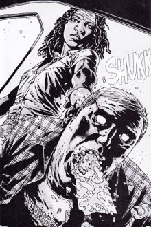

One of my all time favourite comics (and now television show by AMC) is The Walking Dead. The show depicts a post apocalyptic world filled with zombies (dead people) and the living fight for their own survival.

Fortuitously in the **real world** we have no such interaction with the dead and they are placed firmly within the realms of fiction.

However, in Ancient Rome it was a completely different story. The living perceived a very real threat of the dead returning, and sought measures to placate the restless spirits of those that had past.

## The Restless Dead – Lemures, Larvae & Di Manes

In **The Walking Dead**, the dead are said to have risen due to an airborne virus. Those people that die will rise again as one of the walking dead (providing their brain is intact).

> In Ancient Rome, the return of the dead was tied to the concern of what happened after death.

For some, they believed the soul journeyed to another place. Others believed it was an end, a nothingness, an eternal sleep (more on Epicurus thoughts on death here).

The problem with the former was the prospect of the soul not reaching the final destination. Those spirits that failed to complete the journey were said to remain in our world and torment the living. For they were the unburied who lacked family or collegial connections to offer them an adequate burial. They were ethereal in state but oddly enough required feeding for appeasement (note the black beans mentioned later).

The labels given to these spirits can be quite confusing. They are sometimes referred to as **lemures**, **larvae** and **di manes**. The differences are that lemures or larvae are typically people that have been bad, while di manes are those with a nature that has not been determined.

## Romulus & Remus - Discord in Death

Ovid provides us with an account of a lemur in the form of Remus, the murdered brother of the first king of Rome (Romulus):

> The bloodstained ghost of Remus seemed to stand
> By the bed, speaking these words in a faint murmur:
> ‘Behold, I who was half, the other part of your care,
> See what I am, and know what I was once!
> If the birds had signalled the throne was mine,
> I might have been highest, ruling over the people,
> Now I’m an empty phantom, gliding from the fire:
> That is what remains of Remus’ form!

This is more then just an account of a lemur however, it is an etiological myth for the ritual used to placate the dead. It was the appeasement offered to the slain Remus for the crime of fratricide.

> When the phantom fleeing dispelled their sleep,
> They both told the king of his brother’s words.
> Romulus, complying, called that day the Remuria,
> When reverence is paid our buried ancestors.

You can read more in [Book V of the Fasti](http://www.poetryintranslation.com/PITBR/Latin/OvidFastiBkFive.htm).

## Lemuria - Appeasement in Practice

In **The Walking Dead**, severe trauma to the head is enough to appease the most fervent of walkers.

In **Ancient Rome**, the situation is really representative of the type of people they were, that is, a **religious people**.

According to the calendar provided by the poet Ovid, the days of May 9, 11 and 13 were dedicated to the placation of the dead collectively known as the Lemuria.

During this time, the head of the family (paterfamilias) would rise at midnight and walk the house making the ‘mystic sign’ with his hand. This involved extending the first and fourth finger while turning the other fingers inward holding it in place with the thumb.

It is particularly amusing that this **sign** is now the gesture for **rock on** in popular culture! It has been [suggested elsewhere](http://www.languagetrainers.co.uk/blog/2007/09/24/top-10-hand-gestures/) that this sign is still in use when evil is present (joking).

As the **paterfamilias** makes the sign and walks the house, he averts his gaze, throwing black beans (symbolic of the underworld) over his shoulder reciting:

> with these beans I throw I redeem me and mine

While this is happening, it is thought that the dead gathers the beans and follows unseen. After repeating it nine times, he sounds for the spirit to depart.

The rest of the household would then clash bronze pots while repeating:

> Ghosts of my fathers and ancestors, be gone!

And that is how you dealt with the Walking Dead of Ancient Rome!
