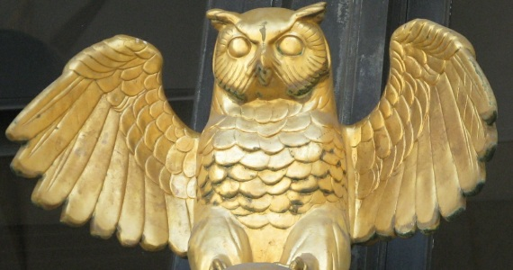
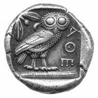

It is often in unexpected places that we find references to classical antiquity. Today, while catching up on another favourite past time (comics), I stumbled upon a reference to classical Greece in a major story arc of Batman.

The reference was to the symbol of an **Athenian Owl**. Subsequent research revealed it to be a symbol for the goddess Athena, a popular coin in the ancient world and a natural predator of bats.

## Batman & the Court of the Owls

The symbol of Batman is well known within our modern world. The concept of both hero cult and storytelling are still fundamental in establishing the ethos of our societies. Like many of the Greek heroes, Batman is a cult figure for a particular city (Gotham), like Cadmus of Thebes or Theseus of Athens.

In the recent story arc by DC Comics, Batman is under attack by a mysterious group known as the Court of the Owls.

Established centuries ago, the group attempts to mould the city of Gotham from behind the scenes and employs assassins known as ‘Talons’ to eliminate Gotham’s ruling elite.

The symbolism is excellent, the owl and the bat, one is the predator of the other and the owl embodies both wisdom and the ever-watching.

## Delving further, the symbolism of the Athenian owl

In Ancient Greece, the Athenian Owl symbolised the goddess Athena who in turn embodied wisdom.

Athena had won patronage of Athens against Poseidon through her gift of the Olive branch which grew into a towering tree to feed and shelter the city. The Athenians had favoured this gift over the one provided by Poseidon of a spring of water which proved to be too salty.

We can speculate at why an owl might be associated with Athena:

1. The light reflecting from an Owl’s eyes at night gives it the appearance of an ‘inner light’ or wisdom itself.

2. A particular species of Owl nested in the Acropolis of Athens (a temple dedicated to the goddess Athena).

If we accept the second point as a more likely story, the presence of Owls could be represented as the presence of Athena in the same manner that the presence of an Eagle is related to Zeus.

## Athenian owls as currency

Remnants of this symbol are left behind in the coinage of Athens. As the most influential coin of its time, the Athenian Owl featured Athena on one side and an Owl on the other. Affectionately known as “Owls”, they were in circulation for well over 300 years (c. 430 B.C. to c. 99 B.C.).

It is also the first widely minted coin that placed a ‘head’ on the front and a ‘tail’ (an animal image) on the obverse.

## The court of owls at Comic-Con 2012

I found this photo of the audience posing as the court of owls from Comic-Con 2012. It is both hilarious and intimidating!

