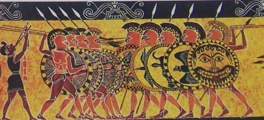
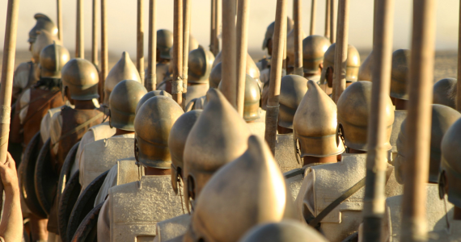
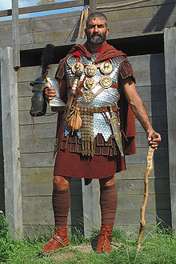
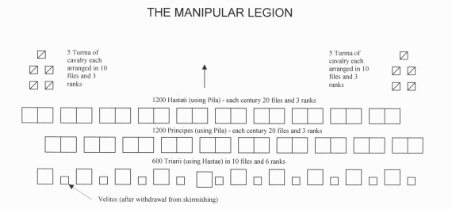

Modern preconceptions of ancient warfare place significant emphasis on the virtues of youth. This is a clear misconception however, experience and teamwork counted for far more in battle. As I discovered, soldiers who fought into their sixties were not unheard of.

This articles discusses three examples of the **elder generations** who excelled at the brutal art of ancient warfare.

## The Stages of Battle

Before discussing the individual examples, it is worthwhile discussing the **stages of battle** in ancient warfare, specifically **hoplite warfare**.

In doing so, we can attempt to understand where the ‘strengths‘ of the elder generation are useful.

### Preparation

The key part of preparation is the forming of ranks which were usually 8 deep. The interesting part about the formation is that the veteran soldiers were placed in the first rank including the commander (or strategos). For this reason, soldiers that survived into middle aged were usually extremely competent.

Other preparations could include a pre-battle speech and the imbibing of wine. Armour was only fitted just prior to engagement by attendants whom then left the field to watching the ensuing battle.

### Charge

The distance between the two armies could vary but they would slowly engage the enemy through a slow trot of around 4 to 6 miles per hour. At around 200 yards the two enemies would charge at each other. During this stage timing was crucial. Charge too early and you only exhaust your troops, too late and the enemy gains the advantage in momentum.

### Collision & Push

As the two armies collided, the rear ranks would push forward forcing grinding the units against each other. Similar to a rugby scrum, once a unit began to move backwards it was very hard to reverse the momentum. The soldiers in the back ranks of the losing phalanx would often drop their weapons and flee when this occurred.

### Aftermath & Conclusion

We can derive from the stages of battle that ancient hoplite warfare was more about **teamwork** and **experience** than any single soldier's physical attributes. This type of warfare could well suit an older and more experienced soldier, so let’s take a look at some examples.

## Old Men #1: The Silver Shields

Recently while studying my history degree, I came across a unit of soldiers that had survived well into their sixties. Their final defeat was not on the field of battle but through the guile of one of the successor kings. These were the **Silver Shields (Argyraspides)**.

The silver shields were formed by Alexander the Great from the veterans of the campaigns in India. These were picked men under the command of Nicanor, the son of Parmenion. They numbered 3,000 and were specifically honoured by Alexander with silver adornments for their weapons (hence the name **Silver Shields**).

After the death of Alexander, these men were barely controllable by the successor generals:

> After taking everything into consideration, therefore, he thought it best to apply to the Argyraspides of Alexander the Great, a body of men that had never yet been conquered, and, radiant with the glory of so many victories. But the Argyraspides disdained all leaders in comparison with Alexander, and thought service under other generals dishonourable to the memory of so great a monarch.

When they did pick a side, it was the wrong one. Although they fought bravely in slaying 5,000 of the enemy, their own booty, wives and children were captured. Furious at the outcome, they berated their general:

> ...pursued him with reproaches “for having involved them, when they were returning home after so many years of completed service, and with the fruits of so many enterprises, and when on the point of being disbanded, in fresh efforts and vast struggles in the field; for having deluded them, when they were recalled, as it were, from their own hearths, and from the very threshold of their country, with vain promises

Unhappier still, they unceremoniously surrendered their own general in return for what was taken from them. Fearing the potency of the silver shields, the victorious general garrisoned them and gradually disbanded the unit over time.

## Old Men #2: The 300 Spartans

The story of the 300 Spartans is well known in modern culture after it was immortalized in film in [1962](http://www.imdb.com/title/tt0055719/) and [2006](http://www.imdb.com/title/tt0416449/). The brave sacrifice of 300 Spartan soldiers and her allies at the Hot Gates is legendary. Their sacrifice was designed to halt the advanced of the Persian army under Xerxes I.

The Greek writer Plutarch summarised their valour as follows:

> When someone said, “Leonidas, are you here to take such a hazardous risk with so few men against so many?” he said, “If you men think that I rely on numbers, then all Greece is not sufficient, for it is but a small fraction of their numbers; but if on men’s valour, then this number will do.”

In terms of age, Leonidas had selected only fathers for the mission. Those men that were old enough to take over the family responsibilities of their fathers. If the stories are true, these were exemplary old men.

## Old Men #3: Triarrii in the Roman Maniple System

There is a famous phrase in Latin:

> ad triarios redisse

Translated it means **at last it has come to the Triarii**.

Unlike hoplite warfare, the more experienced soldiers formed ranks in the third row of the Roman maniple formation.

Optimised for flexibility, the Roman maniple employed the youngest and enthusiastic troops in the front lines. In most battles, the first two lines were sufficient but in some battles the final line of defence lay with the Triarii (hence the term). For a full explanation, see this [article by Mike Anderson](http://www.mikeanderson.biz/2009/03/blog-post_14.html).

## Conclusion

These 3 examples of the **300 Spartans**, the **Silver Shields** & the **Triarii** demonstrate the effectiveness of age and experience in ancient warfare. Qualities that remain just as important today.
