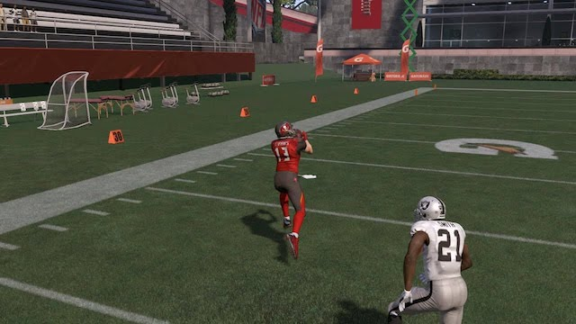
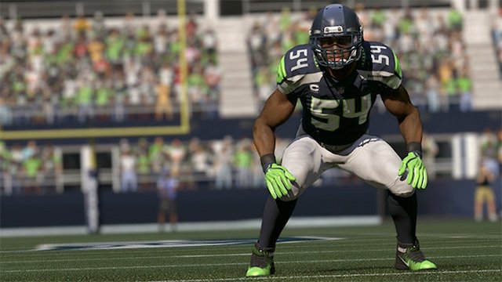
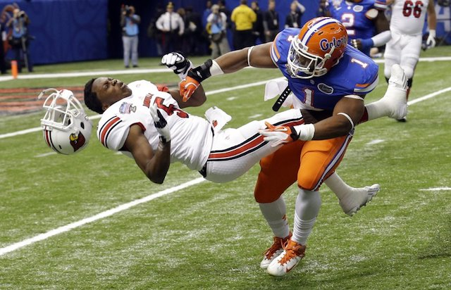
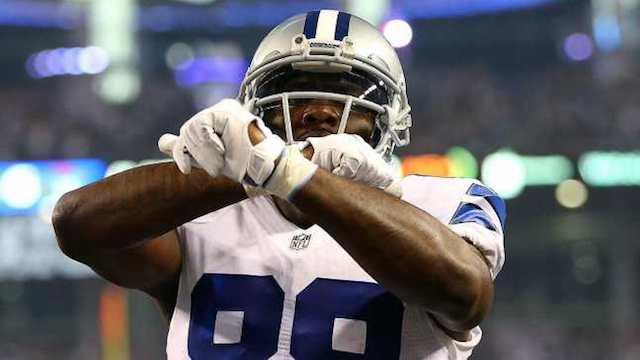

As the Madden 17 season winds down, defensive and offensive schemes have been well established. A series of unrealistic blitzes are well known (via our friends at YouTube) and even worse, offensive glitches like 'swerving' have been thoroughly abused.

Lucky for us, the release of madden 18 should put an end to all this and the playerbase will need to adapt (hopefully to a new glitchfree engine!). With that in mind, let's look at how you can prepare for Madden 18 by adjusting your playstyle today.

## Stop Swerving

The swerve glitch involves selecting a receiver while the ball is in mid-flight and 'swerving' him away from the defender. This motion causes the defender to also swerve giving you a free path back to the ball for an easy catch. It is a glitch that isn't fixed in Madden 17 but has been rectified for Madden 18.

For many H2H players it makes up a large portion of their offense (and unfortunately [some pros](https://twitter.com/volterax?lang=en) as well!). Since it won't be around in Madden 18, it's time to come up with a new scheme and actually play football concepts.

Bottom line, **STOP SWERVING**!

## No More Ball-Hawk

Let's face it, "usering" linebackers was incredibly easy in Madden 17. Your opponent would snap the ball, you would hold down Y and run around the field hoping to intercept. Pretty simple right?

Well in madden 18, they have removed the ball-hawk feature. Holding down Y (or playstation equivalent) will result in an early jump and leave your linebacker looking foolish. Adjust your gameplay by only going for the interception once the ball is thrown.

## Hit-Stick Changes

This change is potentially my favourite.

At high levels of play any user tackle would instantly be a "hit-stick" animation. Players would press the tackle button (as opposed to using the actually hit-stick) and that would lock on to the ball carrier via heat-seeker inducing a hit-stick animation.

However, these tackles **should be risky** and not occur as frequently as they do in Madden 17. To make this happen, EA has put the emphasis on the higher risk usage of the hit-stick and removed it from the heat seaking tackle button. Bravo!

## Stop using Cross-Man Defense

Another great change is the removal of cross man, a popular defensive adjustment in Madden 17. This technique involved manually adjusting users to man coverage to the opposing side of the field. When a receiver would cross near the manned up side (e.g. drag route), the defender would make an immacculate 180 degree turn and shut-down the receiver.

Obviously this isn't a real strategy in football so EA have removed the ability to do this.

**Note:** you can still man linebackers on wide receivers but this is typically only half the width of the field.

## Don't rely 100% on Dollar or Dime

One of the most frustrating aspects of Madden 17 this year was opponents that would [spam dollar defense all game](https://www.youtube.com/watch?v=4v3Mk30nXy4). Similar to cross man, this isn't a viable real life football strategy.

The dollar defense consists of 2 LBs, 3 Lineman and 6 DBs. When you see this defense, it should be weak against the run right? It has an absence of lineman and/or linebackers replacing them with smaller faster defensive backs.

As it turned out, most people could stick in this defensive coverage and blitz some of the backs to provide excellent run stopping capability. Fortunately we are told that if you run either Dime or Dollar in Madden 18 you'll get pancaked similar to rushing only 2 in Madden 17. Great!

## Conclusion

So there you have it, a list of playstyle adjustments that will make you a better player in Madden 18. Yes, there will be glitches and cheese plays in the new Madden but it is getting better each year and personally, I can't wait!
