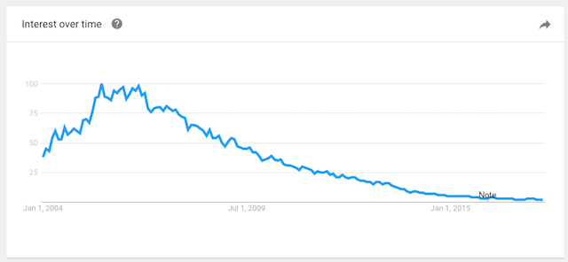

It's been a great honour to participate in the DNN community. What started out as a simple coding hobby allowed me to reach a [global community of developers](http://www.dnnsoftware.com/community) and [build lasting friendships](http://dnn-connect.org/).

Part of that interaction was developing a suite of modules that I initially needed for myself. These needs included modules for blogging (news articles), real estate firms (property agent) and image management (simple gallery).

The success of shareable extensions and the explosive growth of DNN at the time (2004-20007) meant that I could no longer keep up with the demands on my own personal site (where I hosted free versions of these modules).

In 2005, I registered ventrian.com and offered them for sale as part of a low-cost subscription. Since that time, I've extended the modules and only raised the price once (the initial price for a yearly subscription was **\$35**).

Helping others by providing website building blocks is a fantastic feeling!

However, over time the interest in DotNetNuke as a platform has moved towards the enterprise space and the interest in these type of custom extensions has certainly diminished.

For this primary reason it now makes sense to take the existing modules off ventrian.com and move them to [GitHub](https://github.com/ventrian) for anyone that wishes to extend them.

[https://github.com/ventrian](https://github.com/ventrian)

They are all licensed under MIT.

Thank you again for all the years of loyal support!

FYI, I am still working [daily in DNN](https://f5.com/) (and many other technologies). If you need to contact me, you will find me on [Twitter](https://twitter.com/sj_mcculloch) or [LinkedIn](https://www.linkedin.com/in/sjmcculloch/).
