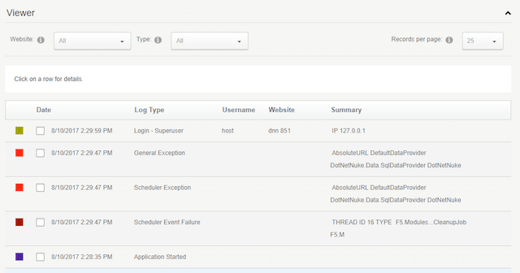

Event logs are great tools for Developers and Administrators alike. They provide an insight into the running state and history of an application.

For DNN, there are two repositories for collecting logging information that both serve different purposes.

## Logging via Admin -> Event Viewer

The DNN event viewer (_admin -> event viewer_) is a portal aware logging repository that has a UI for portal and host administrators.

Portal administrators will only see their portal's events while hosts will see everything.



Writing to the DNN event log is straight forward (although there are a lot of overloads):

```clike
using DotNetNuke.Services.Log.EventLog;

var objEventLog = new EventLogController();
objEventLog.AddLog("Sample Message", "Something Interesting Happened!", PortalSettings, UserId, EventLogController.EventLogType.ADMIN_ALERT);
```

For EventLogType, the common ones developers use are _Host_Alert_ and _Admin_Alert_. There are many more if you look up the enumerated type.

## Log4Net

Alternatively, you can log to Log4Net which is bundled with the DNN install. The main differences are:

- Log4Net does not require an instance of PortalSettings
- Log4Net does not not have a UI for viewing entries (it stores daily files in ~/portals/\_default/logs/\*)
- Log4Net files will exist until physically deleted through the file system
- Log4Net is typically a faster logging process
- Log4Net is unaware of Portal and Host differences

Logging is relatively straight forward (make sure you swap MyClassName for your class name).

```clike
// include somewhere in your class - available to all methods. private static
readonly ILog Logger = LoggerSource.Instance.GetLogger(typeof(MyClassName));
try
{
    // cause some error
} catch (Exception exc) {
    Logger.Error(exc);
}
```

If you're interested in Log4Net configuration, you can find it in {site-root-folder}/DotNetNuke.log4net.config and review their [documentation](https://logging.apache.org/log4net/release/manual/configuration.html).

```html
<?xml version="1.0" encoding="utf-8" ?>
<log4net>
  <appender name="RollingFile" type="log4net.Appender.RollingFileAppender">
    <file value="Portals/_default/Logs/" />
    <datePattern value="yyyy.MM.dd'.log.resources'" />
    <rollingStyle value="Date" />
    <staticLogFileName value="false" />
    <appendToFile value="true" />
    <maximumFileSize value="10MB" />
    <maxSizeRollBackups value="5" />
    <lockingModel type="log4net.Appender.FileAppender+MinimalLock" />
    <layout type="log4net.Layout.PatternLayout">
      <conversionPattern
        value="%date [%property{log4net:HostName}][Thread:%thread][%level] %logger - %message%newline"
      />
      <locationInfo value="true" />
    </layout>
  </appender>
  <root>
    <level value="Error" />
    <appender-ref ref="RollingFile" />
  </root>
</log4net>
```

_Remember: you can find all these files in ~/portals/\_default/logs/_
