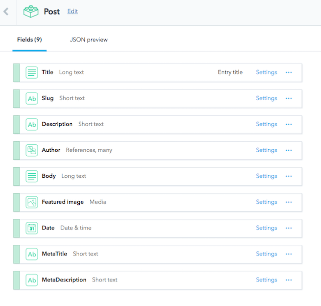
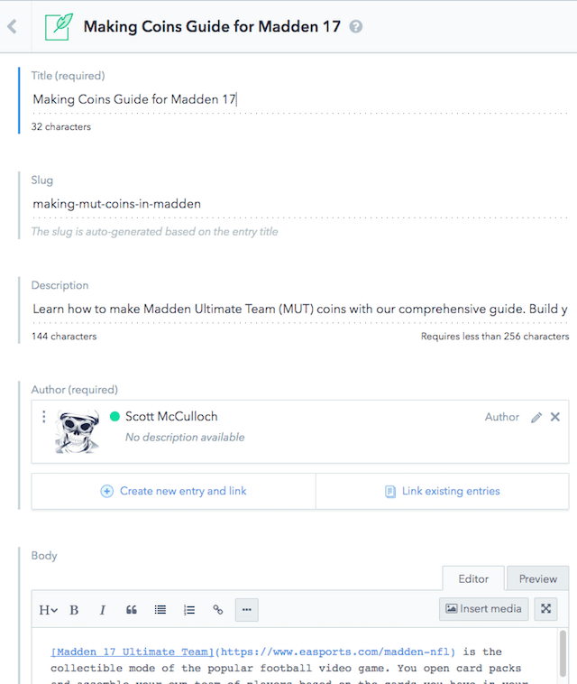
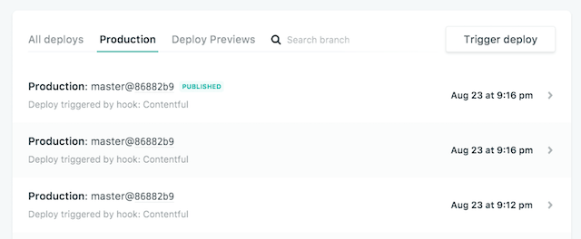
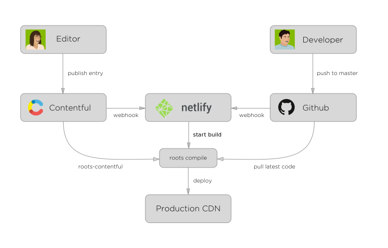

In all of [my years as a software developer](/resume) it's primarily been about what stack do you develop on? What operating system, web servers, languages and databases?

Thanks to the rise of cloud computing, an abstraction layer now exists where we don't care what the underlying platform is. The [JAMstack architecture](https://jamstack.org/) exploits that to deliver better performance, higher security, lower cost of scaling, and a better developer experience.

I'll explore this architecture as I put together a sample website using [Netlify](http://www.netlify.com) & [Contentful](https://www.contentful.com)

## What are we building?

Like all good developers have built in their career, we'll build a very simple blog. We must be able to style it, easily create posts and have it reside in the cloud. We are creating a lightweight Wordpress without the overhead!

## What is the JAMstack?

JAMstack stands for JavaScript, APIs, and Markup.

**Javascript**: Any dynamic programming is handled by Javascript running entirely on the client.

**APIs**: All server side processes are in the form of reusable APIs accessed over HTTP by the javascript.

**Markup**: Templated markup built at either deploy time or processed dynamically by javascript on the client.

## APIs - Headless CMS - Contentful

When I start an application or website, I always start with content modelling. Fortunately new services such as [Contentful](https://www.contentful.com/) make this process a breeze.

Contentful is all about modelling content, providing an interface to add content and then exposing it through APIs. You may have heard of the term [Headless CMS](https://www.contentful.com/r/knowledgebase/headless-and-decoupled-cms/) which means there is no front end (head) for content, instead it is exposed through RESTful services. This is a perfect fit for the JAMstack architecture.

The content modelling process allows you to build entities and relate them to each other. In our example, we'll have the typical **Author**, **Category** and **Post** entities that represent our blogging website.


Examining the **Post** entity, you can see it's made up of a number of custom fields and I've related it to the Author entity.



Now that the content model is setup, we can visit the **Content** tab and add a **Post**.



**Pro Tip**: You can give clients access to add/edit content only. It is also [free up to 1M API calls a month](https://www.contentful.com/pricing/) with all media is stored on a CDN (1TB limit!).

## Javascript & Markup - Building the Site

At this stage we have our blog data available as RESTful APIs in Contentful, next we need to create a site with it.

To do this, I'll use the [Gulp build tool](https://gulpjs.com/) to run our **Javascript** and mesh it with [Nunjucks](https://mozilla.github.io/nunjucks/) as our templating engine for **Markdown**.

I won't go into too many details but you can see [my gulp file on github](https://github.com/sjmcculloch/mutcoins/blob/master/gulpfile.js). In essence, it reads from Contentful and then generates the site using the nunjucks templates.

Retrieving data is trivial thanks to the [library available in NPM](https://www.npmjs.com/package/contentful-management):

```javascript
const nunjucks = require('gulp-nunjucks')

var client = contentful.createClient({
  space: 'nso7hcqr5tuu',
  accessToken:
    '5f6e61df9e7b247fcbaf7e501e93f1c97756279dcc91742a62139beab475f854',
})

// Get the posts data from the cloud CMS and stash it locally
gulp.task('get:posts', () =>
  client
    .getEntries({ content_type: '2wKn6yEnZewu2SCCkus4as' })
    .then(function (resp) {
      var dataObject = []
      for (var item = 0; item < resp.items.length; item++) {
        dataObject.push(resp.items[item].fields)
      }
      fs.writeFileSync('api/posts.json', stringify(dataObject, null, 2))
    })
)
```

And then compiling it with Nunjucks is fairly straight forward:

```javascript
var env = new nunj.Environment(
  new nunj.FileSystemLoader('views', { noCache: true, watch: false }),
  { autoescape: false }
)
env.addFilter('date', dateFilter)

var posts = JSON.parse(
  fs.readFileSync('./api/posts.json', { encoding: 'utf8' })
)
for (var item = 0; item < posts.length; item++) {
  var res = env.render('pages/post.html', posts[item])
  fs.writeFile('dist/' + posts[item].slug + '.html', res)
}
```

**Note**: you can get the space/accesstoken from Contentful's admin area.

## Netlify as a Build & Hosting Service

Netlify in one word is **Awesome**! It offers continuous deployment, builds our site, hosts it on a global CDN and secures it via HTTPS. Furthermore, [it's free for most sites](https://www.netlify.com/pricing/).

You can point it at a github repository, it will retrieve the source, build and host it for you.



Furthermore, through the use of webhooks we can trigger builds from either Contentful or GitHub. These triggers can occur when a new post is added/modified or new code is checked in. You are getting the best of a dynamic CMS without all the headaches!



## Summary

The result of this experiment is www.makemutcoins.com, a simple blog site for making in-game currency for Madden NFL.

It's hosted for free, has content available via Global CDNs (thanks Netlify), media via Global CDNs (thanks Contentful) and APIs via Global CDNs (thanks Contentful). We've secured it via HTTPS and become very resilient to attack as it's only HTML hosted in the cloud. Editors and Developers are also integrated into a continuous deployment model from the start.

The JAMstack is a compelling and modern web architecture. If you combine it with Contentful and Netlify, it's worth considering for your next web project.
