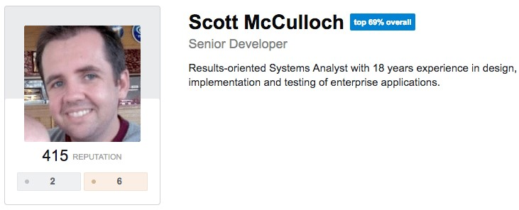
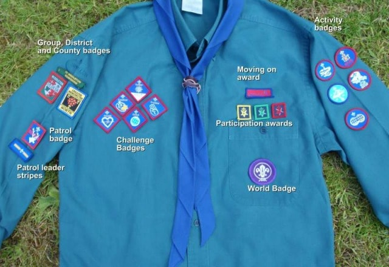

In late 2012 I embarked on a project to implement Gamification for a technical community ([devcentral.f5.com](https://devcentral.f5.com)). The intent was to introduce the elements of game playing (point scoring, competition with others, rules of play) to encourage a deeper engagement.

The implementation of Gamification in an app or website is fairly trivial if you understand a few high level concepts.

<!--more-->

## Actions, Actions, Actions

The core fundamental concept of implementing game mechanics is the measurement of actions.

The definition of an action is **any activity performed by a user**.

Our project was a technical community (similar to [StackOverflow](http://www.stackoverflow.com)) which had actions as follows:

- Ask a Question
- Add an Answer
- Add a Comment
- Vote up a Question
- Vote down a Question
- Accept an Answer
- Vote up an Answer
- Vote down an Answer

After the actions were identified, we assigned value to each. The primary element of value is **reputation**, the externally visible representation of a person's contributions:

To make things a little more complicated, there are 2 types of way reputation is awarded.

The first is when I perform an action and it is given to myself:

- Ask a Question (+1)
- Add an Answer (+2)
- Add a Comment (+1)

The second is when a user performs an action and awards reputation to another user:

- Vote up a Question (+10) - _person who asked question gains reputation_
- Vote down a Question (-2) - _person who asked question loses reputation_
- Accept an Answer (+15) - _person who submitted answer gains reputation_
- Vote up an Answer (+10) - _person who submitted answer gains reputation_
- Vote down an Answer (-1) - _person who submitted answer loses reputation_

You'll notice a difference in the amount of points between the two sets. The second is a vote by your peers and is therefore rewarded better.

## Badges, Levels & Privileges

Now that we have discussed **actions** and the accumulation of **reputation**. It's time to look at what we can do with **reputation scores**.

### Badges

Similar to a Scout's badges, the awarding of badges is a visual display of a user's achievements.

The awarding of badges uses three different methods:

1. **Action Based**: uses actions to construct a badge based on a user performing an action X number of times (e.g. Primary Voter Badge: vote up 10 questions)

2. **Event Based**: uses events to construct a badge based on an event happening X number of times (e.g. A user's question is viewed 500 times)

3. **Administrator Based**: awarded manually by a site administrator (e.g. user of the month)

### Levels & Privileges

Similar to badges, levels can be an external display of a user's achievement.

1. Newbie (0+)
2. Padawan (10+)
3. Jedi Knight (100+)
4. Jedi Master (1000+)

Furthermore, levels can also be used to control privileges. We didn't want users to register a new account and then vote up their own content so we made up voting meet a level requirement.

- Vote up an Answer (+10) - _requires Padawan level_

At one point in time, we had a spammer attack the site over many weeks. During this period we used game mechanics to restrict the posting of questions and comments by making you complete a series of tasks to accumulate points first. After the attacks subsided, we adjusted the game again to remove this requirement.

## Advanced Concepts

While those are the basis of gamification, there are many other ways you can adjust the game.

### Bounties

Bounties are a great way to give user's additional incentive to perform certain actions. You might place a bounty (additional reputation) for a particular action, e.g. give an extra 50 reputation per accepted answer on Technology X questions for this month.

### Challenges

Similar to bounties, a challenge can be a sequence of actions that a user might be _challenged_ with. e.g. Award extra reputation for a user who submits an article, a code snippet and answers 5 questions this month.

### Internal Metrics on Actions

We also recorded an internal metric on each action. This was only visible internally and allowed us to measure the engagement of the overrall site (irrespective of how much reputation was given). This was a much better representation than page views and we called it experience points.

### Adjustments

I wanted to mention that adjusting the game is also an option over time. We found some of our initial reputation assignments needed to be increased or decreased over time. These were not retrospective as it's important to keep people's overall scores intact.

## Conclusion

Gamification is a great tool that you can add to any user-contributed community. It inspires engagement, rewards and recognises those most active in the community.

If you are interested in seeing some code, [I've written a library for the DNN CMS](/files/post-assets/gamification.01.00.00.source.zip) with an [associated presentation](/files/post-assets/gamification.pptx).
