The year was 1994, the first **Collectible Card Game (CCG)** I ever encountered was **Spellfire**, a game based on the popular **Dungeons & Dragons** role playing game. As an avid reader of fantasy books and computer games based on the realms of **Dragonlance**, **Forgotten Realms**, **Dark Sun** and **Ravenloft**, Spellfire was the gateway drug into the CCG genre that continues today.

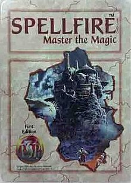

I was fascinated with the blend of card games and the realms of fantasy that I loved. Being able to play iconic heroes such as **Tanis Half-Elven**, **Raistlin Majere**, **Drizzt Do'Urden** and villians like **Lord Soth**, **Count Strahd von Zarovich**, **Takhisis, Queen of Darkness** was immensely fun. As a huge fan of **Dragonlance**, I could base my gameplay around personal tastes!

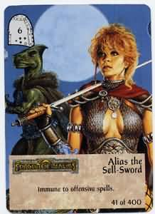

## Spellfire Rules & Gameplay

### Deck Composition

Each player starts with a customised deck of **55 cards** consisting of the following ratio of card types:

- **Rule Cards**: 0-3
- **Realms**: 8-15
- **Holdings**: 0-8
- **Champions**: 1-20\*
- **Artifacts**: 0-10
- **Magical items**: 0-12
- **Events**: 0-10
- **Allies**: any number
- **Abilities**: any number
- **Spells**: any number

> **Note**: total number of **champion levels may not exceed 90**. e.g. Tanis is a level 6 champion.

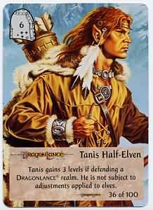

You can tell the card types due to their orientation (horizontal = realms, vertical = all others).

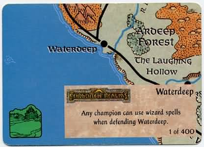

The icon indicates the class (wizard, warrior, psionic, etc). Spells, allies and abilities will have a number modifier (**+** or **-**).

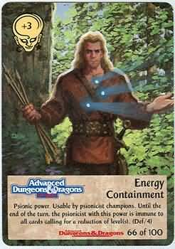

The **world a card belongs to** is important. At the bottom of each card are logos from their respective worlds (e.g. Dragonlance, Forgotten Realms, Greyhawk, etc.). Cards will receive bonuses when played from the same world and some may only be played together.

> For example, a **Dragonlance champion can only use Dragonlance artifacts**. Dragonlance realms can only have Dragonlance holdings.

### Objective

The objective of the game is **build an empire of six unrazed realms**.

Realms must be played in a triangle fashion. The first realm played is the top point of the triangle. The second row must then be filled before any realms are placed in the third row. In this way, your opponent must always attack your front realm (if it's not razed) and protects those behind.

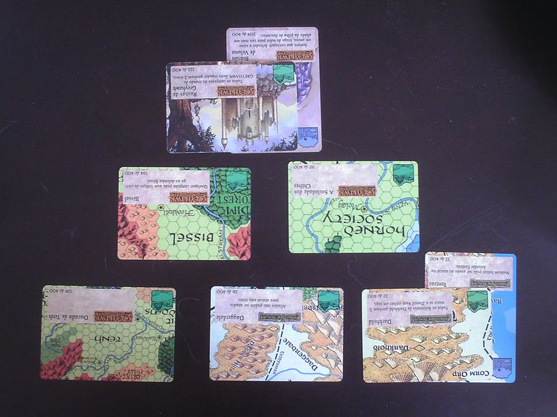

### Starting the Game

To determine who goes first, each player randomly draws one card from their deck and reveals the last digit of the card number. The player with the highest number goes first. If it's a draw, repeat until someone wins.

Your starting hand consists of **five cards**. The maximum number of cards in your hand is 8.

### Gameplay

Every player follows the following turn sequence.

**_[Optional]_ Phase 0: Play a rule card **

A player may choose to play a rule card from hand.

> For example, Marco Volo allows you to look at the top of an opponent's deck and optionally discard. This would eventually be known as **scrying** in other card games!

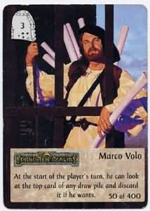

**Phase 1: Draw 3 cards from the draw pile**

Some cards will allow you to draw extra but the default is 3. Remember, your maximum hand size is 8 and you cannot exceed this.

**_[Optional]_ Phase 2: Play a realm and/or holding**

Only one realm and holding can be played per turn.

To play a realm, you may:

- Play a new realm from hand
- Discard 3 cards to rebuild an existing razed realm
- Replace a razed realm with a realm from hand

To play a holding, you may only attach to realms of the matching type.

> For example, the spellfire citadel can only be attached to realms from AD&D.

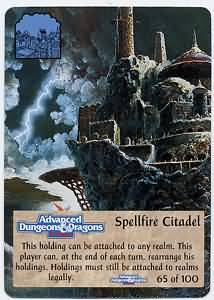

**_[Optional]_ Phase 3: Play cards into pool and use spells, psionics, blood abilities, or thief skills**

You may:

- Place any number of **champions, artifacts and magical items** into the pool. The pool exists to right of your triangle realm formation.

> The pool is the holding area for your cards that are ready to defend or attack other realms. By playing cards into the pool you reduce your handsize and avoid discard in phase 5.

- Use any phase 3 spell, psionic power, blood ability or thief skill (there must be a champion of that class in the pool to use the spell, power or ability)

**_[Optional]_ Phase 4: Attack one realm of another player**

The steps for combat are as follows:

- You may select an opponent's realm to attack.

> A realm must be accessible through the triangle formation. Non-razed realms will block those on lower levels from being attacked.

- Select a champion from your hand or pool to initiate the attack.

> If the **attacker** is from the same world as the attacked realm, he adds 3 to his adjusted level!

- The defender selects a champion from hand or pool to defend the realm

> If the **defender** is from the same world as the attacked realm, he adds 3 to his adjusted level!

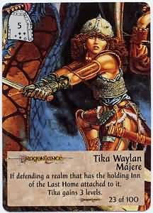

> Tika gains 3 levels defending any realm with the **Inn of the Last Home** attached.

- The atacker's special power and attached cards activate first, followed by the defender's special power and attached cards.

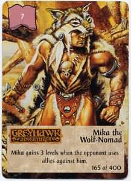

> Mika adds levels anytime an opponent uses allies against him.

- Compare the total levels of each side

- The player that is losing **can play a card** until they are winning. This goes back and forth until a winner is determined.

> Playing Thri-kreen adds +3 to that champion's level.

- The player with the highest adjusted level wins that round

> The defender always wins ties.

- The **winner** places his champion with all attached cards back into his pool. Allies, spells and other non-permanent cards are discarded.

- The **loser** discards all the cards used in combat (including his champion)

> If the loser is the defender, their realm is razed (flipped over).

- The victor earns the **Spoils of Victory** which is to draw one card from your **opponent's deck**.

**Phase 5: Use phase 5 cards and adjust the hand size**

You may:

- Play any special phase 5 cards.

You must:

- Discard down your maximum hand size (**5 cards**)

### Special Rules

🌎 **Rule of the Cosmos**

Only one of each champion, artifact, realm, and holding card can be in play at once. While one player has a specific champion, artifact, realm, or holding in play, no other player can have that card in play.

> Cosmos is a Greek word and means **everything that exists anwyhere**.

➕ **World Bonuses**

When a champion attacks or defends a realm from the same world, that champion’s adjusted level is increased by 3.

✈️ **Flyers, swimmgers AND earthwalkers**

- Flyers may attack any realm regardless of position.
- Swimmers may attack any realm showing a coastline.
- Earthwalkers can move underground to attack any realm that doesn't have special movement requirements (e.g. only clerics can attack).

### Thoughts & Observations

In terms of aesthetics, the card art was reused from existing TSR properties. As someone who was very familiar with artists such as [Larry Elmore](http://www.larryelmore.com/), it was great to see them in card form!

> On a negative note, the cards themselves were printed on poor stock and felt a little cheap.

The game itself had some **interesting design mechanics** I remember:

🏕️ **Resource Management**

Spellfire differentiated itself from Magic the Gathering as it had no resource management. You weren't required to play lands allowing you to ramp up from small to large creatures. This allowed games to be consistent and fast.

🖐️ **Play from hand or pool**

An interesting strategy (or bluff mechanic) allowed you to either play champions to your pool or play direct from hand.

🤏 **Borrowing from opponent's deck**

The **Spoils of Victory** rule allowed you to borrow a card from an opponent's deck. For a physical game, ownership at end of game becomes a difficult task, not to mention the heathens that didn't use card sleeves. For digital games today, it's a common mechanic:

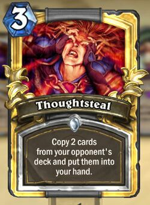

🧞 **Wish**

The **Wish spell** card was the most powerful spell in the game. It ignored all cards that state they are immune or otherwise unaffected by spells unless they state an immunity to the Wish spell. Regardless of a champion’s immunities or special powers, Wish can discard them. It was the ultimate response to your opponenent's game state.

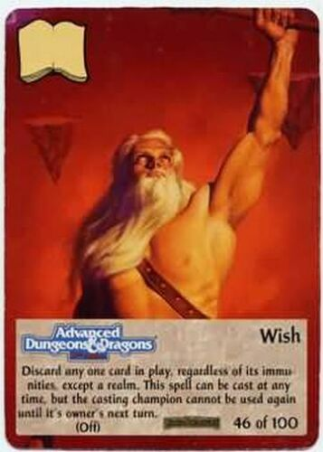

Again, you can see this in modern digital games:

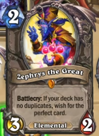

### Timing & Expansions

In April 1994, Spellfire was launched shortly after Magic the Gathering from Wizards of the Coast. The popularity of Magic caught TSR off guard and they pushed out Spellfire in response. The game had 4 editions and 11 expansions:

- [June 1994] - 1st Edition
- [August 1994] - Ravenloft
- [August 1994] - 2nd Edition (20 rares replaced in 1st edition)
- [September 1994] - Dragonlance
- [November 1994] - Forgotten Realms
- [May 1995] - Artifacts
- [September 1995] - Powers
- [October 1995] - 3rd Edition
- [December 1995] - The Underdark
- [February 1996] - Runes & Ruins
- [May 1996] - Birthright
- [July 1996] - 4th Edition
- [July 1996] - Draconomicon
- [September 1996] - Nightstalkers
- [October 1997] - Dungeons

In 1997 it was cancelled by Wizards of the Coast (who had bought out TSR).

### Final Thoughts

Remembering Spellfire was thinking about a wonderful time in my life. I was 16 years old experiencing my first CCG. It was a blend of rich lore from the D&D universe and a competitive card game where you could play your favourite characters, items and locations.

Yes, the gameplay was a little clunky but it was an ambitious response to the behemoth that Magic the Gathering would eventually become. It's design mechanics are echoed in modern card games today, a nice achievement for a game designed a few decades ago and deserving of a spot in CCG history.
