There are over 180+ novels based on the Dragonlance world. Presented is an **essential reading path** that will cover the main narrative of Krynn followed by thematic groups of novels.

You don't have to read all of it, you may in fact stop after the lost chronicles and decide to read more about the heroes of the lance. The world of Dragonlance is large and the journey is where you take it.

## Essential Reading Path

> Chronicles cover the War of the Lance, the cornerstone of Dragonlance.

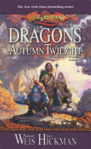

### Dragons of Autumn Twilight

Dragons from the distant past gather to engulf the world of Krynn in war.

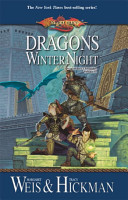

### Dragons of Winter Night

When dragons invade the land, a small band of heroes, including a knight, barbarian, dwarf, and half-elf, begin the search for the magical Dragon Orb and Dragonlance.

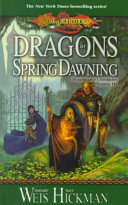

### Dragons of Spring Dawning

Finally armed with dragonlances, a group of heroes, composed of a knight, barbarian, dwarf, and half-elf, face a deadly showdown with the evil dragons and Takhisis, the Queen of Darkness

> Shortly after the War of the Lance, this series continues the journey of Raistlin and Caramon.

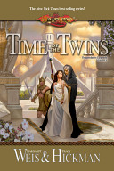

### Time of the Twins

In the uneasy peace following the War of the Lance, Caramon and Tasslehoff the Kender set out to reform Caramon's twin brother Raistlin, the most powerful warrior of evil in the land of Krynn.

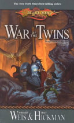

### War of the Twins

Raistlin, the enigmatic but evil magic-user, gathers his powers to destroy the Queen of Darkness, but his twin brother, Caramon, together with Tasslehoff the Kender, braves overwhelming odds in a distant time dimension to stop him.

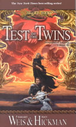

### Test of the Twins

Caramon must travel back and forth in time in order to save the world from his twin brother, Raistlin, who has become the Master of the Tower of High Sorcery.

> The lost chronicles cover the background events of the War of the Lance.

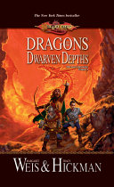

### Dragons of the Dwarven Depths

Picking up where the first book of the classic Dragonlance Chronicles left off, this tale follows the Companions of the Lance on their adventures following the rescue of the refugees of Pax Tharkas.

### Dragons of the Highlord Skies

Seeking a dragon orb rescued from the Tower of High Sorcery in Planathus by an elven wizard before its fall to the forces of the Kingpriest, the Dragon Highlord Ariakas assigns the task of retrieving it to Kitiara Uth-Matar.

### Dragons of the Hourglass Mage

Raistlin Majere, a Black Robe wizard, must battle his sister, Kitiara, and her terrifying ally, the death knight Lord Soth, in order to thwart Takhisis, the Dark Queen.

> The War of the Lance is over and now is the time of the next generation of heroes.

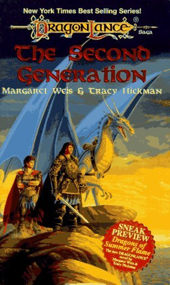

### The Second Generation

Years have passed since the end of the War of the Lance. The people of Ansalon have rebuilt their lives, their houses, their families. The Companions of the Lance, too, have returned to their homes, raising children and putting the days of their heroic deeds behind them.
But peace on Krynn comes at a price. The forces of darkness are ever vigilant, searching for ways to erode the balance of power and take control.

### Dragons of Summer Flame

Summer has come to Krynn, a summer unlike any before. The sun bears down on land and sea, searing the world with relentless light and heat. Clouds and rain are nowhere to be found, and even the darkness of night brings little relief from the strange and oppressive day.

> Core fifth age novels set after the Chaos War.

### The Dawning of a New Age

The Summer of Chaos has ended. Ansalon's nightmare has only just begun.
The gods have departed the world, heralding a new Age of Mortals. But before the dust of war can settle, vast shadows cover the land. Dragons have come to Ansalon, larger and more powerful than any ever seen, and they will wreak havoc on nations still trembling from war. As the lands themselves begin to change under the dire magic of the new dragon overlords, new heroes arise to lead the fight for freedom.

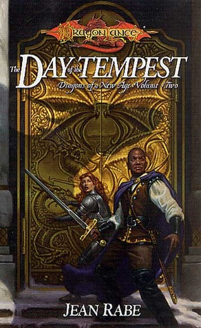

### The Day of the Tempest

The Summer of Chaos has ended.
Ansalon's nightmare has only just begun. The gods have departed the world, heralding a new Age of Mortals. But before the dust of war can settle, vast shadows cover the land. Dragons have come to Ansalon, larger and more powerful than any ever seen, and they will wreak havoc on nations still trembling from war. As the lands themselves begin to change under the dire magic of the new dragon overlords, new heroes arise to lead the fight for freedom.

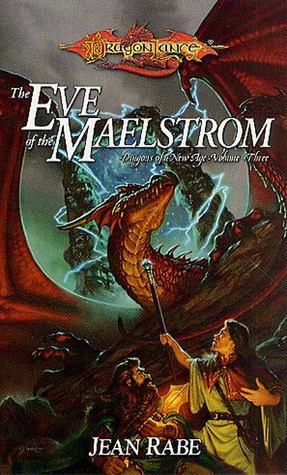

### The Eve of the Maelstrom

The Summer of Chaos has ended.
Ansalon's nightmare has only just begun. The gods have departed the world, heralding a new Age of Mortals. But before the dust of war can settle, vast shadows cover the land. Dragons have come to Ansalon, larger and more powerful than any ever seen, and they will wreak havoc on nations still trembling from war. As the lands themselves begin to change under the dire magic of the new dragon overlords, new heroes arise to lead the fight for freedom.

### Downfall

A one-time Hero of the Heart, Dhamon Grimwulf has descended into a life of crime, bitterness, and squalor, but as the dragon overlords of the Fifth Age plot to destroy their enemies, he, with the help of his former comrades, must redeem himself from his self-destructive life.

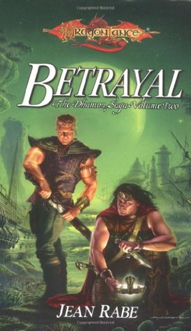

### Betrayal

How much is an act of betrayal worth?
Worth the price of a soul?
Dhamon Grimwulf and his band of mercenaries greedily eye a long-forgotten treasure concealed beneath a grassy plain. Legends promise riches too numerous to count, wealth too grand to be believed. But in a shifting world of secrets and deception, such fortune comes at a high price, higher even than the searing agony Dhamon suffers under the curse of a dragon's scale.

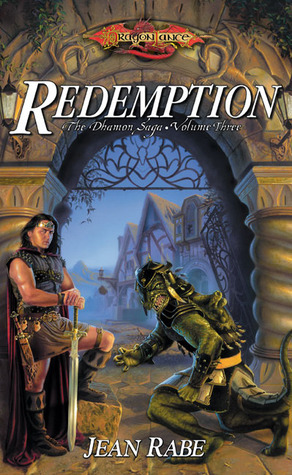

### Redemption

The third and final title in the Dhamon Saga.. This title ties up the story of a character first introduced in popular Dragonlance saga author Jean Rabe's Dragons of a New Age trilogy.

> Novels concerning the Age of Mortals

### Dragons of a Fallen Sun

The people of Krynn have known war in past ages. Some are still alive who remember the triumph of good at the conclusion of the War of the Lance. Still more remember the devastation of the Chaos War, which ended the Fourth Age of the world.

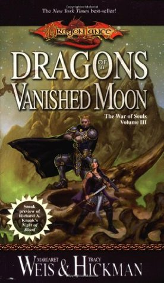

### Dragons of a Vanished Moon

The flames of war devour Ansalon. The army of dead souls marches toward conquest, led by the mystical warrior Mina, who serves the powerful One God.

A small band of heroes, driven to desperate measures, leads the fight against overwhelming odds.

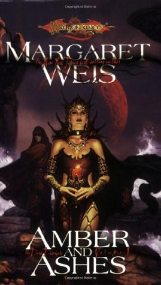

### Amber and Ashes

A new trilogy from Dragonlance setting co-creator Margaret Weis takes up where the War of Souls series left off with the central character Mina. While following her story, this new trilogy also explores the chaos that is post-war Krynn. This is Weis’s first solo trilogy in the Dragonlance world.

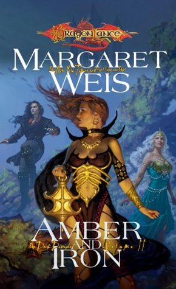

### Amber and Iron

The world of Krynn is ever changing, and even the gods can be taken by surprise. And if that's true of the gods, what chance can a mere mortal have? Caught up in forces none of them could hope to face alone, a small but determined band of adventurers come together in a desperate attempt to stop an invasion.

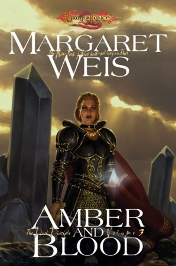

### Amber and Blood

The Dark Disciple's fate will alter the future of Krynn. In the concluding volume of this post-War of Souls trilogy, Mina learns the truth about herself and the terrible knowledge drives her insane. Rhys, the monk of Majere, accompanied by his dog Atta and the kender Nightshade, is given the dangerous assignment of guarding the crazed god, escorting her on a long, strange journey to the mysterious place known as Godshome, where Mina hopes to find the answer to the riddle of her existence.

## Congratulations! End of Essential Reading!

Now your reading journey is where you want to take it. I've grouped some of my favourite novels into themes. These can be read in any order.

## Recent Past - Heroes of the Lance

> Novels that feature time travel during War of the Lance. New for 2022!

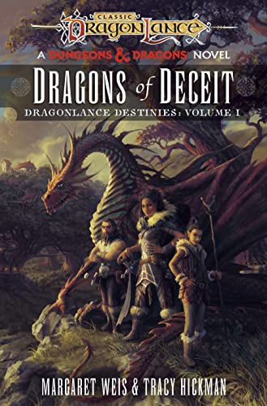

### Dragons of Deceit

Destina Rosethorn--as her name implies--believes herself to be very much a favored child of destiny. But when her father dies in the War of the Lance, her carefully-constructed world comes crashing down. 

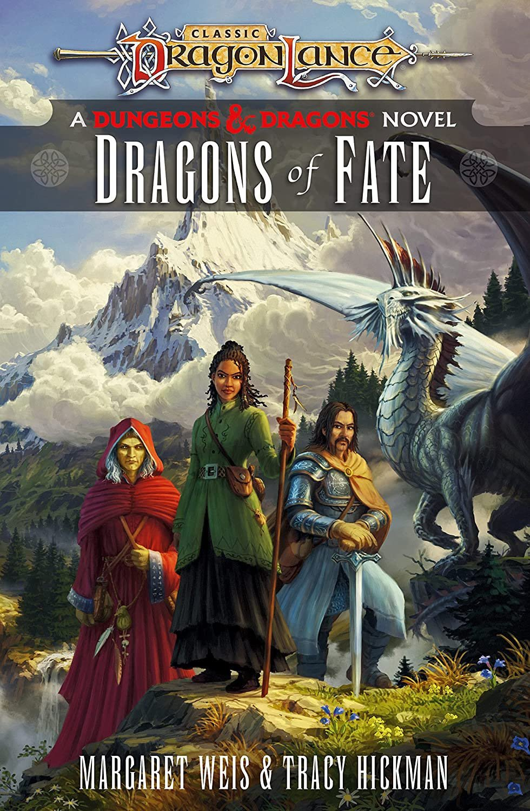

### Dragons of Fate

A courageous heroine trapped in the distant past is determined to return to her own time—without changing the shape of the world forever!

> Novels about the companions set before the War of the Lance.

### Darkness & Light

The Companions have gone their separate ways, each vowing to return with news of the growing darkness in Ansalon. Sturm Brightblade, a warrior whose honor is his life, and Kitiara, a passionate woman of uncertain loyalties, travel north in search of Sturm's long-lost father.

### Kendermore

Before the War of the Lance, carefree kender Tasslehoff Burrfoot is enjoying the company of his friends at the Inn of the Last Home when a bounty hunter arrives and charges him with desertion for violating the kender laws of prearranged marriage. But Tasslehoff's intended has pulled a disappearing act of her own. The race is on to see who gets dragged to the altar first in a tale of adventure replete with magic, monsters, and mayhem.

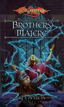

### Brothers Majere

Darkness and unrest are growing. People disappear in the night, and there are rumors of foul forces at work. To this land caught in the grips of a nameless terror come Raistlin and Caramon Majere, two brothers--one a wizard, one a warrior--who are trying to eke out a living on the backroads of Ansalon. Desperate for money, they agree to take on a job in the backwater village of Mereklar. But they soon discover they may be in over their heads. A beautiful noblewoman, a savage beast, the Queen of Darkness, and a spellbound kender will decide the fates of the brothers Majere.

### Riverwind the Plainsman

Fourth in a series of recovers of the classic Preludes series. First launched over a decade ago, the Preludes series has continued to prove popular with Dragonlance fans. This re-release of Riverwind the Plainsman showcases a new look that is also reflected in the other recovers of this series.

### Flint the King

First launched over a decade ago, the Preludes series has continued to prove popular with Dragonlance fans. This digital release of Flint the King showcases a new look that is also reflected in the other recovers of this series. The title features cover art from lead Dragonlance saga artist Matt Stawicki.

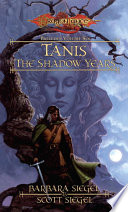

### Tanis, the Shadow Years

First launched over a decade ago, the Preludes series has continued to prove popular with Dragonlance fans. This re-release of Tanis, The Shadow Years showcases a new look that is also reflected in the other recovers of this series.

> Novels about how the Heroes of the Lance first meet.

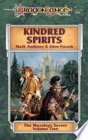

### Kindred Spirits

When Flint Fireforge, dwarf and metalsmith, receives a wondrous summons from the Speaker of the Sun, he journeys to the fabled elven city of Qualinost. There he meets Tanis, a thoughtful youth born of a tragic union between elf and man. Tanis and Flint, each a misfit in his own way, find themselves unlikely friends. But a pompous elf lord is mysteriously slain, and another elf soon meets the same fate. Tanis stands accused, and if his innocence cannot be proven, the half-elf will be banished forever.

### Wanderlust

One spring day Tasslehoff Burrfoot comes to Solace, accidentally pockets a copper bracelet, and (forcibly) makes the acquaintance of Tanis Half-Elven and Flint Fireforge. A simple tale. Except that the fate of the entire race of Dargonesti sea elves hangs in the balance. How does this piece of kender-coveted jewelry lead the companions and a sea elf princess to ally with the phaethons, creatures with wings of flame?

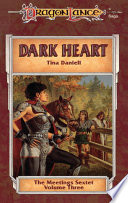

### Dark Heart

At long last, the story of the beautiful dark-hearted Kitiara Uth Matar. This compelling novel tells the story of the birth of her twin brothers, the warrior Caramon and the frail mage Raistlin, and Kit's admirable role in their upbringing. But her youthful mercenary deeds and increasing fascination with evil throw her into the company of a roguish stranger and band of adventurers whose fates are intermingled with her own. Haunted by the memory of her Solamnic father, she hunts him ceaselessly.

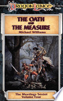

### The Oath and the Measure

Although Raistlin and Caramon urge him not to go, Sturm Brightblade attends an annual Solamnic ceremony that is interrupted by ... A stranger, taunting challenge. Clues from the past. Death. Once he accepts a mysterious gauntlet, young Sturm must make a dangerous journey with some curious friends, rescue a fair if querulous maid, defeat a traitor knight, and learn the secret fate of his long-lost father. He must also learn the meaning of honor.

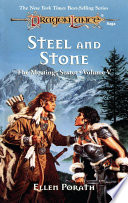

### Steel and Stone

The tempestuous affair of Kitiara Uth Matar and Tanis Half-Elven begins with the sword. Life isn't simple for the hotheaded pair. They must contend with a carnivorous, two-headed troll; a deposed leader who believes Kitiara is the cause of the ruler's troubles; a vindictive mage who seeks peculiar vengeance; and Kit's hulking former lover. They also meet a beautiful magic-user hiding a painful secret, and a giant owl with a sardonic sense of humor.

### The Companions

Caramon, Sturm, and Tasslehoff, on an innocent ship's errand, are blown thousands of miles off course by a magic windstorm and transported to the eastern Bloodsea. Caramon and Sturm are left for dead while Tasslehoff mysteriously turns against his friends... Back in Solace, Raistlin convinces Flint Fireforge and Tanis Half-Elven that they must make a perilous journey to Mithas, the kingdom of the minotaurs. Their task: not only to rescue their friends, but also to defeat the elusive Nightmaster.

> Want more Raistlin & Caramon? These novels explore their youth.

### Soulforge

The story of Raistlin and Caramon's youth, of their mother and father and wayward half-sister Kitiara. Life-long friendships are forged in peacetime - Solace with the would-be knight Sturm, Flint Fireforge, half-elf Tanis, and kender Tasslehoff.

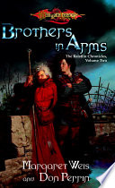

### Brothers in Arms

In the fiery siege of the city of Hope’s End the young mage Raistlin must leave behind his ideals to save himself and his brother. Yet as Raistlin and Caramon train as mercenaries, far away another soul is forged in the heat of battle. Another path is chosen, and a future dragon highlord begins her rise to power. She is Kitiara Uth Matar, the twins’ half sister.

> Individual novels of figures in the recent past.

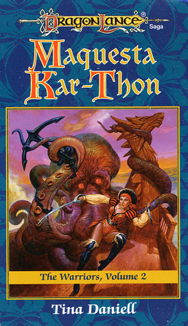

### Maquesta Kar-Thon

At 18, Maquesta Kar-Thon captains the Perechon to save her father. The minotaur lord Attat poisoned him, and withholds the antidote until she captures the deadly sea monster Morkoth for his private zoo. Attat sends along renegade minotaur Bas Ohn-Koraf and shadowperson warrior Ilyatha to fight pirates, Blood Sea imps, kuo-toa, and a skeptical crew.

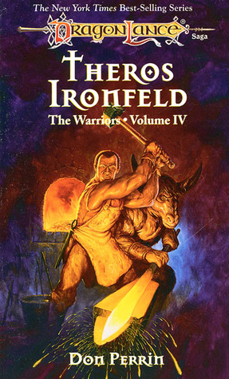

### Theros Ironfield

As a young boy, Theros Ironfeld was captured and pressed to service under the minotaurs. As a man, he first fought draconians to a standstill in Solace, and later, by mysterious means, acquired a silver arm. And when the evil dragons came to conquer, he was the only man who could forge the fabled dragonlances necessary to defeat them.

### Before the Mask

In the bleak Khalkist Mountains, on a stormy winter night, a child is born amid hard words, ill will, and the ominous prophecy of a druidess. Young Verminaard grows up unlovely and unloved, trading friends and family for a dark romance with an evil, mysterious voice and the sinister weapon it comes to inhabit.

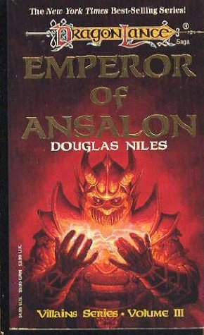

### Emperor of Ansalon

Vast armies surge across Krynn, spreading shadows of evil dragonkind over the land. All these horrific forces follow the commands of one man. . .

Ariakas, the Emperor of Ansalon.

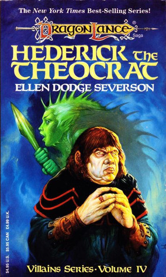

### Hederick the Theocrat

Hederick, leader of the Seeker religion in Solace and self-ordained conscience of Krynn, embarks on a terrifying inquisition that threatens all who follow magic and the true gods and allows the forces of evil into the world.

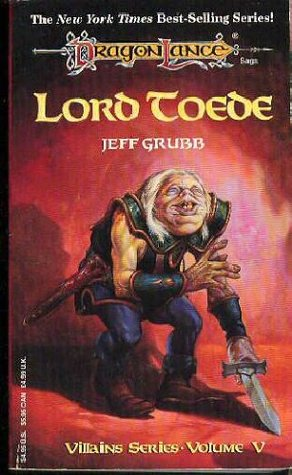

### Lord Toede

In the depths of the Abyss, the domain of Takhisis, two dark powers argue over the nature of true nobility. To see if the ignoble can be made noble, they return one of their evil-hearted agents to life. They choose Fewmaster Toede, former ruler of Flotsam, recently dead from dragon fire.

## Distant Past

> Heroic tales of Huma and his faithful companion, Kaz the minotaur.

### The Legend of Huma

"To the West Huma rode, to the High Clerist's Tower,
On the back of the Silver Dragon
And the path of their flight crossed over a desolate country
where the dead walked only, mouthing the names of dragons."

### Kaz the Minotaur

After the death of the legendary knight Huma, Kaz, a renegade minotaur, wanders the land of Ansalon, hunted by his own kin for escaping the servitude of the Dark Queen and by the Knights of Solamnia, his former comrades, who have declared him an outlaw.

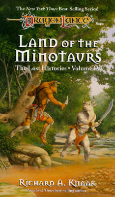

### Land of the Minotaurs

Throughout the time of Krynn, one race has remained strong in its pride and beliefs. The minotaurs envision themselves as the children of destiny, the future masters of the world. Despite adversity, defeat, and enslavement, that belief has never wavered.

> The history of the Dwarven clans and the founding of Thorbardin.

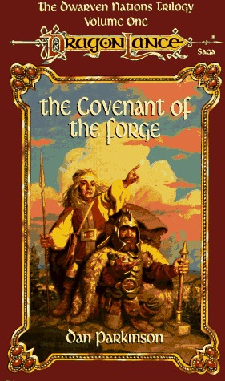

### The Covenant of the Forge

Explores the folklore and history of the dwarven clans of Krynn through the bickering clans' reconciliation and the construction of the legendary Thorbardin.

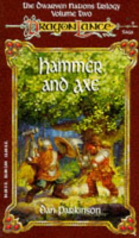

### Hammer and Axe

When the humans of Ergoth threaten Thorbardin, the clans of Thorbardin are drawn into territorial wars between humans and elves.

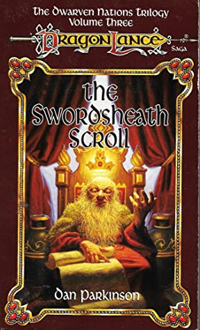

### The Swordsheath Scroll

Despite the stubborn courage of dwarven warriors, the protracted Wilderness War ends as a no-win. The Swordsheath Scroll is signed, and Thorbardin shows its support of the open-minded Qualinesti elves by joining in the construction of magnificent Pax Tharkas.

> The history of the elven nations.

### Firstborn

Silvanos, the august founder of the united elven nation known as Silvanesti, is dead and buried in a crystal tomb. The leadership of the clans and households has fallen to his son, Sithel, who is himself father of twin sons.

### The Kinslayer Wars

Kith-Kanan is torn between his love for a human woman with a mysterious background and his loyalty toward his brother and rival, Sithas, ruler of the Silvanesti elves, who has declared war on the humans of Ergoth.

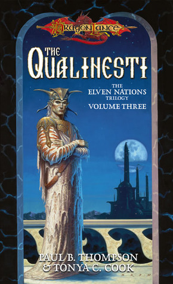

### The Qualinesti

When Kith-Kanan of Qualinost, a society of renegade elves, is appointed Speaker of the Suns, his triumph is marred by memories of past failures, his unfaithful wife, and the strange behavior of his successor, his son.

> The story of the Kingpriest of Istar.

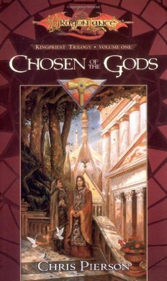

### Chosen of the Gods

After the Kingpriest fortells his own death, dark forces converge on the Temple and a priestess of the god Paladine enters on a quest to find the Lightbringer, chosen by the gods to bring light to battle the coming darkness.

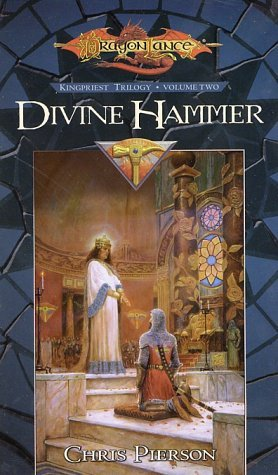

### Divine Hammer

Twenty years have passed since Beldinas the Kingpriest assumed the throne. His is a realm of unsurpassed grandeur and wealth, a testament to the mightiest age of the empire of Istar.
But evil exists in this great realm, threatening the peace and sanctity of the province. Beldinas must turn to his most loyal lieutenant, Cathan, for help. Following Cathan's lead, the Knights of the Divine Hammer strive to extinguish a foul sorcery that will stop at nothing to serve its own dark ends.

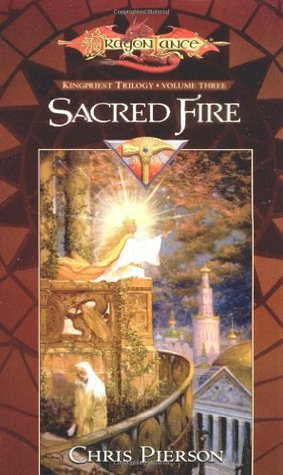

### Divine Hammer

As Beldinas, the Kingpriest of Istar, approaches victory in his long war against the forces of evil, his long-lost hero, Cathan Twice-Born, a one-time Kingpriest's champion, returns, seeking the meaning of a fateful dark vision of a burning hammer.

> Individual novels on figures from the distant past.

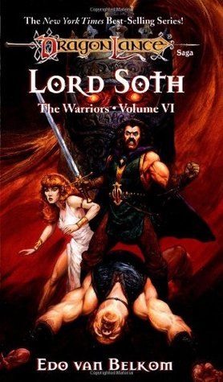

### Lord Soth

There once was a mighty warrior whose jealous passions and neglect of duty led him to lose all that was dear to him--his love, his life, his very spirit. His tale is a descent into darkness and evil.

His name was Lord Soth, and this is his story.

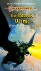

### The Black Wing

One score and six years before confronting the Companions in Xak Tsaroth, the black dragon Khisanth is awakened from a centuries-long sleep. The world she had known as a young wyrm is gone, irrevocably changed by the Cataclysm. Now fully grown, she has much to learn about being a dragon in a world where her kind are feared as the villians in stories told to children.

## Post War of the Lance

> The Chaos War has descended on Krynn, novels surrounding the core events.

### The Last Thane

For generations the baser clans of Thorbardin have raged against Hylar, ancestral rulers of the vast underground realm. Now, the finest Hylar army has marched away to face the Knights of Takhisis - and the dark dwarves see their opportunity. Besieged in the Life Tree that is their fortress city, the Hylar struggle to survive. Magic and madness threaten from all sides as Theiwar, Daergar and Klar press the onslaught with bloodthirsty frenzy.

### Tears of the Night Sky

Crysania, high priestess of the Temple of Paladine, is blind to the beauty of the world but not to the joy of her faith. Lately, though, her communion with the god of light has become distant. Now a mysterious stone has come into her possession. Its power compels her to undertake a merilous quest, accompanied by a strange band of companions.

### The Puppet King

Treason within, war from without.
Torn asunder by the nightmares of a mad king, the elven realm of Silvanesti has nearly been restored to its former grandeur. But the elf Porthios, returning to his homeland, launches a rebellion against young Gilthas, his own nephew.
Gilthas's troubles are multiplied by threats from green dragons and from the Knights of Takhisis. Now, with Porthios at his throat, Gilthas must choose between blood and honor.

### Reavers of the Blood Sea

During the hottest summer in memory, minotaurs fight against the Knights of Takhisis, into whose hands their god Sargonnas has delivered them. In the midst of the conflict, the armies of Chaos plunge into the heart of Ansalon.

Now the minotaur warrior Aryx must unite his people and their enemy, the knights, against the monstrous servants of Chaos. If he succeeds, the two sides may forge a bond that will change Krynn for all time.

### The Siege of Mt. Nevermind

A miraculous machine . . . and a nightmare!
Innova, a young gnomish recluse finds himself in a terrible situation. Tried in a gnomish court for an unfortunate accident and sentenced to spend months at the bottom of Mt. Nevermind tuning gnomeflingers, young Innova makes an incredible discovery. The whole gnomish society is changed by one machine that, unlike any other gnomish invention, makes the entire mountain run like clockwork.

> A personal favourite, learn the fate of Draconians after the War of the Lance

### The Doom Brigade

The fearless draconians of the War of the Lance have retired from the field of battle to a pleasant valley in the Kharolis Mountains. Well, it would be pleasant, if it weren’t for some dwarves, whose irritating feuding prevents the draconians from realizing their greatest hope — the ability to continue their doomed race. When the dwarves discover a map leading to a fortune buried in the dwarven kingdom of Thorbardin, the draconians are swept up in a feverish race for treasure.

### Draconian Measures

The regiment of draconian engineers featured in "The Doom Brigade" seek a safe haven for their precious cargo of young draconians. All they have to do is stay alive. Surely that shouldn't be too hard.
But Commander Kang puzzles over a sinister mystery. Why are some of his men vanishing? Kang will have to use draconian measures to defeat his foes and save his race. They'd better be enough -- the fate of his entire race hangs in the balance.

## Short Stories

> Tales surrounding the heroes of the lance and the races of Krynn.

### The Magic of Krynn

Containing nine superlative short stories and the novella "The Magic of Krynn" by "New York Times" bestselling authors Weis and Hickman, this collection boasts all of the strange creatures and races of Krynn, with appearances by the original Companions of the Lance.

### Kender, Gully Dwarves and Gnomes

It includes stories by some of the best-loved authors writing in the Dragonlance world, including a novella by New York Times best-selling authors and Dragonlance setting co-creators Margaret Weis and Tracy Hickman.

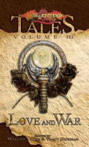

### Love and War

The legend of Raistlin's daughter! For the first time, Caramon, the surviving twin of the enigmatic and powerful mage, tells one of the strangest and best-loved tales in all of Krynn. Plus, immerse yourself in nine additional exciting short stories-tales of chivalry and affection, heroic quests and foul villainy, magic in battle and transcendent defeat-featuring all the beloved companions and fantastic creatures of the best-selling Dragonlance Saga.

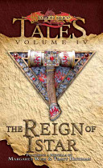

### The Reign of Istar

This collection of tales is edited by the creators of the Dragonlance mythology. The Reign of Istar contains a number of short stories by popular Dragonlance authors as well as a novella by Weis and Hickman.

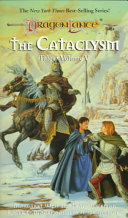

### The Cataclysm

The Kingpriest's arrogance brings the wrath of the gods upon Krynn. The result is the Cataclysm -- chaos and anarchy, despair and villainy . . . and inspiring heroism.

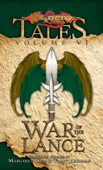

### The War of the Lance

The world of Krynn is caught in the grips of a terrible war between the minions of Takhisis, Queen of Darkness, and the followers of Paladine and the gods of good. Dragons, both foul and fair, clash in the skies, and a small band of friends who will one day be known as the Heroes of the Lance, strive for freedom and honor.

## Conclusion

I'll be updating this list overtime as I read more Dragonlance novels. If you have any suggestions, drop a comment below.

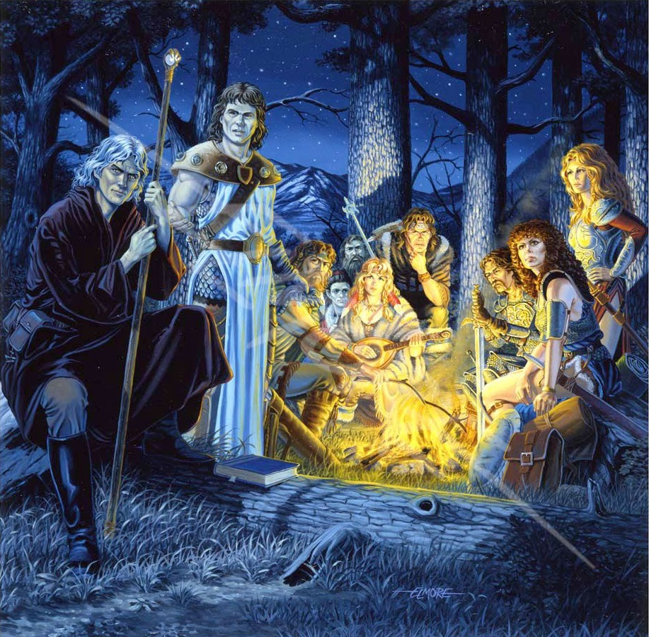
