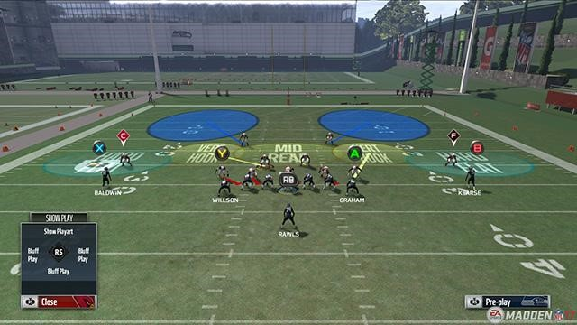
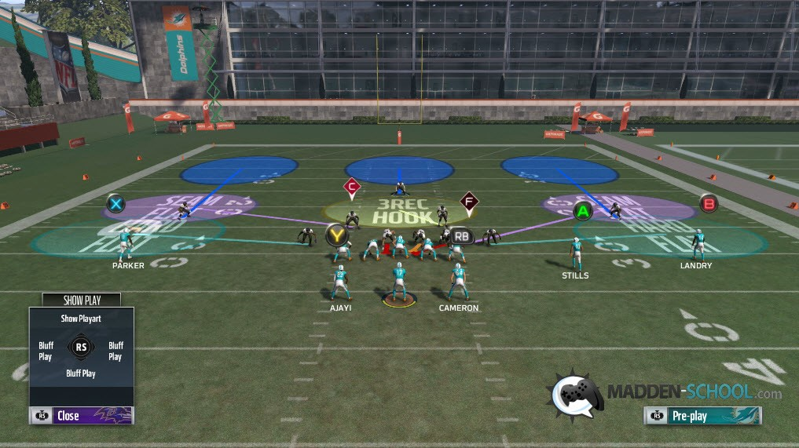
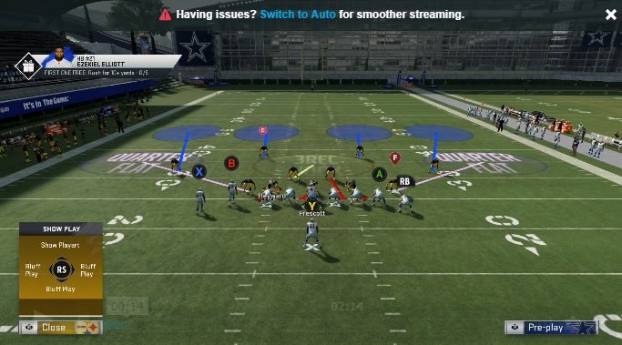

In preparation of the impending launch of Madden 21, this guide will provide a refresher on how **recognize** and **beat** various zone coverage schemes.

## Recognise & Beat Cover 2

### How to recognise?

Two deep safeties playing both sides of the field with the CB's playing about 5 yards off the line of scrimmage.

### How to beat?

**Expose the deep middle**:

Deep post routes over the middle. Try and get the CBs to play outside and audible your inside receiver to a drag/slant to draw the LB towards them to open up the underneath throw across the middle against the safety.

> Get the LB/CB out of the play so only the safety is shadowing your receiver across the middle.

**Over/Under routes on the outside (hi-low scenario)**:

Where you can get the CB to bite down on the under route which opens up the over route. Post routes/C routes with an underneath receiver work extremely well. If you can also audible your inside receiver to play across the deep middle/vert it can help draw the safetie to that player, and open up the Post/C routes. Posts with hitch routes on the underneath work well too.

> Watch if the CB drops back to cover the post or pulls forward to play the underneath and adjust accordingly.

**Verticals**

Once again this comes back to the deep across the middle. Hitting those seam receivers can work really well in these situations depending on how the LBs are playing their zones.

> Watch the deep seam receiver unless it's press hit the outside WR before they get to the safety. Sink: hit the TE over the LB or the HB.

**Wheels Slot/HB (RED ZONE)**

The CB covers the flat route and lets the wheel WR open up over the top. The outside guy should be drawing the safety to the inside to help open up the wheel.

> takes time to develop and works best in the redzone.

**Texas concept**

Try to draw the CBs to the outside of the field and while using your inside receiver to the draw the LBs back and hit the HB across the middle on the hi-low.

> Get the LBs to drop back to open up the HB for a catch.

## Recognise & Beat Cover 3

### How to recognise?

Primary way to recognize is spotting the one safety over the deep middle of the play and the two CBs on the outside about 7 to 8 yards off the line of scrimmage). With four other defenders playing on the inside ready to drop into the underneath coverages.

### How to beat?

**Verticals**

Hitting the seam receiver that the safety does not follow. The plan here is that your outside receivers draw the CBs towards them on the deep outside and that your seam receivers will break their coverage against the slower LBs.

> Look for the seam receiver that isn't being covered by the deep middle safety. Takes a bit of time for the receivers to break their coverage. In Press coverage your WR will be open for deep yardage. Non-Press try crossing TE because the safety is on a deep route , but this can mean a sack.

**Curl flats/comebacks**

Hitting the curl/comebacks, you need to have that underneath route to draw that flat defender from the inside and keep him down and outside to open up that curl/comeback. The deep CB will always being playing behind the curl or comeback so you should have plenty of time to get the ball to your receiver.

> Throw the ball right as your receiver is about to make their turn and to make sure that the flat defender actually bit down on the underneath/flat route.

**Pivots and Dig/In routes**

The hope here is when you run the dig/in route that at first the flat outside defender drops back and starts to cover him which pulls him off of your pivot route at the start of the play and then from there the LB over the middle will drop off the pivot route to cover your dig/in route which should open up the pivot routes.

> Waiting long enough that your dig/in route receiver breaks across the middle of the play and out runs his defender or to hit your pivot route for a solid 5-10 yard gain.

## Recognise & Beat Cover 4

### How to recognise?

Try spotting the two safeties and CBs playing in deep coverage with the CBs playing about 5 yards to the outside and 2 yards shallower than the safeties.

### How to beat?

**Stick concepts**

Using a stick concept will force the outside underneath zone defender to make a decision on which receiver to cover. If you run a slant from the opposite side of the stick and wait long enough for him to cross the whole field he can open up for much more yards than the stick.

> Make sure to wait and see which receiver the outside underneath zone defender is going to cover and hit the correct receiver.

**Hi-low concepts across the middle**

Running Hi-low plays across the middle to take advantage of the inside linebackers. Drive plays work well, along with deep in routes and an underneath drag route to go along with it (You can also add a drop off route to the outside to help draw in that close inside linebacker which causes the MLB to decide between the deep in route or the drag.)

> Wait to see which route the MLB decides to cover.

**Dig with Post/Switch routes**

These are the plays that can help get you some bigger yardage against cover 4 (20-40 range). You want to have a fairly deep dig across the middle to help occupy and draw the safeties down towards him to open up the deep post/switch route. You should be able to hit your deep guy right in the middle of the field. Always have your dumb off as an option.

> Waiting until the play fully develops and hitting your deep receiver when he’s right between the safeties.
