Previously I posted a [recommended Dragonlance reading order](/dragonlance-reading-order) based on the heroes of the lance. It focused on the chronicles and the chronological introduction of those characters.

Since a plethora of Dragonlance novels exist (160+), I wanted to have an alternate guide based around individual character paths. If you like a particular character, this guide has the books primarily associated with them.

## Raistlin & Caramon Majere

> Fan favourites of the series, the Majere twins and their turbulent upbringings.

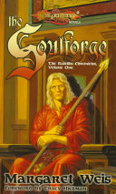

### Soulforge

The story of Raistlin and Caramon's youth, of their mother and father and wayward half-sister Kitiara. Life-long friendships are forged in peacetime - Solace with the would-be knight Sturm, Flint Fireforge, half-elf Tanis, and kender Tasslehoff.

### Brothers in Arms

In the fiery siege of the city of Hope's End the young mage Raistlin must leave behind his ideals to save himself and his brother. Yet as Raistlin and Caramon train as mercenaries, far away another soul is forged in the heat of battle. Another path is chosen, and a future dragon highlord begins her rise to power. She is Kitiara Uth Matar, the twins' half sister.

### Brothers Majere

Darkness and unrest are growing. People disappear in the night, and there are rumors of foul forces at work. To this land caught in the grips of a nameless terror come Raistlin and Caramon Majere, two brothers--one a wizard, one a warrior--who are trying to eke out a living on the backroads of Ansalon. Desperate for money, they agree to take on a job in the backwater village of Mereklar. But they soon discover they may be in over their heads. A beautiful noblewoman, a savage beast, the Queen of Darkness, and a spellbound kender will decide the fates of the brothers Majere.

### Dark Heart

At long last, the story of the beautiful dark-hearted Kitiara Uth Matar. This compelling novel tells the story of the birth of her twin brothers, the warrior Caramon and the frail mage Raistlin, and Kit's admirable role in their upbringing. But her youthful mercenary deeds and increasing fascination with evil throw her into the company of a roguish stranger and band of adventurers whose fates are intermingled with her own. Haunted by the memory of her Solamnic father, she hunts him ceaselessly.

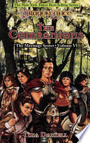

### The Companions

Caramon, Sturm, and Tasslehoff, on an innocent ship's errand, are blown thousands of miles off course by a magic windstorm and transported to the eastern Bloodsea. Caramon and Sturm are left for dead while Tasslehoff mysteriously turns against his friends... Back in Solace, Raistlin convinces Flint Fireforge and Tanis Half-Elven that they must make a perilous journey to Mithas, the kingdom of the minotaurs. Their task: not only to rescue their friends, but also to defeat the elusive Nightmaster.

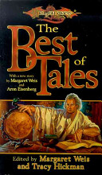

### Best of Tales Volume 1

Here are collected the best short stories of the original Dragonlance Tales 1 series, unfolding a world of heroism, magic, and fantasy. It is a treasure for loyal fans of the saga, and for new readers it is an enthralling introduction to the world of Krynn.

## Tanis Half-Elven

> The leader of the companions and tales of his troubled elven upbringings.

### Kindred Spirits

When Flint Fireforge, dwarf and metalsmith, receives a wondrous summons from the Speaker of the Sun, he journeys to the fabled elven city of Qualinost. There he meets Tanis, a thoughtful youth born of a tragic union between elf and man. Tanis and Flint, each a misfit in his own way, find themselves unlikely friends. But a pompous elf lord is mysteriously slain, and another elf soon meets the same fate. Tanis stands accused, and if his innocence cannot be proven, the half-elf will be banished forever.

### Tanis, the Shadow Years

First launched over a decade ago, the Preludes series has continued to prove popular with Dragonlance fans. This re-release of Tanis, The Shadow Years showcases a new look that is also reflected in the other recovers of this series.

### Steel and Stone

The tempestuous affair of Kitiara Uth Matar and Tanis Half-Elven begins with the sword. Life isn't simple for the hotheaded pair. They must contend with a carnivorous, two-headed troll; a deposed leader who believes Kitiara is the cause of the ruler's troubles; a vindictive mage who seeks peculiar vengeance; and Kit's hulking former lover. They also meet a beautiful magic-user hiding a painful secret, and a giant owl with a sardonic sense of humor.

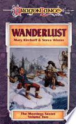

### Wanderlust

One spring day Tasslehoff Burrfoot comes to Solace, accidentally pockets a copper bracelet, and (forcibly) makes the acquaintance of Tanis Half-Elven and Flint Fireforge. A simple tale. Except that the fate of the entire race of Dargonesti sea elves hangs in the balance. How does this piece of kender-coveted jewelry lead the companions and a sea elf princess to ally with the phaethons, creatures with wings of flame?

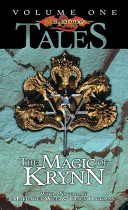

### The Magic of Krynn

Containing nine superlative short stories and the novella "The Magic of Krynn" by "New York Times" bestselling authors Weis and Hickman, this collection boasts all of the strange creatures and races of Krynn, with appearances by the original Companions of the Lance.

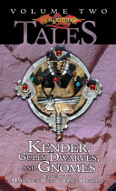

### Kender, Gully Dwarves and Gnomes

It includes stories by some of the best-loved authors writing in the Dragonlance world, including a novella by New York Times best-selling authors and Dragonlance setting co-creators Margaret Weis and Tracy Hickman.

### Love and War

The legend of Raistlin's daughter! For the first time, Caramon, the surviving twin of the enigmatic and powerful mage, tells one of the strangest and best-loved tales in all of Krynn. Plus, immerse yourself in nine additional exciting short stories-tales of chivalry and affection, heroic quests and foul villainy, magic in battle and transcendent defeat-featuring all the beloved companions and fantastic creatures of the best-selling Dragonlance Saga.

## Flint & Tasslehoff Burrfoot

> Flint & Tasslehoff for the lighter side of Krynn.

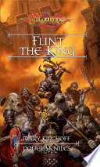

### Flint the King

First launched over a decade ago, the Preludes series has continued to prove popular with Dragonlance fans. This digital release of Flint the King showcases a new look that is also reflected in the other recovers of this series. The title features cover art from lead Dragonlance saga artist Matt Stawicki.

### Wanderlust

One spring day Tasslehoff Burrfoot comes to Solace, accidentally pockets a copper bracelet, and (forcibly) makes the acquaintance of Tanis Half-Elven and Flint Fireforge. A simple tale. Except that the fate of the entire race of Dargonesti sea elves hangs in the balance. How does this piece of kender-coveted jewelry lead the companions and a sea elf princess to ally with the phaethons, creatures with wings of flame?

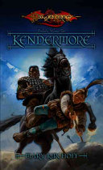

### Kendermore

Before the War of the Lance, carefree kender Tasslehoff Burrfoot is enjoying the company of his friends at the Inn of the Last Home when a bounty hunter arrives and charges him with desertion for violating the kender laws of prearranged marriage. But Tasslehoff's intended has pulled a disappearing act of her own. The race is on to see who gets dragged to the altar first in a tale of adventure replete with magic, monsters, and mayhem.

### The Companions

Caramon, Sturm, and Tasslehoff, on an innocent ship's errand, are blown thousands of miles off course by a magic windstorm and transported to the eastern Bloodsea. Caramon and Sturm are left for dead while Tasslehoff mysteriously turns against his friends... Back in Solace, Raistlin convinces Flint Fireforge and Tanis Half-Elven that they must make a perilous journey to Mithas, the kingdom of the minotaurs. Their task: not only to rescue their friends, but also to defeat the elusive Nightmaster.

### Best of Tales Volume 1

Here are collected the best short stories of the original Dragonlance Tales 1 series, unfolding a world of heroism, magic, and fantasy. It is a treasure for loyal fans of the saga, and for new readers it is an enthralling introduction to the world of Krynn.

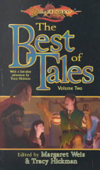

### Best of Tales Volume 2

Here are collected the best short stories of the Dragonlance Tales II series. For new readers, this is your invitation to a world of wondrous adventure and fantasy, while for longtime followers of the Dragonlance saga, this is a collector's edition of indispensable stories.

## Kitiara uth Matar

> The dangerous dragon highlord and her troubled past.

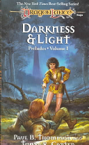

### Darkness & Light

The Companions have gone their separate ways, each vowing to return with news of the growing darkness in Ansalon. Sturm Brightblade, a warrior whose honor is his life, and Kitiara, a passionate woman of uncertain loyalties, travel north in search of Sturm's long-lost father.

### Dark Heart

At long last, the story of the beautiful dark-hearted Kitiara Uth Matar. This compelling novel tells the story of the birth of her twin brothers, the warrior Caramon and the frail mage Raistlin, and Kit's admirable role in their upbringing. But her youthful mercenary deeds and increasing fascination with evil throw her into the company of a roguish stranger and band of adventurers whose fates are intermingled with her own. Haunted by the memory of her Solamnic father, she hunts him ceaselessly.

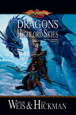

### Dragons of the Highlord Skies

Seeking a dragon orb rescued from the Tower of High Sorcery in Planathus by an elven wizard before its fall to the forces of the Kingpriest, the Dragon Highlord Ariakas assigns the task of retrieving it to Kitiara Uth-Matar.

## Riverwind

> Tales from the barbarian plains.

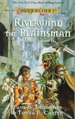

### Riverwind the Plainsman

Fourth in a series of recovers of the classic Preludes series. First launched over a decade ago, the Preludes series has continued to prove popular with Dragonlance fans. This re-release of Riverwind the Plainsman showcases a new look that is also reflected in the other recovers of this series.

## Sturm Brightblade

> Tales of the solamnic knight among the companions.

### Darkness & Light

The Companions have gone their separate ways, each vowing to return with news of the growing darkness in Ansalon. Sturm Brightblade, a warrior whose honor is his life, and Kitiara, a passionate woman of uncertain loyalties, travel north in search of Sturm's long-lost father.

