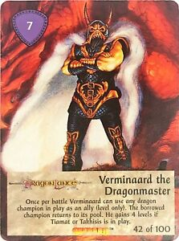
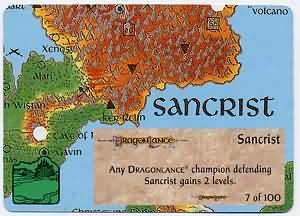
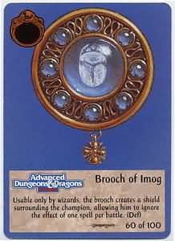
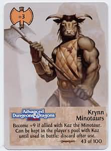

Recently I've been re-learning Spellfire, a Dungeons & Dragons CCG from the 90s. I've detailed the gameplay and mechanics [here](/remembering-spellfire-ccg-rules-gameplay).

I'm also a big Dragonlance fan, check out my [Dragonlance Reading Order](/dragonlance-reading-order).

Here is a 60 card Dragonlance deck you can use:

## Champions (9 Cards)

- 1 x Avatar of Kiri-Jolith
- 1 x Caramon Majere
- 1 x Dargent
- 1 x Governor Erann Flowstone
- 1 x Kaz the Minotaur
- 1 x Kiri
- 1 x Silver Dragon
- 1 x Raistlin Majere
- 1 x Wizard of the Black Robes

## Opposing Champions (8 Cards)

- 1 x Black Dragon
- 1 x Blue Dragon
- 1 x Cyan Bloodbane
- 1 x Deathstream
- 1 x Fire Dragon
- 1 x Skie
- 1 x Sleet
- 1 x Verminaard the Dragonmaster

## Realms (10 Cards)

- 1 x Cristyne
- 1 x Isle of Selasia
- 1 x Khur
- 1 x Nordmaar
- 1 x Northern Ergoth
- 1 x Plains of Dust
- 1 x Reorxcrown Mountains
- 1 x Sancrist
- 1 x Spine of Taladas
- 1 x Thorin

## Holdings (3 Cards)

- 1 x Inn of the Last Home
- 1 x Shoikan Grove
- 1 x The Lost Citadel

## Artifacts (3 Cards)

- 1 x Hammer of Kharas
- 1 x Shield of Huma
- 1 x The Nightjewel

## Magical Items (5 Cards)

- 1 x Blamblower
- 1 x Brooch of Imog
- 1 x Flute of Wind Dancing
- 1 x Inflatable Flotilla
- 1 x Irongnome

## Allies (5 Cards)

- 1 x Aurak Draconians
- 1 x Brine Dragon
- 1 x Kapak Draconians
- 1 x Krynn Minotaurs
- 1 x Sivak Draconians

## Events (5 Cards)

- 1 x Moon Nuitari Waxes
- 1 x Mishakal Intervenes
- 1 x Kiri-Jolith Arrives
- 1 x Habbakuk Interferes
- 1 x Zeboim, the Sea Queen Is Enraged

## Rules (2 Cards)

- 1 x Night of the Eye
- 1 x Tower of Sorcery

## Wizard Spells (5 Cards)

- 1 x Antimagic Barrier
- 1 x Charm Monster
- 1 x Fire Rain
- 1 x Strength
- 1 x Switch

## Cleric Spells (5 Cards)

- 1 x Despair
- 1 x Peace
- 1 x Protection from Draconians
- 1 x Reflection
- 1 x Summon Griffon

