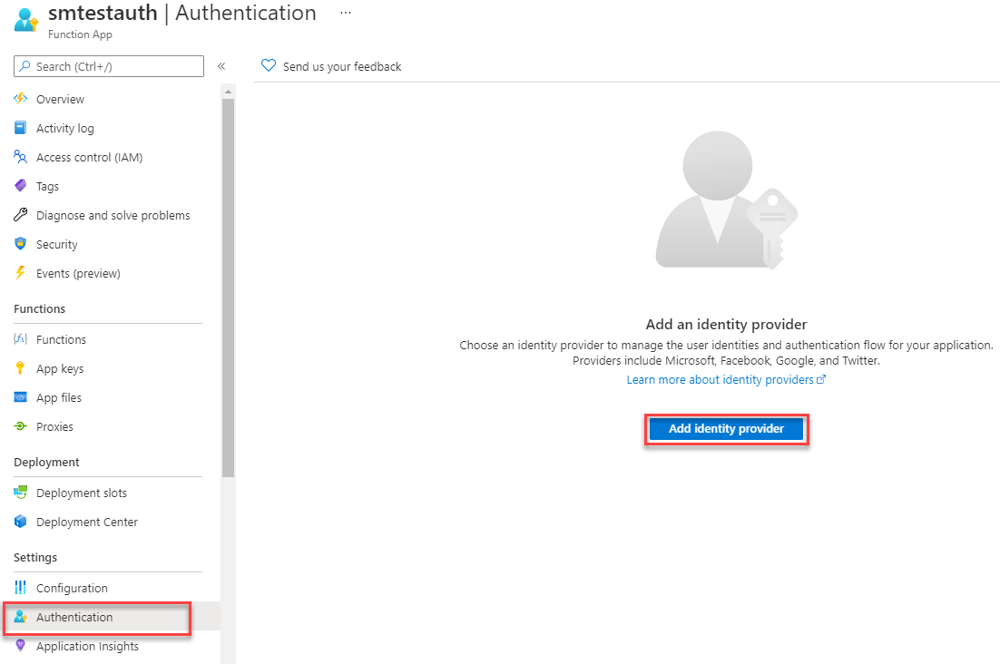
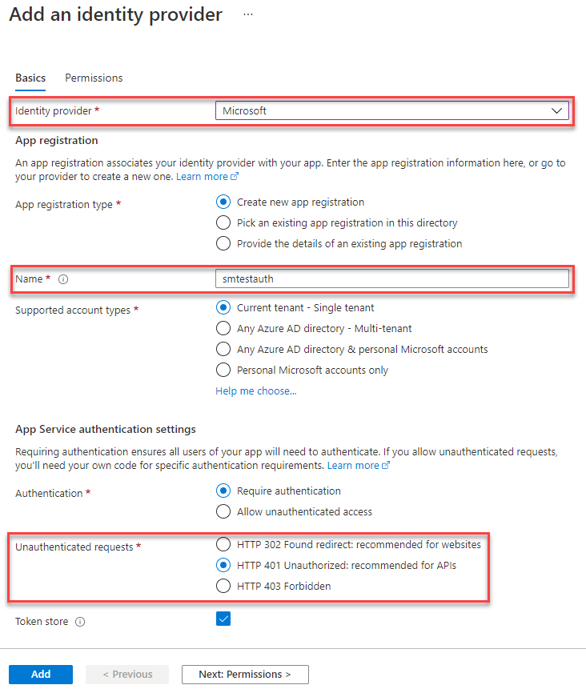
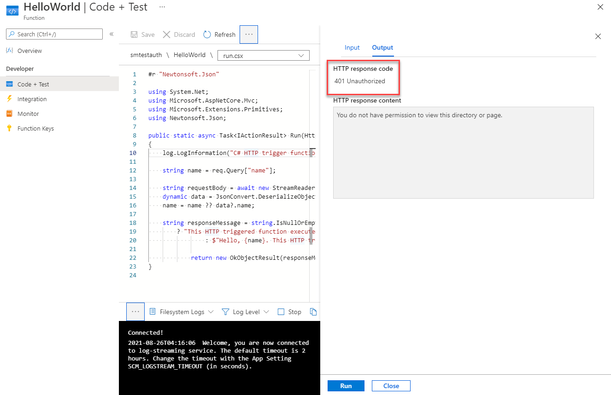

The following steps describe how to protect an Azure Function with AAD (Azure Active Directory).

## Step 1: Add identity provider

Navigate to your Azure Function and then the **Authentication** blade. Click **Add identity provider**.

## Step 2: Identity provider settings

- Select **Microsoft** as the identity provider
- Enter **any name** for your application registration for AAD (you can leave it as the default of your Azure Function name)
- Change **Unauthenticated requests** to HTTP 401

## Step 3: Verify Azure Function secured

Call any of your **functions** on your newly secured Azure Function. You should receive a **401**.

If you want to securing call this Azure Function, see the following related entries:

- [How to call an AAD protected Azure Function](/how-to-call-aad-protected-azure-function) (Console App, different Azure Function, etc.)
