Once you have [protected an Azure Function using AAD (Azure Active Directory)](/how-to-protect-an-azure-function-with-aad) , these instructions allow you to securely call it from a React application (or any other javascript SPA library).

We'll accomplish this by using the [MSAL.js library for javascript](https://github.com/AzureAD/microsoft-authentication-library-for-js).

## Step 1: Create React App

Create a brand new react application using the following:

```bash
npx create-react-app auth-app
cd auth-app
npm install @azure/msal-browser @azure/msal-react
npm install react-bootstrap bootstrap
```

Start your application using:

```bash
npm start
```

You should see an empty react application at [https://localhost:3000](https://localhost:3000) as follows:

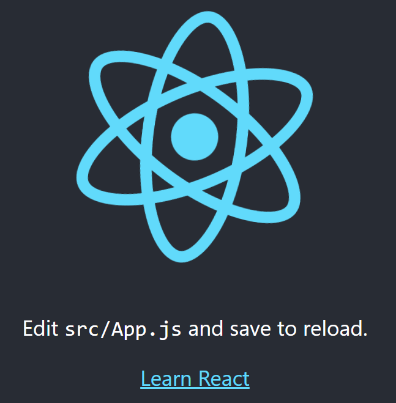

## Step 2: Create an App Registration in Azure Active Directory

This registration will be for your client React application. It will allow you to request an access token and have the appropriate permissions to call the Azure Function.

In the Azure Portal, navigate to **Azure Active Directory** and select **New registration**.

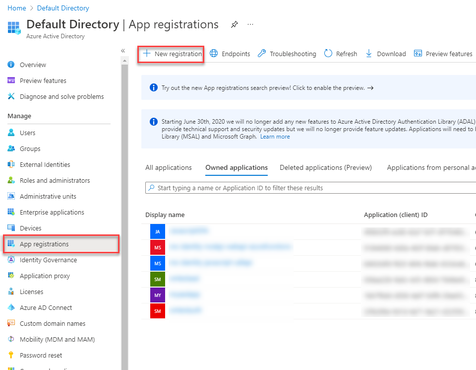

Fill in a **name** for your react application, select **Single-page application (SPA)** and enter **http://localhost:3000** as your Redirect URI.

Click **Register**.

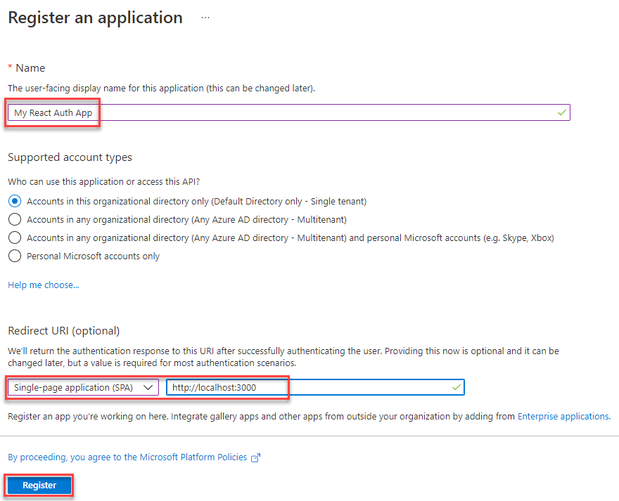

Record down **Application (client) ID** and **Directory (tenant) ID**. You will use these later.

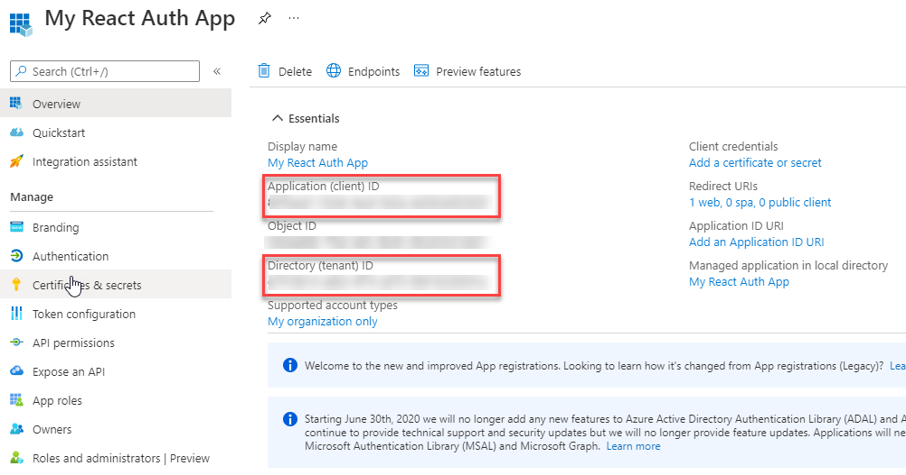

## Step 3: API Permissions

This step assumes you have already secured an Azure Function and registered it in AAD. If you have not, see [this guide](/how-to-protect-an-azure-function-with-aad).

In this step we will grant your react application access to your Azure Function. The protected function for this example is called **smtestauth**.

In Azure Active Direcory, on your newly create application registration (My React Auth App), navigate to **API permissions** and select **Add a permission**.

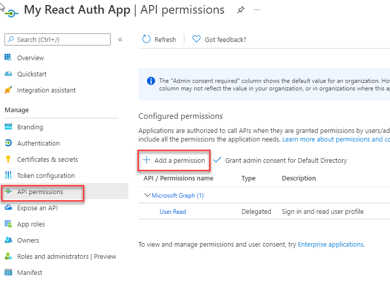

Select the **My APIs** tab and the secured function name (smtestauth).

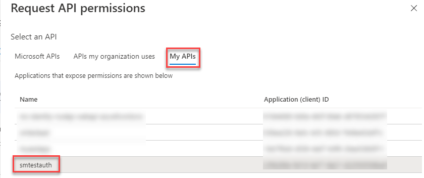

Check the **user_impersonation** permission and select **Add permissions**.

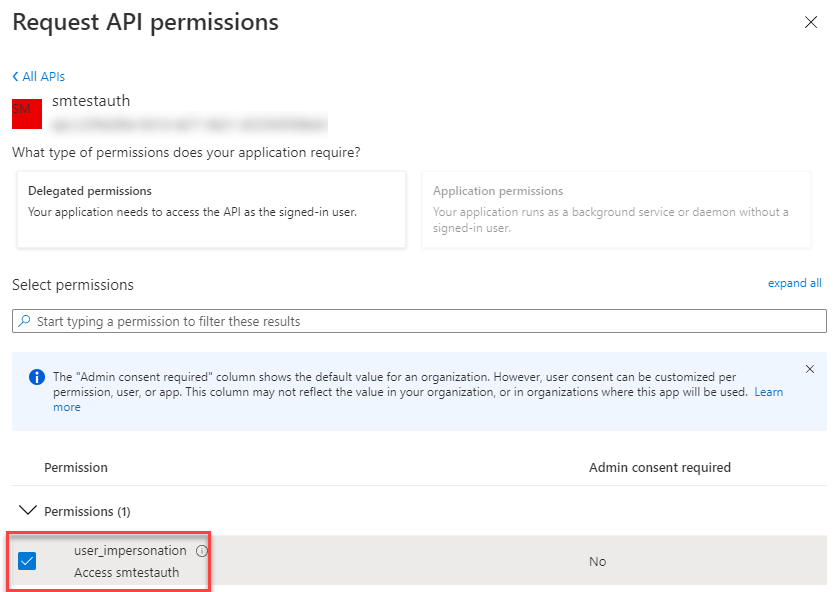

Next, click on this new permission to get the API scope:

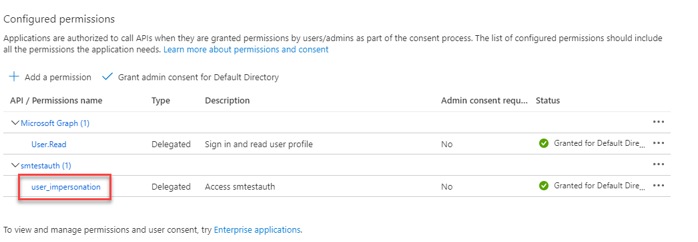

Copy the **api://xxxxx-xxxxx-xxxxx-xxxx/user_impersonation** value. That will be your **API scope** that you will use later.

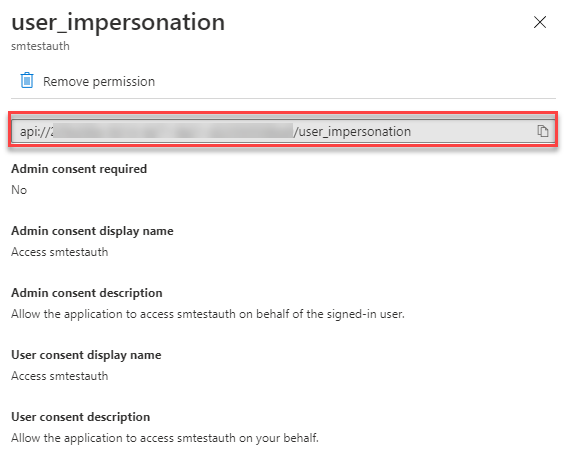

## Step 4: Configure React Application

This step will configure your React application to authenticate against AAD using MSAL.js. In this example we will protect all pages from unauthenticated access.

### src/authConfig.js

Create a file named **authConfig.js** in the **src** folder of your react application.

The contents of the file is:

```js
export const msalConfig = {
  auth: {
    clientId: 'Enter_the_Application_Id_Here',
    authority: 'https://login.microsoftonline.com/Enter_the_Tenant_Info_Here',
    redirectUri: 'Enter_the_Redirect_Uri_Here',
  },
  cache: {
    cacheLocation: 'sessionStorage',
    storeAuthStateInCookie: false,
  },
}

export const apiRequest = {
  url: 'Enter_Url_of_Service',
  scopes: ['Enter_API_Scope'],
}
```

Substitute the following with IDs you recorded earlier:

- Enter_the_Application_Id_Here = Application (client) ID
- Enter_the_Tenant_Info_Here = Tenant ID
- Enter_the_Redirect_Uri_Here = http://localhost:3000
- Enter_Url_of_Service = URL of the Azure Function you want to call
- Enter_API_Scope = API scope recorded in last section

### src/index.js

Open **src/index.js** and add the following imports:

```js
import 'bootstrap/dist/css/bootstrap.min.css'
import { PublicClientApplication, EventType } from '@azure/msal-browser'
import { MsalProvider } from '@azure/msal-react'
import { msalConfig } from './authConfig'
```

Below the imports, add the following code:

```js
const msalInstance = new PublicClientApplication(msalConfig)

const accounts = msalInstance.getAllAccounts()
if (accounts.length > 0) {
  msalInstance.setActiveAccount(accounts[0])
}

msalInstance.addEventCallback(event => {
  if (event.eventType === EventType.LOGIN_SUCCESS && event.payload.account) {
    const account = event.payload.account
    msalInstance.setActiveAccount(account)
  }
})
```

Wrap your App with the MsalProvider component as follows:

```js
<MsalProvider instance="{msalInstance}">
  <App />
</MsalProvider>
```

### src/app.js

Open **src/app.js** and replace the code with the following:

```js
import { MsalAuthenticationTemplate } from '@azure/msal-react'
import { InteractionType } from '@azure/msal-browser'
import { loginRequest } from './authConfig'

function App() {
  return (
    <MsalAuthenticationTemplate
      interactionType={InteractionType.Redirect}
      authenticationRequest={loginRequest}
    >
      <div class="alert alert-primary" role="alert">
        Hello, I am authenticated.
      </div>
    </MsalAuthenticationTemplate>
  )
}

export default App
```

View your app at [http://localhost:3000](http://localhost:3000), it should redirect you to AAD for login. Once you have been authenticated you should see:

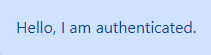

> If you do not see the above, double check the authConfig.js values.

## Step 5: Obtain Access Token

To call a secured Azure Function, we first need an access token.

### src/apiCall.js

Create a file named **apiCall.js** in the **src** folder of your react application.

The contents of this file is:

```js
import { apiRequest } from './authConfig'
import { msalInstance } from './index'

export async function bearerToken() {
  const account = msalInstance.getActiveAccount()
  if (!account) {
    throw Error(
      'No active account! Verify a user has been signed in and setActiveAccount has been called.'
    )
  }

  const response = await msalInstance.acquireTokenSilent({
    ...apiRequest,
    account: account,
  })

  return response.accessToken
}

export async function apiCall() {
  const token = await bearerToken()

  const headers = new Headers()
  const bearer = `Bearer ${token}`

  headers.append('Authorization', bearer)

  const options = {
    method: 'GET',
    headers: headers,
  }

  return fetch(apiRequest.url, options)
    .then(response => response.json())
    .catch(error => console.log(error))
}
```

Replace the contents of **App.js** with the following:

```js
import React, { useState } from 'react'
import { MsalAuthenticationTemplate } from '@azure/msal-react'
import { InteractionType } from '@azure/msal-browser'

import { apiCall, bearerToken } from './apiCall'

function App() {
  const [accessToken, setAccessToken] = useState(null)

  const getAccessToken = async () => {
    const token = await bearerToken()
    setAccessToken(token)
  }

  const callApi = async () => {
    apiCall()
  }

  return (
    <MsalAuthenticationTemplate interactionType={InteractionType.Redirect}>
      <div className="alert alert-primary" role="alert">
        Hello, I am authenticated.
      </div>

      <hr />

      <div>
        <button
          type="button"
          className="btn btn-primary"
          onClick={getAccessToken}
        >
          Get Access Token
        </button>
        {accessToken && <div>Access token is: {accessToken}</div>}
      </div>

      <hr />

      <div>
        <button type="button" className="btn btn-primary" onClick={callApi}>
          Call API
        </button>
      </div>
    </MsalAuthenticationTemplate>
  )
}

export default App
```

Run your react application, you should be able to retrieve an Access Token and display it:


Clicking **Call API** should display the results of your Azure Function (assuming it returns a simple string):


## Troubleshooting

As you can see, there are a lot of steps with the above configuration. Below are some common issues that I've had setting up secured applications.

### 401 Unauthorized

If you are receiving a 401 Unauthorized response calling the API, check your function is actually **anonymous** in code. You have protected the Azure Function already via the portal and you may have inadvertantly applied 2 layers (function keys) as security.

e.g.

```js
public async Task<IActionResult> Location(
        [HttpTrigger(AuthorizationLevel.Anonymous, "get", Route = null)] HttpRequest req)
```

Alternatively, your token might not be a valid **audience** (AUD). You can check **Allowed token audiences** by navigating to Azure Function -> Authentication -> Edit Provider:

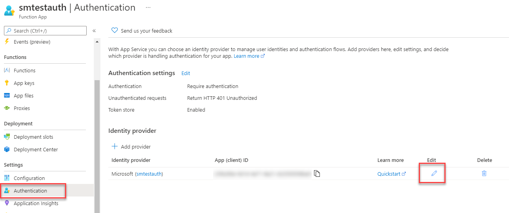

In **Allowed token audiences**, add **api://Enter_your_client_ID** and click **save**.

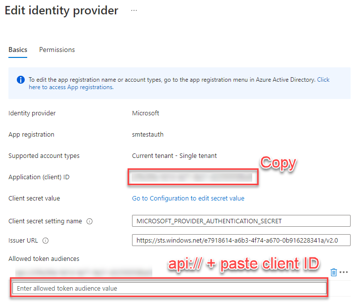
