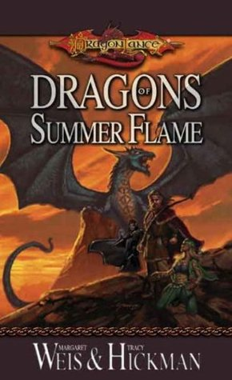
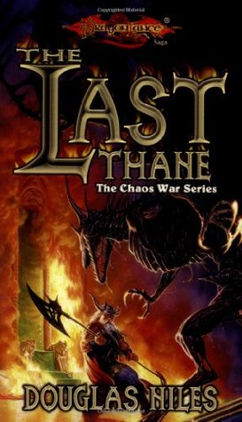

The **Chaos War** (also known as the second cataclysm) was a series of books in the Dragonlance series. The god Chaos has been freed and has sought to bring an end to all of Ansalon.

The following is a recommended reading order. Before reading any of these novels, you should familiar with the core chronicles mentioned in the [Dragonlance Reading Order](/dragonlance-reading-order).

> ⭐ means recommended reading.

## Core Novels

> These novels cover the primary events of the Chaos War.

### The Second Generation ⭐

Years have passed since the end of the War of the Lance. The people of Ansalon have rebuilt their lives, their houses, their families. The Companions of the Lance, too, have returned to their homes, raising children and putting the days of their heroic deeds behind them.
But peace on Krynn comes at a price. The forces of darkness are ever vigilant, searching for ways to erode the balance of power and take control.

### Dragons of Summer Flame ⭐

Summer has come to Krynn, a summer unlike any before. The sun bears down on land and sea, searing the world with relentless light and heat. Clouds and rain are nowhere to be found, and even the darkness of night brings little relief from the strange and oppressive day.

## Supplemental Novels

> These novels cover the background events of the Chaos War.

### The Last Thane

For generations the baser clans of Thorbardin have raged against Hylar, ancestral rulers of the vast underground realm. Now, the finest Hylar army has marched away to face the Knights of Takhisis - and the dark dwarves see their opportunity. Besieged in the Life Tree that is their fortress city, the Hylar struggle to survive. Magic and madness threaten from all sides as Theiwar, Daergar and Klar press the onslaught with bloodthirsty frenzy.

### Tears of the Night Sky ⭐

Crysania, high priestess of the Temple of Paladine, is blind to the beauty of the world but not to the joy of her faith. Lately, though, her communion with the god of light has become distant. Now a mysterious stone has come into her possession. Its power compels her to undertake a merilous quest, accompanied by a strange band of companions.

### The Puppet King ⭐

Treason within, war from without.
Torn asunder by the nightmares of a mad king, the elven realm of Silvanesti has nearly been restored to its former grandeur. But the elf Porthios, returning to his homeland, launches a rebellion against young Gilthas, his own nephew.
Gilthas's troubles are multiplied by threats from green dragons and from the Knights of Takhisis. Now, with Porthios at his throat, Gilthas must choose between blood and honor.

### Reavers of the Blood Sea

During the hottest summer in memory, minotaurs fight against the Knights of Takhisis, into whose hands their god Sargonnas has delivered them. In the midst of the conflict, the armies of Chaos plunge into the heart of Ansalon.

Now the minotaur warrior Aryx must unite his people and their enemy, the knights, against the monstrous servants of Chaos. If he succeeds, the two sides may forge a bond that will change Krynn for all time.

### The Siege of Mt. Nevermind

A miraculous machine . . . and a nightmare!
Innova, a young gnomish recluse finds himself in a terrible situation. Tried in a gnomish court for an unfortunate accident and sentenced to spend months at the bottom of Mt. Nevermind tuning gnomeflingers, young Innova makes an incredible discovery. The whole gnomish society is changed by one machine that, unlike any other gnomish invention, makes the entire mountain run like clockwork.

