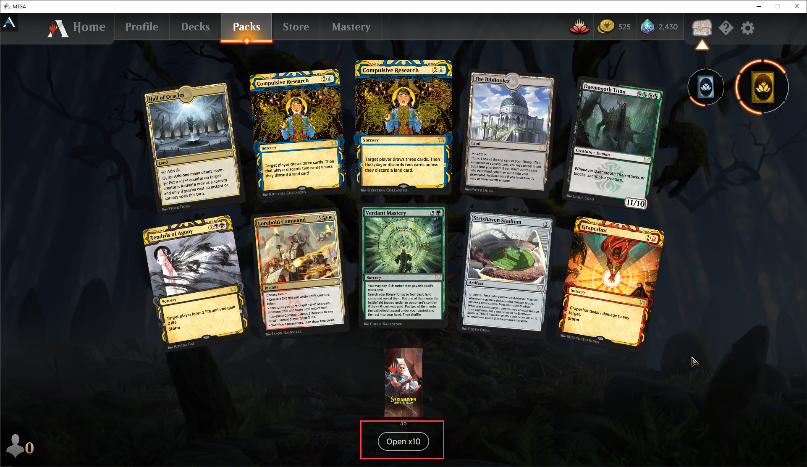
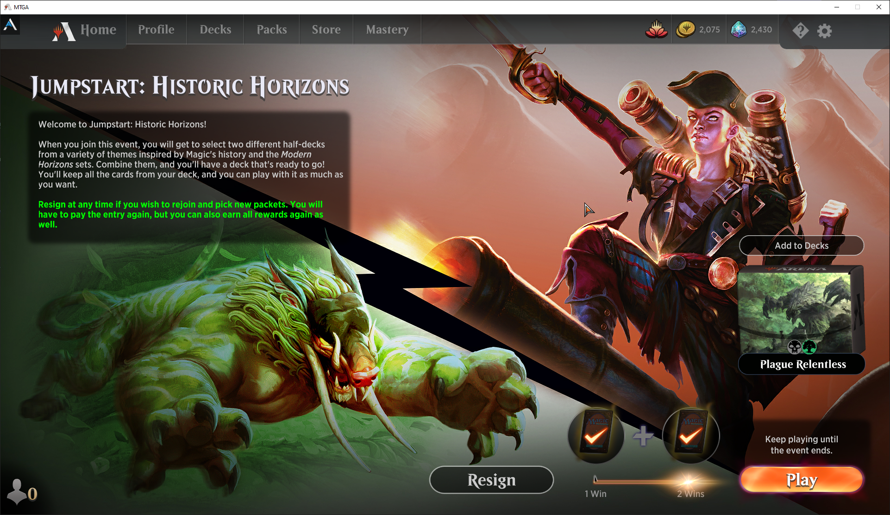
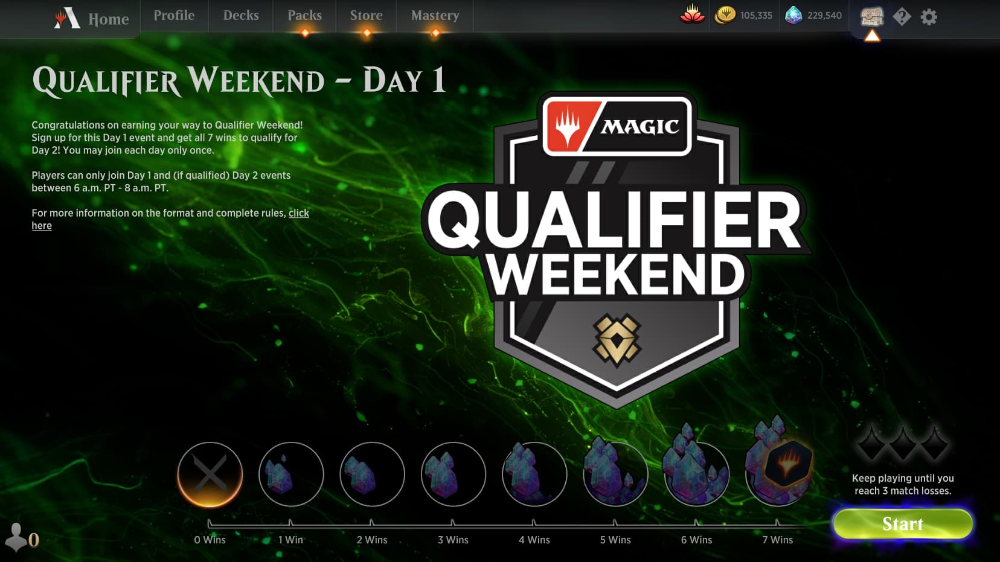
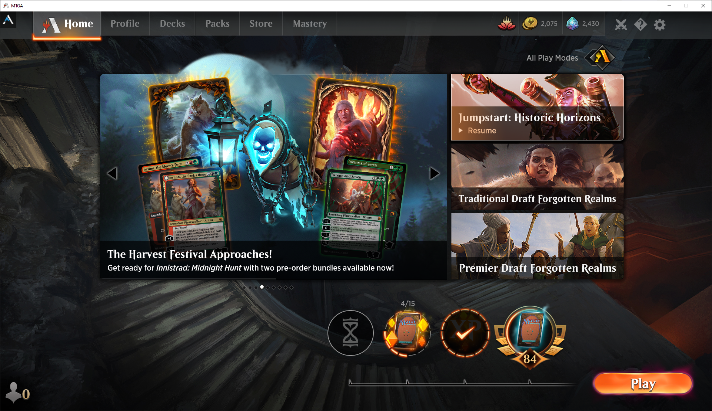

It's no secret that the online card game market is highly competitive. The frontrunner [Hearthstone](https://playhearthstone.com/en-us) has had a clear lead for many years. However, it's competitors are quickly catching up.

Here are 5 enhancements Hearthstone could borrow from it's rival [MTG Arena](https://magic.wizards.com/en/mtgarena).

## Daily cosmetic deals

MTG Arena encourages players back to their store each day via **daily deals** on cosmetics. Significant discounts on individual cosmetics are available. Occasionally a deal for free gold or gems will also appear. Cosmetics are a great monetisation model (e.g. Fortnite) and keeps the base game cheaper for everyone.

## Bulk pack opening

Hearthstone has been out since 2014. Opening pack bundles (~50+ packs) is no longer exciting as it forces you to open one at a time. MTG Arena has a handy feature to open 10 at a time and displays the **rares**.

## Regular in-game events

Each week MTG Arena has a plethora of events that offer different game modes (singleton, pauper, draft, sealed, brawl, historic). It would be great to see Hearthstone adopt some regular mini-events that allow users to break away from the meta and use their deck crafting skills. I don't think the current brawl mode is enough.

## Tournaments

One of the most requested features within Hearthstone are tournaments within the client. MTG Arena has achieved this.

## Updated Client

The Hearthstone client has been around since 2014. It's often sluggish and mobile performance is not great. Perhaps it's time to invest in a better and more vibrant client?

