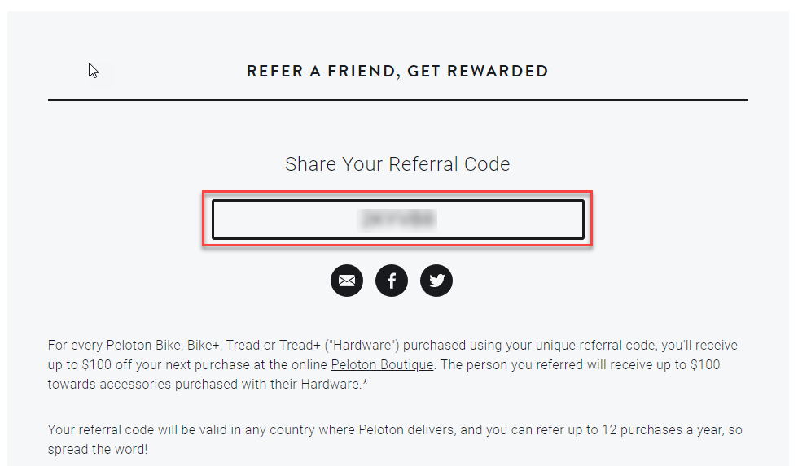
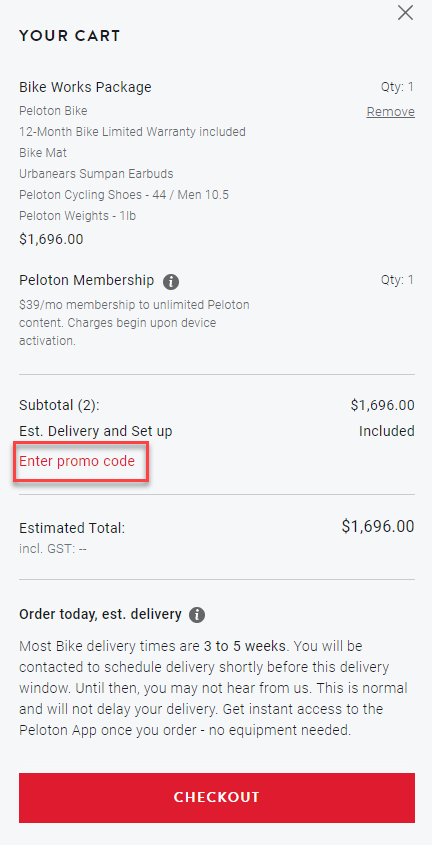
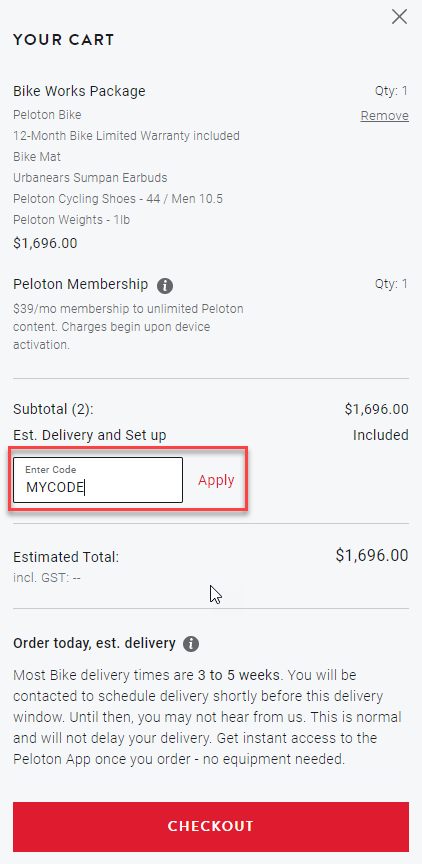
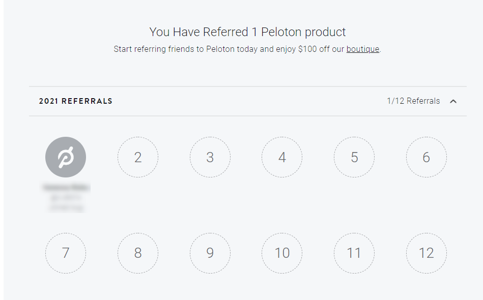

Recently I purchased a Peloton bike which has been the best purchase of the pandemic. However, I found their referral program a little confusing so I've collated all the information here.

> If you don't have a referral code, you can use my referral code to take **$150** off your **hardware** order: **2KZKZE**

## Referral program rules

For every referral, **you'll earn $100** towards apparel and **your friend will receive $150** off their hardware (bike, treadmill) purchase.

Official rules:

- _For any friend you refer who purchases a Peloton Bike or Tread using your referral code, you will receive up to $150(AUD) off your next Apparel purchase and your friend purchasing the Peloton product will receive $150(AUD) towards Bike or Tread accessories. Get rewarded for up to 12 referrals per year._

Peloton apparel is available at:

- https://apparel.onepeloton.com.au

## Accessing your referral code

You can access your referral code to give to your friend here:

- https://www.onepeloton.com.au/settings/referrals

## How to use a referal code

When viewing your cart, click **enter promo code**:

Specify your **code** and click **apply**.

## How do I redeem my referral

Your referrals will be listed at the bottom of the referrals page:

- https://www.onepeloton.com.au/settings/referrals

> However, to access a code for redemption on the apparel site, you'll need to contact Peloton via live chat. I don't know why this isn't automated?

## How it could be better

- When a referral occurs, a coupon code for apparel is automatically sent to your email.
- The apparel site should use the same login as the main Peloton site and have the coupon pre-loaded.
