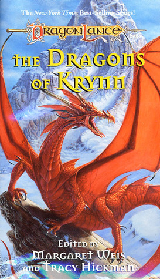
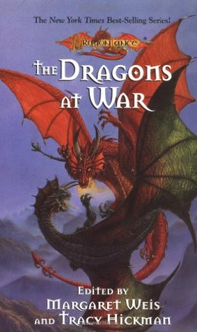

Kang's Regiment are a Draconian based unit known as the **First Dragonarmy Engineers**. As the War of the Lance ended in defeat for the forces of the Dark Queen, a group of her draconian soldiers left the field of battle and these stories tell of their ongoing struggle for survival.

## Chronological Order

### The Dragons of Krynn

This novel is a collection of short stories. **The First Dragonarmy Bridging Company** is an introduction to Kang's regiment.

### The Dragons at War

This novel is a collection of short stories. The story of the catapulting minotaur can be found in **The First Dragonarmy Engineer's Secret Weapon**.

### The Doom Brigade

The fearless draconians of the War of the Lance have retired from the field of battle to a pleasant valley in the Kharolis Mountains. Well, it would be pleasant, if it weren’t for some dwarves, whose irritating feuding prevents the draconians from realizing their greatest hope — the ability to continue their doomed race. When the dwarves discover a map leading to a fortune buried in the dwarven kingdom of Thorbardin, the draconians are swept up in a feverish race for treasure.

### Heroes and Fools

This novel is a collection of short stories. The tale of Kang's trek north, pursued by goblins, is told in **To Teach the Righteous of the Right**.

### Draconian Measures

The regiment of draconian engineers featured in "The Doom Brigade" seek a safe haven for their precious cargo of young draconians. All they have to do is stay alive. Surely that shouldn't be too hard.
But Commander Kang puzzles over a sinister mystery. Why are some of his men vanishing? Kang will have to use draconian measures to defeat his foes and save his race. They'd better be enough -- the fate of his entire race hangs in the balance.

## Passing References

> These novels reference events featuring Kang's regiment but do not directly contain them.

### Dragons of Autumn Twilight

The episode of the wicker dragon referred to in Draconian Measures is found within this novel.

