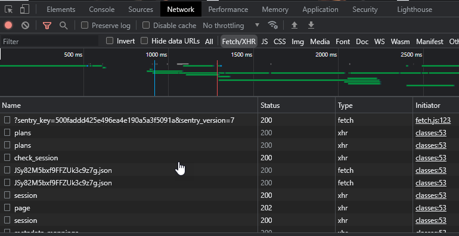
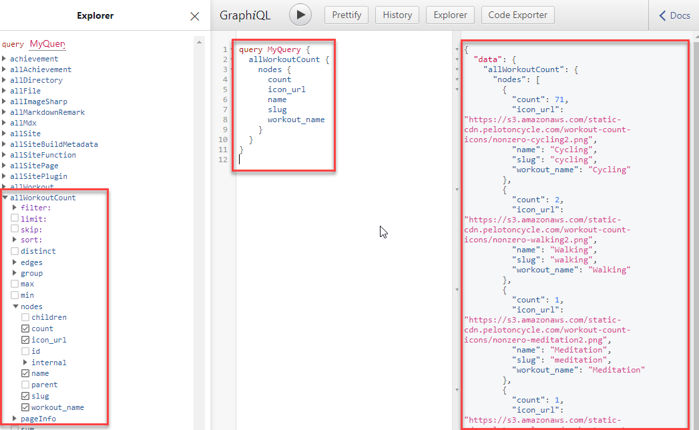
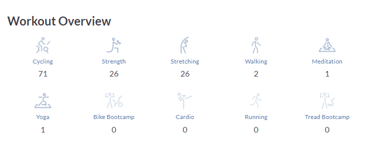

I recently purchased a Peloton Bike+ and was amazed by the amount of raw statistics. It is ideal to integrate into other data repositories ([including my stats page](/stats)) to showcase my recent activity.

I'll be using javascript/react/gatsby to demonstrate how it was achieved.

## Peloton API

The Peloton API isn't documented in an official capacity (although there have been some attempts by third parties). To understand what is possible requires using the browser's devtools on their member's website.



### Authentication Token

Any API call requires an authentication token. This can be accessed as follows (remember to use secrets for your username/password and don't store in code):

```javascript
const body = {
  username_or_email: 'my-username',
  password: 'my-password',
}

const response = await fetch('https://api.onepeloton.com/auth/login', {
  method: 'post',
  body: JSON.stringify(body),
  headers: { 'Content-Type': 'application/json' },
})
```

A successful authentication will return an object as follows:

```javascript
const authData = {
  session_id: 'my-username',
  user_id: 'my-password',
}
```

You'll use the session_id as a header in future API calls. The user_id is a unique identifier that is used for API paths.

### Example API call

Once you have the authentication token established (session_id), you will be able to call other API methods.

The following code calls the overview method which returns information about the logged in user.

```javascript
const opts = {
  headers: {
    cookie: `peloton_session_id=${authData.session_id};`,
    'peloton-platform': 'web',
  },
}

const responseOverview = await fetch(
  `https://api.onepeloton.com.au/api/user/${authData.user_id}/overview?version=1`,
  opts
)
const overviewData = await responseOverview.json()
```

> Important: methods on the Peloton API require that you pass **peloton-platform** in the header.

A full list of methods can be found at:

- https://app.swaggerhub.com/apis/DovOps/peloton-unofficial-api/0.2.3.

## Gatsby Integration

Gatsby is a wonderful framework for integration due to GraphQL. This allows you to integrate many different data sources into the graph and have one query language for access.

### Gatsby sourceNodes

Integration to the Peloton API can be configured in gatsby-node.js. The **sourceNodes** extension point allows a hook to source additional nodes into the graph. Perfect for an API.

```javascript
exports.sourceNodes = async ({
  actions,
  createNodeId,
  createContentDigest,
}) => {
  // step 1: authenticate with Peloton
  const body = {
    username_or_email: process.env.PELOTON_USERNAME,
    password: process.env.PELOTON_PASSWORD,
  }

  const response = await fetch('https://api.onepeloton.com/auth/login', {
    method: 'post',
    body: JSON.stringify(body),
    headers: { 'Content-Type': 'application/json' },
  })
  const authData = await response.json()

  const opts = {
    headers: {
      cookie: `peloton_session_id=${authData.session_id};`,
      'peloton-platform': 'web',
    },
  }

  // Step 2: retrieve workout data from the overview
  const responseOverview = await fetch(
    `https://api.onepeloton.com.au/api/user/${authData.user_id}/overview?version=1`,
    opts
  )
  const overviewData = await responseOverview.json()

  // Step 3: create nodes in the graph
  overviewData.workout_counts.workouts.forEach(workoutCount => {
    const newNode = {
      ...workoutCount,
      id: createNodeId(workoutCount.name),
      internal: {
        type: 'WorkoutCount',
        contentDigest: createContentDigest(workoutCount),
      },
    }
    actions.createNode(newNode)
  })
}
```

If you visit the GraphQL interface shipping with Gatsby (http://localhost:8000/\_\_\_graphql), you'll see our new **allWorkoutCount** node.



The documentation for Gatsby nodes is here:

- https://www.gatsbyjs.com/docs/reference/config-files/gatsby-node/#sourceNodes

## The End Result

As you can see by the stats page, the integration to Peloton is straight forward:

- Retrieve an authentication token
- Call API
- Build nodes in Gatsby based on Peloton data
- Query GraphQL in React components
- Modify github action yml file to trigger daily


