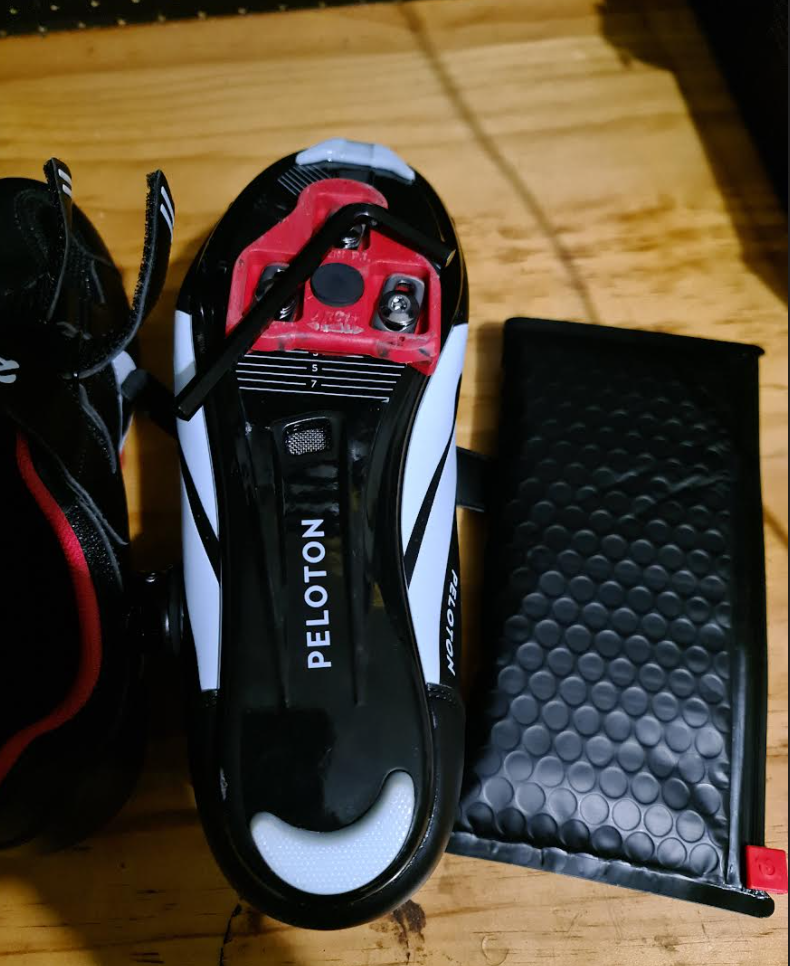
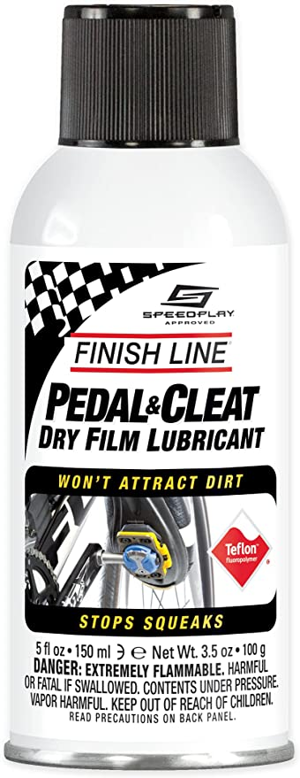

Recently I discovered a clicking noise when my wife rode our brand new Peloton. When she would stand up on the bike (out of the saddle) a clicking noise would be produced on each revolution of the bike's pedals. 

Here are a few fixes I discovered trying to rectify the issue:

## Fix 1: Tighten Cleats 

Lucky for us, the noise did not occur when I was riding, so it was easy to deduce that the issue was her shoes. Using the tool provided with the bike I was able to tighten the cleats which thankfully resolved the issue.

## Fix 2: Cleat Lubricant

Your cleats might require lubricant to resolve the squeaky or clicking noise. You can find cleat lubricant on amazon or any bike store.

## Fix 3: Contact Peloton Support

If the issue is not with the shoes, it may require assistance from Peloton support. I've read reports of a misaligned crank arm which will require a technician to resolve.

You can contact peloton support [here](https://www.onepeloton.com/company/contact).

## Conclusion

Is there any other solutions people have? Please leave a comment below. 