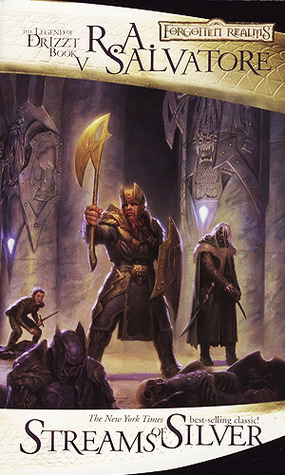
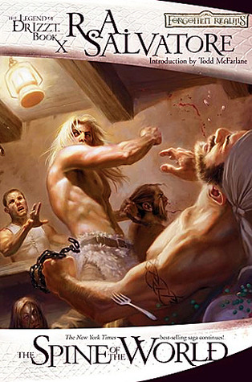
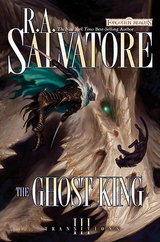
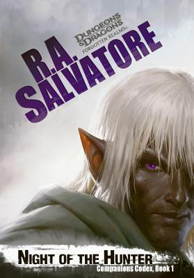
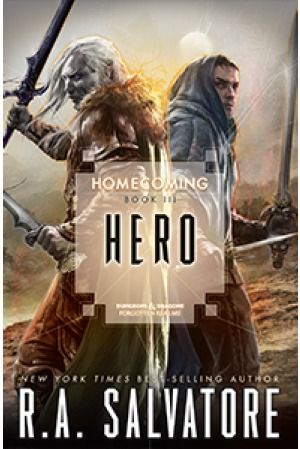
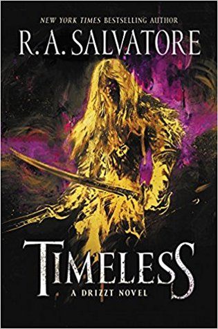
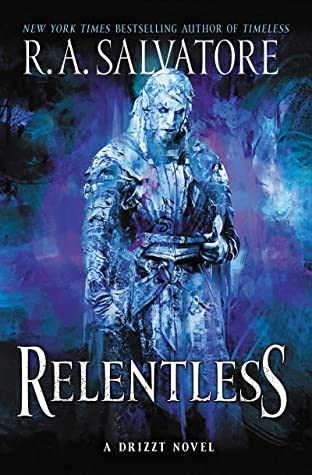

The **Legend of Drizzt** is an iconic series of fantasy novels by R.A. Salvatore. The following is a recommended reading order.

## Icewind Dale Trilogy

> I've always preferred reading the events of Icewind Dale before the preludes. These novels were published first and you'd do the same for Star Wars right?

### Crystal Shard

Akar Kessel, weak-willed apprentice mage, starts events that find a magical device, the crystal shard. Dwarf Bruenor rescues barbarian Wulfgar from the ruins of Ten-Towns, for 5 years of service - and friendship. With help from renegade dark elf Drizzt, Wulfgar becomes a warrior with brawn and brains. Can the trio stave off the crystal shard forces?

### Streams of Silver

Drizzt Do'Urden still struggles with his own inner voices, voices that call him back to the pitless depths of the Underdark. But louder still are the voices of his newfound friends Bruenor, Wulfgar, and Regis—and the call of a dream that, at long last, Bruenor has decided to fulfill.

### The Halfling's Gem

Regis has fallen into the hands of the assassin Artmis Entreri, who is taking him to Calimport to deliver him into the clutches of the vile Pasha Pook. But Drizzt and Wulfgar are close on their heels, determined to save Regis from his own folly as much as from his powerful enemies.

## Dark Elf Trilogy

> The origin tales of Drizzt Do'Urden.

### Homeland

The startling tale of how one lone drow walked out of the shadowy depths of the Underdark, leaving behind a society of evil and a family who want him dead.

### Exile

Drizzt Do'Urden has been exiled from his country and forced to wander the tunnel-mazes of the Underdark, which are haunted by the evil dark elves.

### Sojourn

After years spent in the ruthless confines of the Underdark, Drizzt Do’Urden has emerged from the subterranean society of his youth to start a new life.

## Legacy of the Drow

> The enemies from Drizzt's past have caught up with him.

### The Legacy

Life is good for Drizzt Do'Urden, better than it ever has been for the beleaguered dark elf. His dearest friend, the dwarf Bruenor, has reclaimed his throne, and his adventuring companions, Wulfgar and Catti-brie, are to be wed in the spring. Even the halfling Regis has returned. All the friends are united in the safety and prosperity of Mithril Hall, where streams of silver mithril run deep and dwarven hammers bang out the solemn rhythms of ancient and unending songs.

### Starless Night

Though Drizzt is still reeling from the death of his barbarian friend, he is allowed little time to grieve. Dark elves are gathering in the caverns deep under Mithral Hall, hell-bent on destruction. To keep his adopted home and family safe, Drizzt must now return to the dreadful drow city of his birth.

### Siege of Darkness

While Mithral Hall teems with whispers of the war to come, chaos erupts both above and below ground. On the surface of Faerûn, the first signs of the Time of Troubles make themselves known, forcing deities to assume their mortal forms. Beneath them in the Underdark, all but one drow house has lost their magical powers, and Lolth has handed the reins of leadership over to the demon Errtu.

### Passage to Dawn

It has been six years since the fateful Battle of Mithral Hall; six long years during which Drizzt Do’Urden and Catti-brie have been away from the only place they ever truly felt at home. The pain of a lost companion still weighs heavily on their strong shoulders, but chasing pirates aboard Captain Deudermont's Sea Sprite has been enough to draw their attention away from their grief.

## Paths of Darkness

### The Silent Blade

Determined to destroy the evil Crystal Shard, Drizzt seeks out the help of a scholar-priest named Cadderly. But instead, his worst fears are realized when the artifact falls into the hands of the dark elf mercenary Jarlaxle and his unlikely ally Artemis Entreri.

### The Spine of the World

Spending just one day in the torture chambers of the Abyss would be enough to break even the heartiest soul. Wulfgar of Icewind Dale was there for six miserable years. Though Wulfgar has since been freed, he is still haunted by the memories of the pain he endured at his captor Errtu's hands. Hoping to distance himself from his past, he flees to the faraway port city of Luskan—but in so doing, isolates himself from his friends and develops an unhealthy penchant for booze.

### Sea of Swords

When the mark of Wulfgar’s legendary warhammer is found on the person of pirate Sheila Kree, Drizzt Do’Urden knows his friend is in dire need of his help. Thus, Drizzt, Catti-brie, Regis, and Bruenor spring into action, determined to save Wulfgar and recover Aegis-fang once and for all. But the road to victory is paved with monsters—from goblins and ogres to Wulfgar’s own personal demons.

## The Sellswords

### Servant of the Shard

Powerful assassin Artemis Entreri tightens his grip on the streets of Calimport, driven by the power of his hidden drow supporters. But his sponsor, Jarlaxle, grows ever more ambitious, and Entreri struggles to remain cautious and in control. Soon, the power of the malevolent Crystal Shard grows greater than them both, threatening to draw them into a vast web of treachery from which there will be no escape.

### Promise of the Witch King

Human assassin Artemis Entreri and his dark elf companion Jarlaxle have come to the demon-haunted wastelands of the frozen north at the request of their dragon patron. It doesn't take long for them to find themselves caught in the middle of a struggle between powerful forces that would like nothing more than to see them both dead -- or worse.

### Road of the Patriarch

ILNEZHARA and TAZMIKELLA are ancient dragons of great power, accustomed to easily manipulating the humans around them. But not all humans are so easily led. When they pushed Entreri and Jarlaxle into the heart of the Bloodstone Lands, not even they could have imagined the strength of the human assassin’s resolve, or the limitless expanse of the drow mercenary’s ambition.

## The Hunter's Blades Trilogy

### The Thousand Orcs

When a blood-thirsty banc of orcs led by an as-yet-unseen enemy, comes rampaging out of the Spine of the World, it lays waste to everything in its path. Dark elf ranger Drizzt Do'Urden and his most trusted friends find themselves in the path of destruction. As blades slash and feet trample, even the heroes may not survive a desperate stand.

### The Lone Drow

Drizzt Do'Urden has become the Hunter, the bane of the orc hordes still ravaging the North. Cut off, alone, convinced that everything he ever valued has been destroyed, all that's left is to kill, and kill, and kill, until there are no enemies left. But there are a lot of enemies, and even the Hunter is just one lone drow.

### The Two Swords

Dark elf Drizzt Do'Urden would like nothing more than to kill King Obould Many-Arrows, the leader of the slavering orc army that slaughtered his closest friends. Now, it seems even Innovindil, Drizzt’s new moon elf companion, cannot escape the grip of Obould’s murderous scourge. When the orc king steals Innovindil’s beloved pegasus, Drizzt must accompany her on a rescue mission to the northern lands of the frost giants—even if it means suffering the same fate as the Companions.

## Transitions

### The Orc King

Drizzt is back, and facing a world changed forever!
An uneasy peace between the dwarves of Mithral Hall and the orcs of the newly established Kingdom of Many-Arrows can't last long. The orc tribes united under Obould begin to fight each other, and Bruenor is determined to finish the war that nearly killed him and almost destroyed everything he's worked to build. But it will take more than swords and axes to bring a lasting peace to the Spine of the World.

### The Pirate King

The Arcane Brotherhood has long held the city of Luskan in their power, but when corruption eats away at their ranks, Captain Deudermont comes to the rescue of a city that has become a safe haven for the Sword Coast's most dangerous pirates. But rescuing a city from itself may not be as easy as Deudermont thinks, and when Drizzt can't talk him out of it, he'll be forced to help.

### The Ghost King

With the collapse of Mystra’s Weave and the onslaught of the Spellplague, all of Faerûn is thrown into chaos. But as magic turns more dangerous and unreliable, an even greater foe presents itself: the Ghost King, an entity that contains the combined might of a dragon, a mind flayer, and the Crenshinibon—the demonic crystal shard thought to be destroyed years ago.

## Neverwinter Saga

### Gauntlgrym

Drizzt joins Bruenor on his quest for the fabled dwarven kingdom of Gauntlgrym: ruins said to be rich with ancient treasure and arcane lore. But before they even get close, another drow and dwarf pair stumbles across it first: Jarlaxle and Athrogate. In their search for treasure and magic, Jarlaxle and Athrogate inadvertently set into motion a catastrophe that could spell disaster for the unsuspecting people of the city of Neverwinter.

### Neverwinter

With the last of his trusted companions having fallen, Drizzt is alone--and free--for the first time in almost a hundred years. Guilt mingles with relief, leaving Drizzt uniquely vulnerable to the persuasions of his newest companion--Dahlia, a darkly alluring elf and the only other member of their party to survive the cataclysm at Mount Hotenow.

### Charon's Claw

Drizzt draws his swords once more to aid his friends. His lover, Dahlia Sin’felle, can speak of nothing but the moment she will face the Netherese lord Herzgo Alegni once again. Drizzt has already followed a trail of vengeance beside Dahlia. Can he justify one more battle to settle a grudge he does not understand? Artemis Entreri too seeks vengeance. He offers to aid Dahlia in her mission to destroy Alegni. But Charon’s Claw, Alegni’s sentient sword, dominates Entreri’s movements—if not his mind.

### The Last Threshold

Drizzt is tangled up in Dahlia’s dark secrets more than ever. The ties that once held them close now threaten to rip apart as Dahlia’s bonds to Drizzt’s former foe, Artemis Entreri, continue to grow. Determined to stand for what’s right in the Realms once again, Drizzt forges a new road north toward Icewind Dale. Will Dahlia, Entreri, and the rest of his new companions follow? Will he be forced to fight the darkness alone?

## The Sundering

### The Companions

As Drizzt's fate hangs in the balance, he reflects on the lives of the trusted allies who stood by his side throughout his early life--the friends now known as the Companions of the Hall. Meanwhile, the first stirrings of the Sundering begin.

## Companions Codex

### Night of the Hunter

Drizzt Do’Urden returns to Gauntlgrym with old friends by his side once again, as they seek to rescue Bruenor’s loyal shield dwarf-turned-vampire. But not only do Drizzt and his allies face a perilous journey through the Underdark and the dangers of the undead that lie within, but they must cross through a colony of drow, who would like nothing better than to see Drizzt Do’Urden dead.

### Rise of the King

Having escaped Gauntlgrym, the Companions of the Hall are united in body and spirt—but not in ideals. As the Darkening casts its shadows upon the northern cities of the Shining White, portending war, the past rears its angry head. Old debts insist on payment and old wrongs demand to be set right. The bloody dwarf-orc feud reignites with disastrous consequences.

### Vengeance of the Iron Dwarf

In the evolving world of the Forgotten Realms setting, the Sundering has given way to months of cloud-cloaked darkness, and war rages under that oppressive sky. The orcs have broken a hard-fought treaty that's held, however tentatively, for a hundred years, and the time to settle old scores has devolved into an all-out brawl for control of the ancient realms of the North.

## Homecoming

### Archmage

The pall that had descended over the North is gone, and a new day has dawned on a victorious Mithral Hall, but no matter how bright things seem on the surface, Drizzt and his companions know that what lurks just under their feet remains steeped in evil and charged with unimaginable power.

### Maestro

Drizzt is going home. But not to Mithral Hall. Not to Icewind Dale. He's going to Menzoberranzan. Something terrible-immense-unspeakable, has come to the City of Spiders, leaving death and destruction in its wake.

### Hero

Something akin to “peace" has come to the Underdark. The demon hordes have receded, and now the matron mothers argue over the fate of Drizzt Do'Urden. Even so, it becomes clear to one matriarch after another that while the renegade drow may come and go Menzoberranzan, the City of Spiders will crawl forever on.

## Homecoming

### Timeless

Centuries ago, in the city of Menzoberranzan, the City of Spiders, the City of Drow, nestled deep in the unmerciful Underdark of Toril, a young weapon master earned a reputation far above his station or that of his poor house.

### Boundless

Split between time and two worlds, Zaknafein had always been conflicted. That inner turmoil was magnified by his inferior position as a male dark elf in the matriarchal drow society. Only his status as one of the greatest warriors—as well as his friendship with the mercenary Jarlaxle—kept him sane. When he finally perished, he was content knowing he left behind a legacy as substantial as his son Drizzt.

### Relentless

Displaced in time and unexpectedly reunited with his son Drizzt Do'Urden, Zaknafein has overcome the prejudices ingrained in him as a drow warrior to help his son battle the ambitious Spider Queen and stem the tide of darkness that has been unleashed upon the Forgotten Realms. Though Zaknafein has endured the most difficult battles, survival has come at a terrible cost, and the fight is far from over.

## The Way of the Drow

### Starlight Enclave

After the settling dust of the demon uprising and two years of peace, rumblings from the Menzoberranzan drow have Jarlaxle nervous. Worried his allies may be pulled into a Civil War between the great Houses, he is eager to ensure Zaknafein is armed with weapons befitting his skill, including one in particular: Khazid’hea. A powerful artifact, the sword known as “Cutter” has started wars, corrupted its users, and spilled the blood of many, many people.

