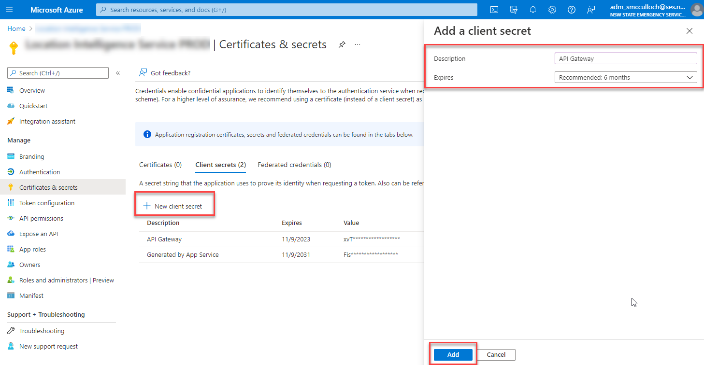
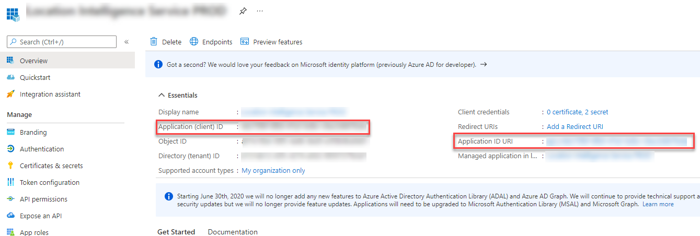

Recently I had a requirement to expose an AAD protected Azure Function via an Azure API Gateway.

> The caveat was the function was to be exposed via a header key (not an internal AAD bearer token).

Fortunately, the Azure API management services makes it relatively straight forward. It allows you to secure via a header key, generate a bearer token at the gateway and set it when calling the backend API.

## Application Configuration in AAD

Before setting the API Gateway configuration, it's necessary to configure the Azure Function to generate a secret for the gateway to use.

Navigate to your Azure Function, select authentication ([assuming you have already protected it via AAD](/how-to-protect-an-azure-function-with-aad)) and click on the application name to configure the app in Azure Active Directory.


Navigate to **Certificates and secrets** once you are viewing your app in Azure Active Directory.

Click **New Client Secret**, specify a description and click **Add**.

Copy the **Value** of the secret, you'll need that later.



Navigate back to **Overview** of the application and also record the **Application (client) ID**, **Application ID URI** and **Tenant ID**.



## Azure Gateway Configuration

Assuming you have created a function in the API gateway, the internal processing should look like the following (substitute the values you recorded previously).

The values you are substituting:

- **Tenant ID**: used to make a token request
- **App ID**: represents the client_id
- **Secret Value**: represents the client_secret
- **Application ID URI**: represents the resource
- **Backend URI**: the URL of the function you are protecting

```xml

<policies>
    <inbound>
        <base />
        <rewrite-uri template="/" />
        <send-request ignore-error="true" timeout="20" response-variable-name="bearerToken" mode="new">
            <set-url>https://login.microsoftonline.com/{tenant-id-here}/oauth2/token</set-url>
            <set-method>POST</set-method>
            <set-header name="Content-Type" exists-action="override">
                <value>application/x-www-form-urlencoded</value>
            </set-header>
            <set-body>@{
            return string.Format("client_id={0}&client_secret={1}&resource={2}&grant_type=client_credentials", "{app-id-here}", "{secret-id-here}", "{application-id-uri-here}");
            }</set-body>
        </send-request>
        <set-header name="Authorization" exists-action="override">
            <value>@("Bearer " + (String)((IResponse)context.Variables["bearerToken"]).Body.As<JObject>()["access_token"])</value>
        </set-header>
        <set-backend-service base-url="{back-end-url-here}" />
        <set-header name="Ocp-Apim-Subscription-Key" exists-action="delete" />
    </inbound>
    <backend>
        <base />
    </backend>
    <outbound>
        <base />
    </outbound>
    <on-error>
        <base />
    </on-error>
</policies>

```
