Below are the hardest powerzone rides I've found on the Peloton platform.

I'll post my graphs as I complete them. #sjmcculloch

## Watts Up - 60 Min PZ - 4/30/22

[Ride Link](https://members.onepeloton.com/classes/cycling?modal=classDetailsModal&classId=2108106ad3484c819956865346c9acaa)

## The Grinch - 45 Min PZ - 12/8/21

[Ride Link](https://members.onepeloton.com/classes/cycling?modal=classDetailsModal&classId=da105028cc5442748781d22e5c384c81)

## Lung Buster 2.0 - 30 Min PZ - 9/21/21

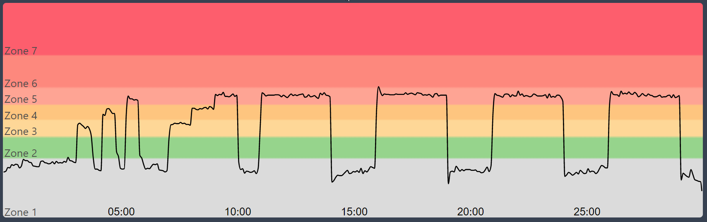

[Ride Link](https://members.onepeloton.com.au/classes/cycling?duration=%5B%221800%22%5D&class_type_id=%5B%22665395ff3abf4081bf315686227d1a51%22%5D&sort=original_air_time&desc=true&modal=classDetailsModal&classId=c139d4aeab444f57bd9c0c99474a677d)

## The Blender - 45 Min PZM - 8/19/21

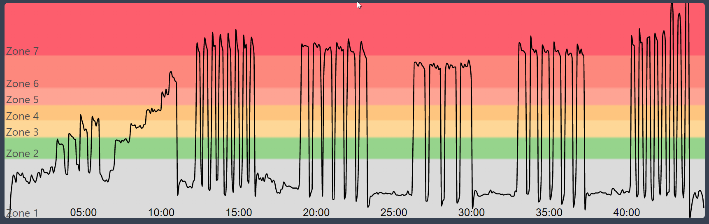

[Ride Link](https://members.onepeloton.com.au/classes/cycling?duration=%5B%222700%22%5D&class_type_id=%5B%22665395ff3abf4081bf315686227d1a51%22%5D&instructor_id=%5B%22304389e2bfe44830854e071bffc137c9%22%5D&sort=original_air_time&desc=true&modal=classDetailsModal&classId=d6012037eec84a44bf10993b32972b2f)

## Batman - 45 Min PZ - 12/23/20

[Ride Link](https://members.onepeloton.com.au/classes/cycling?duration=%5B%222700%22%5D&class_type_id=%5B%22665395ff3abf4081bf315686227d1a51%22%5D&instructor_id=%5B%22304389e2bfe44830854e071bffc137c9%22%5D&sort=original_air_time&desc=true&modal=classDetailsModal&classId=3596b418cca84cc9819a1a54e75028e7)

## Jalapeno Popper - 45 Min PZ - 12/2/20

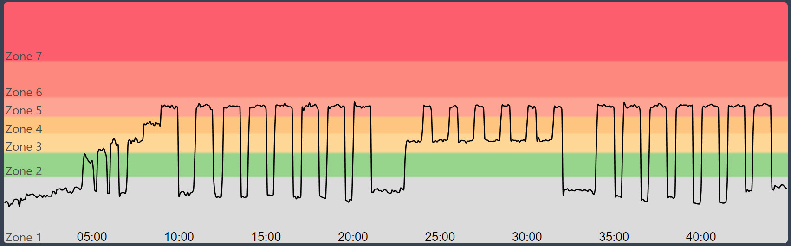

[Ride Link](https://members.onepeloton.com.au/classes/cycling?duration=%5B%222700%22%5D&class_type_id=%5B%22665395ff3abf4081bf315686227d1a51%22%5D&instructor_id=%5B%22304389e2bfe44830854e071bffc137c9%22%5D&sort=original_air_time&desc=true&modal=classDetailsModal&classId=d0069c74e4c145d7a3bd514a5b23da26)

## Baby Rhino - 45 Min PZ - 11/24/20

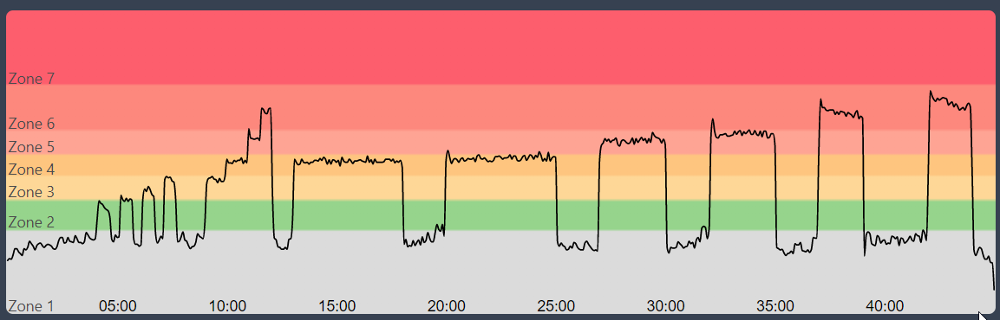

[Ride Link](https://members.onepeloton.com.au/classes/cycling?duration=%5B%222700%22%5D&class_type_id=%5B%22665395ff3abf4081bf315686227d1a51%22%5D&instructor_id=%5B%22304389e2bfe44830854e071bffc137c9%22%2C%221e59e949a19341539214a4a13ea7ff01%22%5D&sort=original_air_time&desc=true&modal=classDetailsModal&classId=b86666bf2db44a76b736d0e95cf52533)

## Baby Bear Claw - 45 Min PZ - 3/5/20

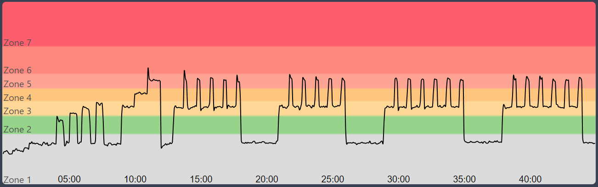

[Ride Link](https://members.onepeloton.com/classes/cycling?modal=classDetailsModal&classId=522ef0b8e3b649cd88b1bc13615fbbb0)

## Washing Machine - 45 Min PZ - 3/5/20

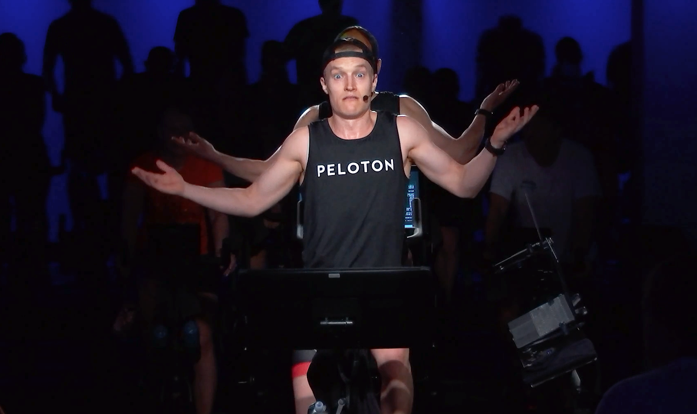

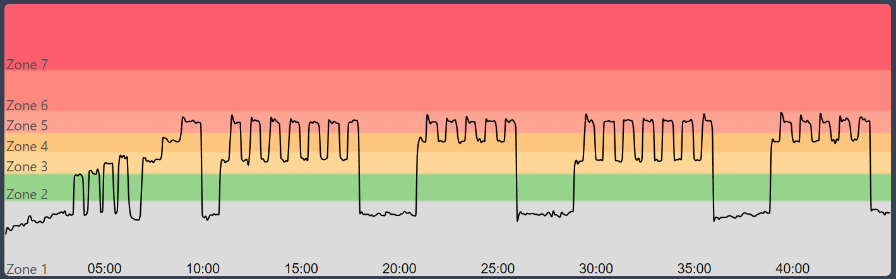

[Ride Link](https://members.onepeloton.com.au/classes/cycling?duration=%5B%222700%22%5D&class_type_id=%5B%22665395ff3abf4081bf315686227d1a51%22%5D&instructor_id=%5B%22304389e2bfe44830854e071bffc137c9%22%2C%221e59e949a19341539214a4a13ea7ff01%22%5D&sort=original_air_time&desc=true&modal=classDetailsModal&classId=d3d2ade1cadc420ab1a1b2612cea2f4f)

## Bear Claw - 45 Min PZ - 12/9/19

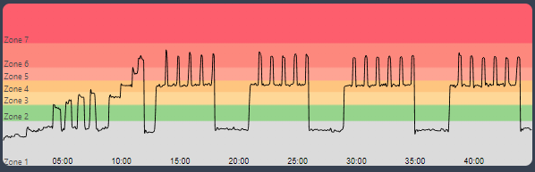

[Ride Link](https://members.onepeloton.com.au/classes/cycling?duration=%5B%222700%22%5D&class_type_id=%5B%22665395ff3abf4081bf315686227d1a51%22%5D&instructor_id=%5B%22304389e2bfe44830854e071bffc137c9%22%2C%221e59e949a19341539214a4a13ea7ff01%22%5D&sort=original_air_time&desc=true&modal=classDetailsModal&classId=d9ccc69fd4e44633be8ff44223649de4)

## Bush - 60 Min PZE - 12/7/19

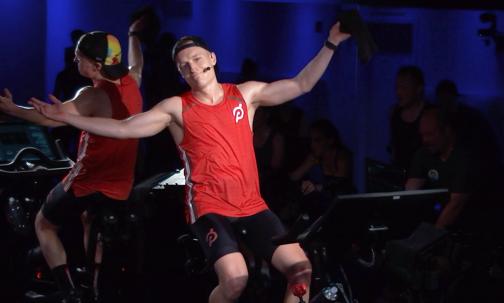

[Ride Link](https://members.onepeloton.com.au/classes/cycling?duration=%5B%222700%22%2C%223600%22%5D&class_type_id=%5B%22665395ff3abf4081bf315686227d1a51%22%5D&instructor_id=%5B%22304389e2bfe44830854e071bffc137c9%22%2C%221e59e949a19341539214a4a13ea7ff01%22%5D&sort=original_air_time&desc=true&modal=classDetailsModal&classId=481afd2bb576439bbf1bc3a3bd40db11)

## Life Changing Interval - 60 Min PZ - 6/15/19

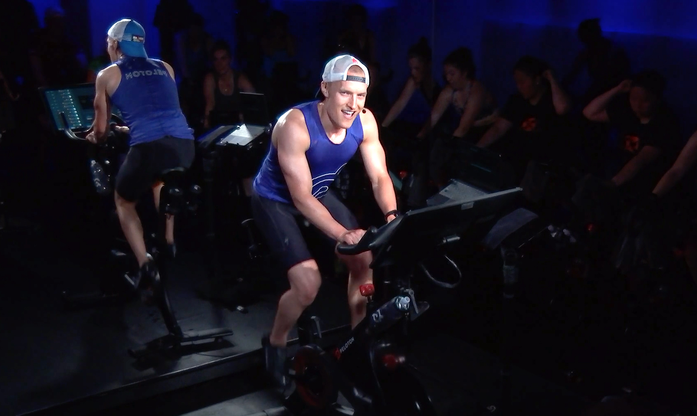

[Ride Link](https://members.onepeloton.com.au/classes/cycling?duration=%5B%222700%22%2C%223600%22%5D&class_type_id=%5B%22665395ff3abf4081bf315686227d1a51%22%5D&instructor_id=%5B%22304389e2bfe44830854e071bffc137c9%22%2C%221e59e949a19341539214a4a13ea7ff01%22%5D&sort=original_air_time&desc=true&modal=classDetailsModal&classId=87bdedb6066a47c88cd031f317099659)

## Death by Zone 5 - 45 Min PZM - 6/14/19

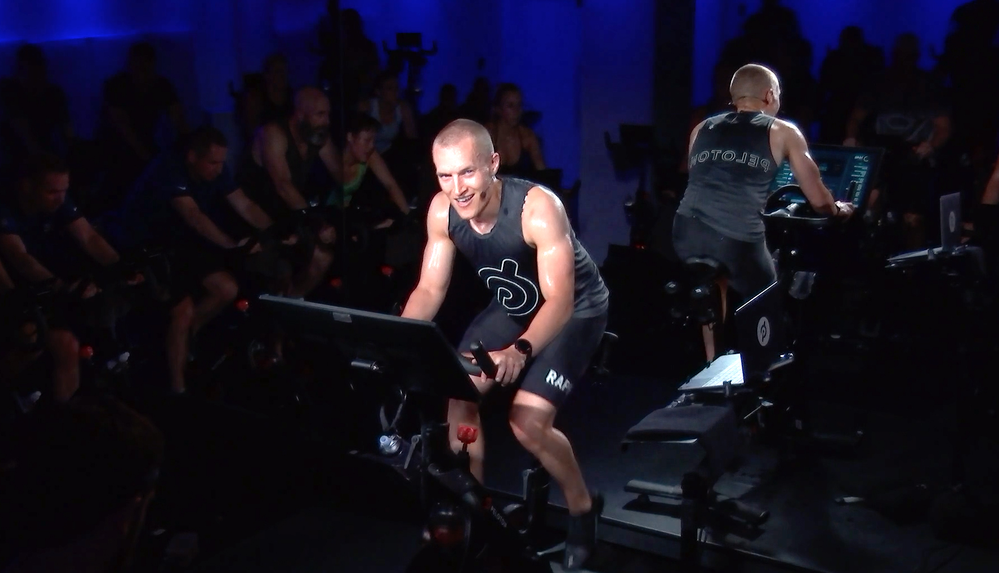

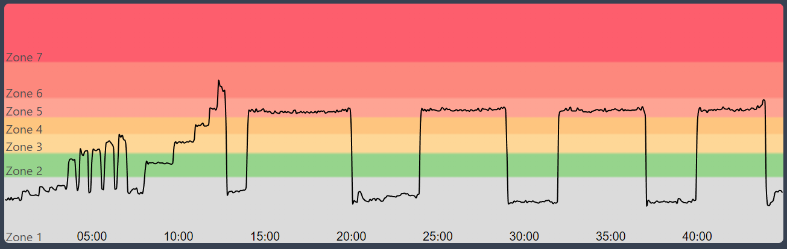

[Ride Link](https://members.onepeloton.com.au/classes/cycling?duration=%5B%222700%22%2C%223600%22%5D&class_type_id=%5B%22665395ff3abf4081bf315686227d1a51%22%5D&instructor_id=%5B%22304389e2bfe44830854e071bffc137c9%22%2C%221e59e949a19341539214a4a13ea7ff01%22%5D&sort=original_air_time&desc=true&modal=classDetailsModal&classId=dc4402ad17fa4a12b5fd76a78d7f6926)
