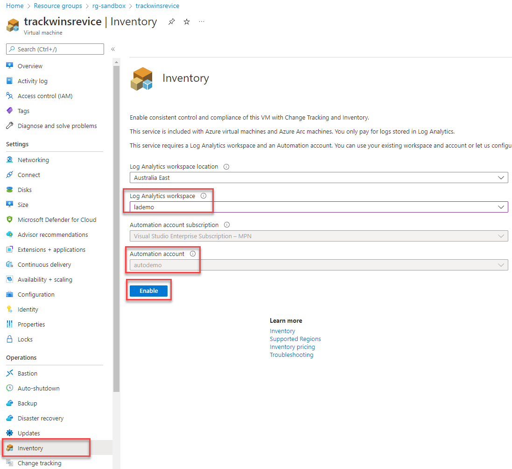
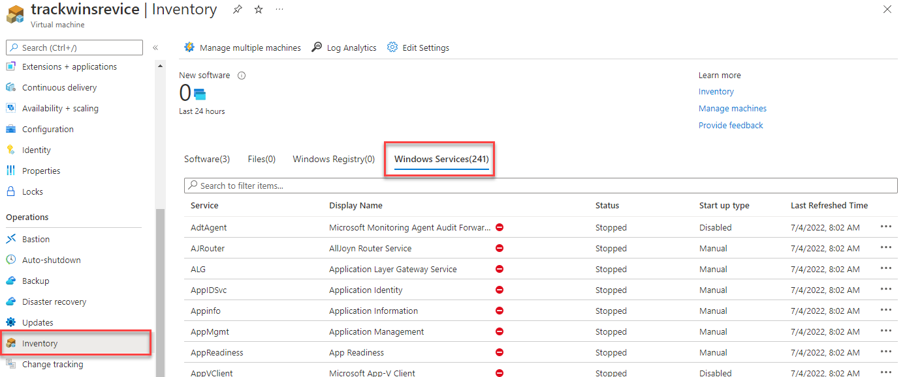
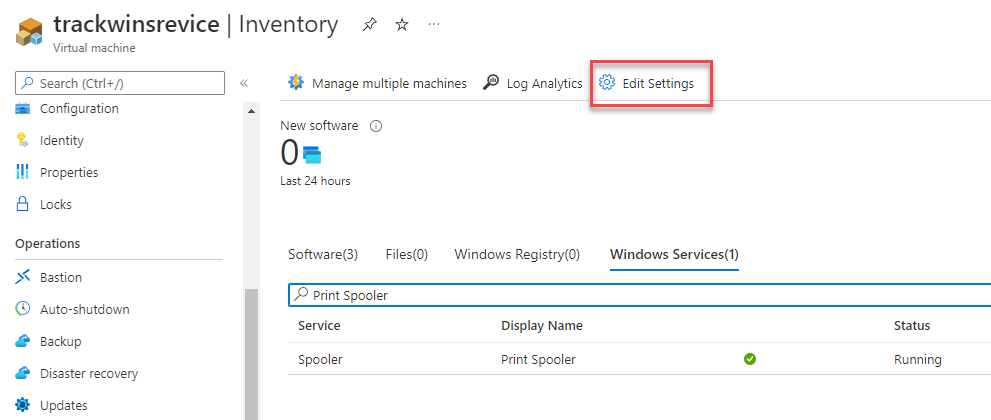
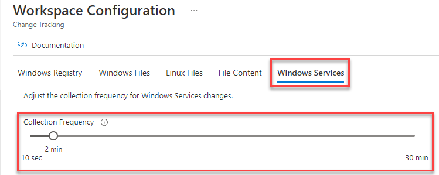
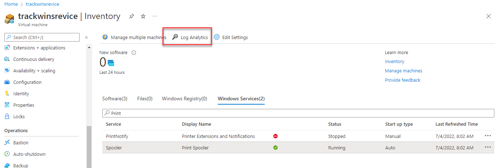
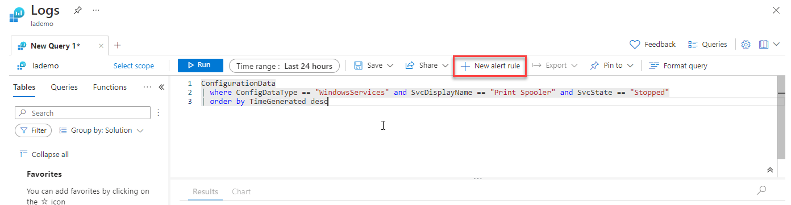
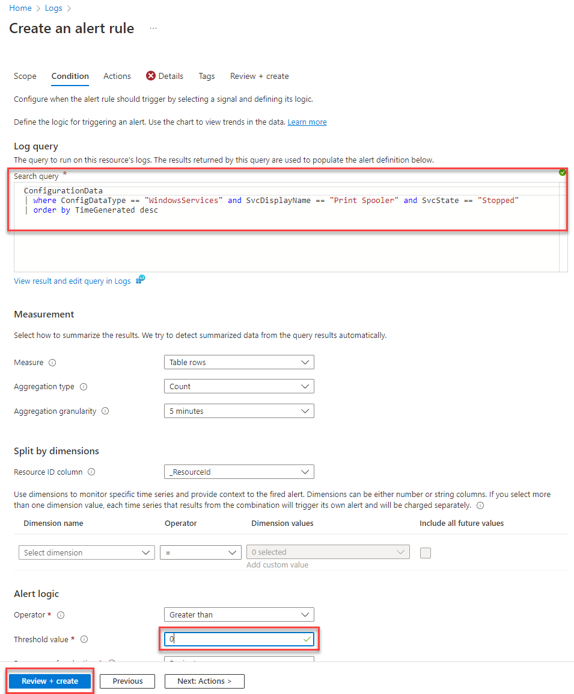
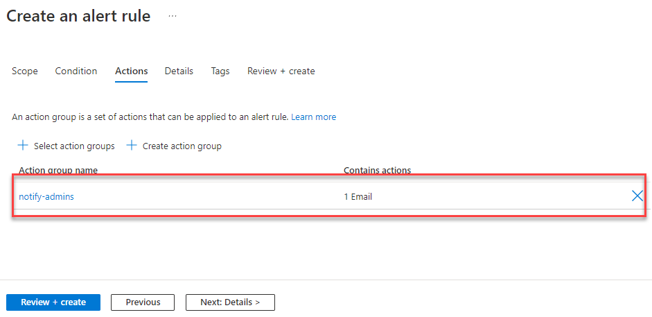
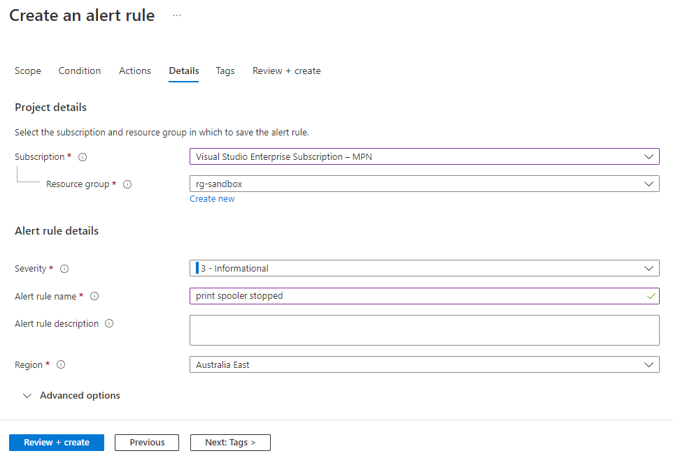
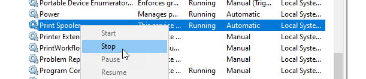

The requirement is to track a Windows Service running on a Virtual Machine on Azure. When the service was stopped (or crashed), generate an alert to the support team.

## Prerequisites

You will need a **Log Analytics Workspace** and **Automation** service to store configuration and generate alerts.

## Step 1: Enable VM Inventory and Change Tracking

This feature monitors the Virtual Machine for changes in software, files, windows registry and windows services.

1. On the desired Virtual Machine in the Azure Portal, select **Inventory** under **Configuration Management**.

2. Select your **Log Analytics Workspace** and **Automation Account**, then click **Enable**.



This will allow Azure to collect inventory on your virtual machine and monitor for changes.

> Note: on my account, it took a few hours for all windows services to show up.

When fully configured, the **Inventory** will show a tab with all Windows Services and their current state:



The default collection of windows service states are 30 minutes. This might be too slow for monitoring purposes. You can change this value in **Edit Settings**:



Navigate to **Windows Services** tab and change the collection frequency to a smaller number (e.g. 2 minutes):



## Step 2: Configure Alert

Now that services are showing, we can setup an alert in **Log Analytics** to monitor the **Print Spooler** service.



Modify the query to look for **Print Spooler** and a corresponding **Stopped** event.

```
ConfigurationData
| where ConfigDataType == "WindowsServices" and SvcDisplayName == "Print Spooler" and SvcState == "Stopped"
| order by TimeGenerated desc
```

Select **+ New alert rule** to use this query as the alert:



The rule engine will use this query as the signal and you can specify how often it checks:

- Set a **threshold value** to **0**.

> Azure will evaluate this query every 5 minutes and will trigger on 1 or more change events.



- Navigate to **Actions**
- Specify an existing **Action Group** or create a new one. My action group sends an email to myself.

> This is a list of people/services to notify when the alert triggers.



- Navigate to **Details**.
- Give your alert an **Alert Rule Name** and **Severity**.



- **Review + Create** to complete the alert setup.

## Step 3: Testing the Alert

RDP into your server and stop the **Print Spooler** service.



Once the service has stopped, you should receive a notification within the next 5 minutes stating the service has stopped.


