The complete list of Dragonlance sourcebooks and modules. A green tick indicates ownership. 

If you are looking for the fantasy novels, see [Dragonlance reading order](/dragonlance-reading-order). 

## Advanced Dungeons & Dragons 1st/2nd Edition

> The original modules set in the Dragonlance world.

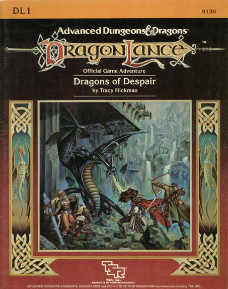

### DL1 - Dragons of Despair

An adventure for characters Level 4-6.

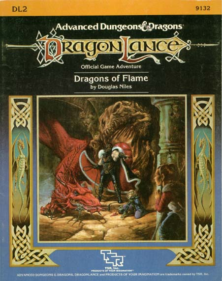

### DL2 - Dragons of Flame

An adventure for characters level 5-7

### DL3 - Dragons of Hope

An adventure for characters level 6-8.

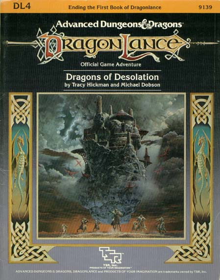

### DL4 - Dragons of Desolation

An adventure for characters level 6-8.

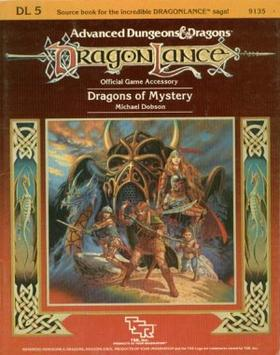

### DL5 - Dragons of Mystery

A sourcebook for the most exciting epic ever from TSR. Now you and your players can have the entire world of Krynn at your fingertips! 

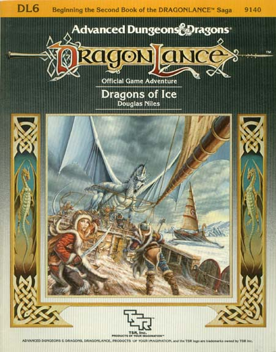

### DL6 - Dragons of Ice

An adventure for characters level 6-9.

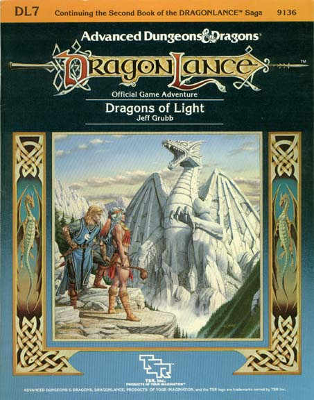

### DL7 - Dragons of Light

An adventure for characters level 7-9.

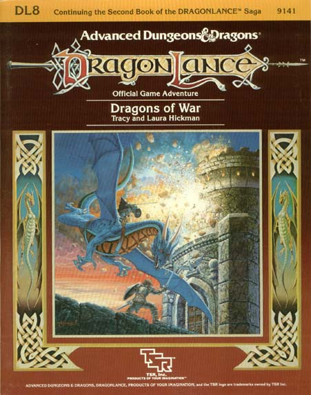

### DL8 - Dragons of War

An adventure for characters level 8-10.

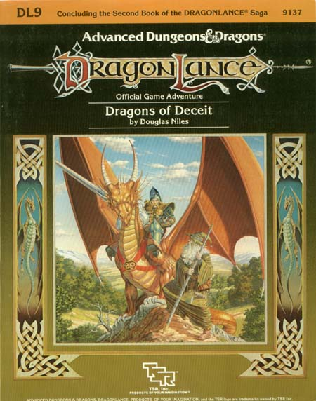

### DL9 - Dragons of Deceit ✅

An adventure for characters level 8-10.

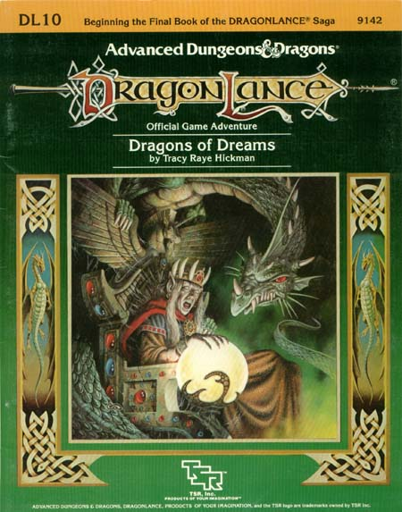

### DL10 - Dragons of Dreams ✅

An adventure for characters level 8-10.

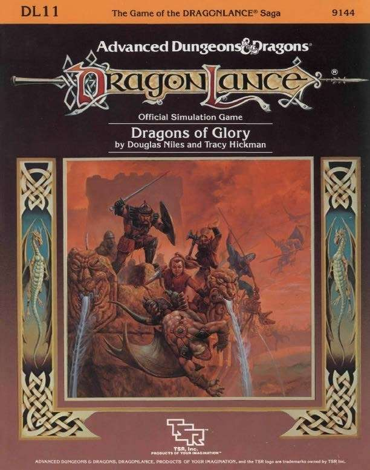

### DL11 - Dragons of Glory

Across the world of Krynn, the armies of light and darkness clash in titanic struggle. Now the vast forces of the High Solamnic Knights and the Dragon Highlords are yours to command. "Dragons of Glory" puts you and your players in charge of all the armies of Krynn.

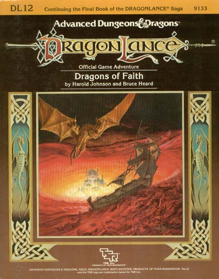

### DL12 - Dragons of Faith

An adventure for Character Levels 9-10.

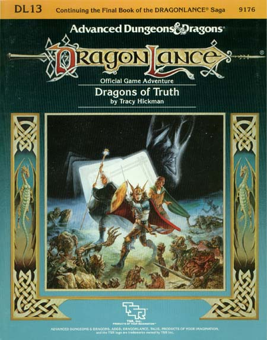

### DL13 - Dragons of Truth

An adventure for characters level 10-13.

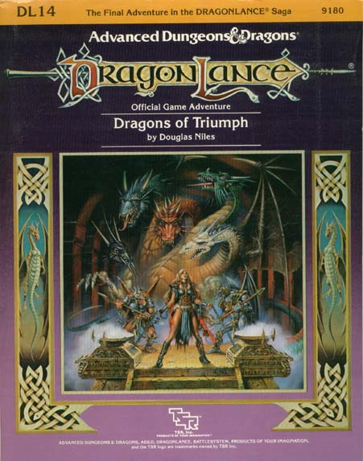

### DL14 - Dragons of Triumph

An adventure for characters level 6-8.

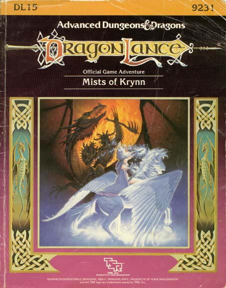

### DL15 - Mists of Krynn

Twelve different authors have combined to fill this book with adventures, new NPCs, and in-depth looks at the unique races of Krynn, including Kender, Gully Dwarves, Shadow People, and the fearsome Draconians! 

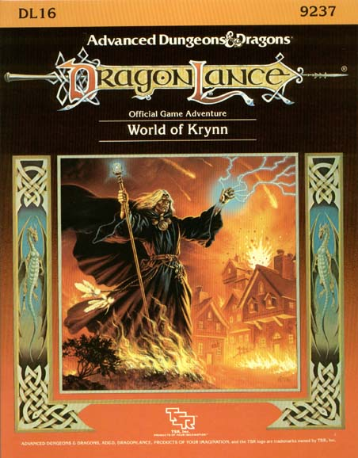

### DL16 - World of Krynn

You are cordially invited to enter the dangerous world of the Dragonlance saga. The World of Krynn brings you to previously unexplored corners of Krynn with new challenges for your characters.

> Sourcebooks to create your own Dragonlance adventures.

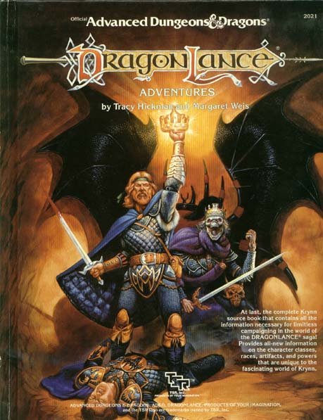

### Dragonlance Adventures ✅

Provides all-new information on the character classes, races, artifacts, and powers that are unique to the fascinating world of Krynn.

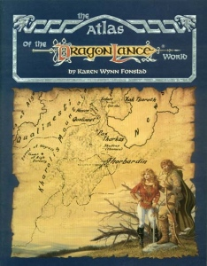

### Atlas of the Dragonlance World ✅

Accompany the Heroes of the Lance on their epic travels across Krynn in this magnificently illustrated volume.

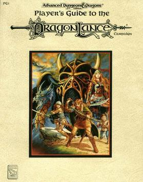

### Player's Guide to the Dragonlance Campaign

Through a combination of original fiction and long-established fact, you will discover the continent of Ansalon—home to the Heroes of the Lance. You will find information about the races of the world, its major cities and regions, its deities, and its monsters

> Boxed sets containing assorted sourcebooks and maps.

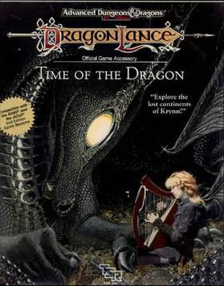

### Time of the Dragon

Time of the Dragon includes two information-packed books totaling 160 pages, four full-color maps, and 24 individual color plates showing maps, NPCs, and major races.

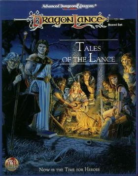

### Tales of the Lance

The Tales of the Lance set guides you through a land of romance and adventure. Discover tinker gnomes, curious kender, valiant knights, and dark, deadly dragons. Join the adventure in the world of the legendary Dragonlance.

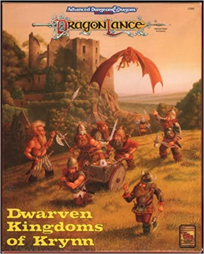

### Dwarven Kingdoms of Krynn

The secrets of the dwarves revealed! Two booklets contained in this set hold information that has never before been collected in one place.

> Dragonlance Adventures

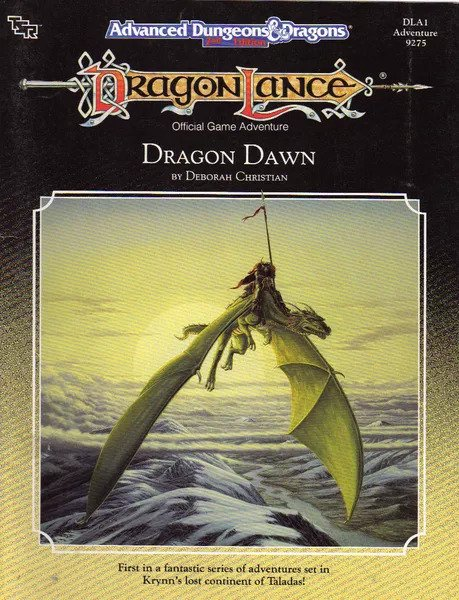

### DLA1 - Dragon Dawn

Players must track down the dragon killers and warn the conclave of the Othlorx, but those are only the first steps in thwarting a dreadful conspiracy aimed at all of Krynn!

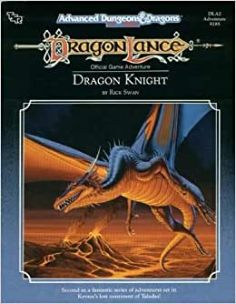

### DLA2 - Dragon Knight

Someone or something is killing the Othlorx ('The Uninvolved') dragons of Taladas. Not only good dragons, but evil ones as well. PCs must masquerade as dragon hunters and set out to destroy dragons.

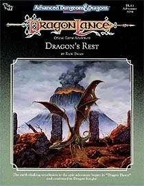

### DLA3 - Dragon's Rest

On the previously unknown continent of Taladas, the heroes must strive to thwart the extraplanar invasion plans of Erestem, Queen of Evil, also known as Takhisis. Failure means doom for all of Krynn!

> Dragonlance Expansions

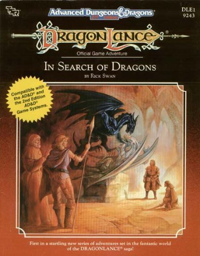

### DLE1 - In Search of Dragons

In this AD&D adventure set in the world of the Dragonlance saga, players must discover what is wrong with the good dragons of Krynn.

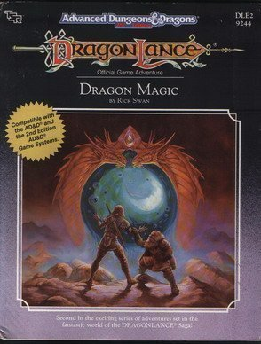

### DLE2 - Dragon Magic

Following Search of Dragons, the players investigate, the knowledge they gain seems to point more and more to a sinister thereat of evil undreamed of since the War of the Lance.

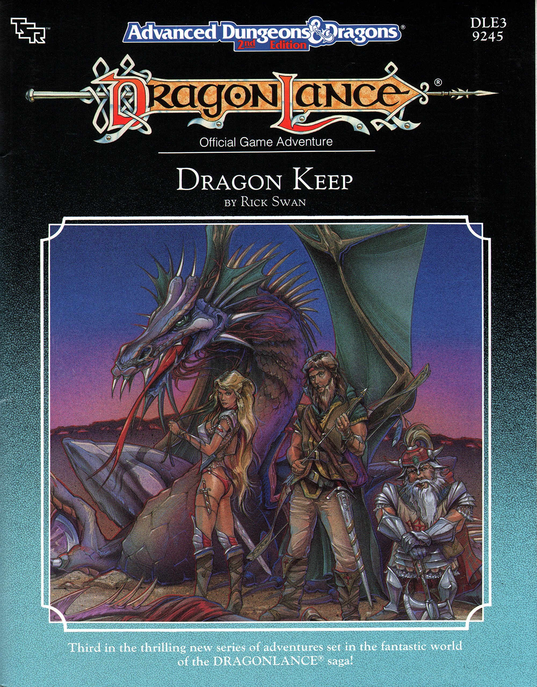

### DLE3 - Dragon Keep

This third module brings to a climax the epic tale begun with In Search of Dragons, and continued in Dragon Magic. On success or failure hangs the fate of tone of the noblest races of Krynn.

> Dragonlance Quests

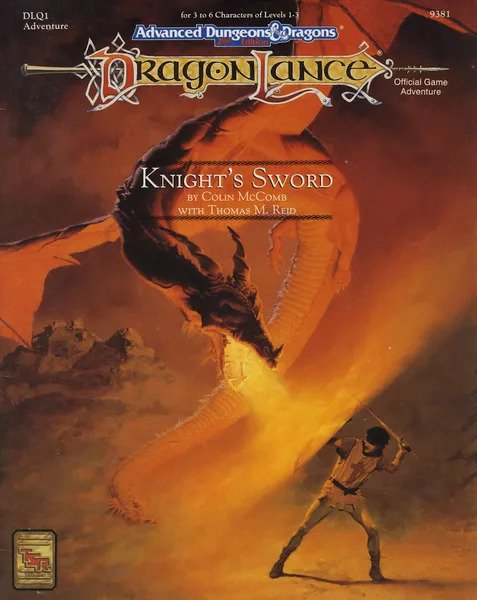

### DLQ1 - Knight's Sword

An adventure for characters level 1-3.

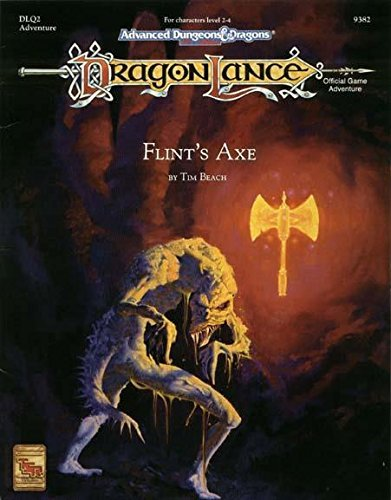

### DLQ2 - Flint's Axe

An adventure for characters level 2-4.

> Dragonlance Resources

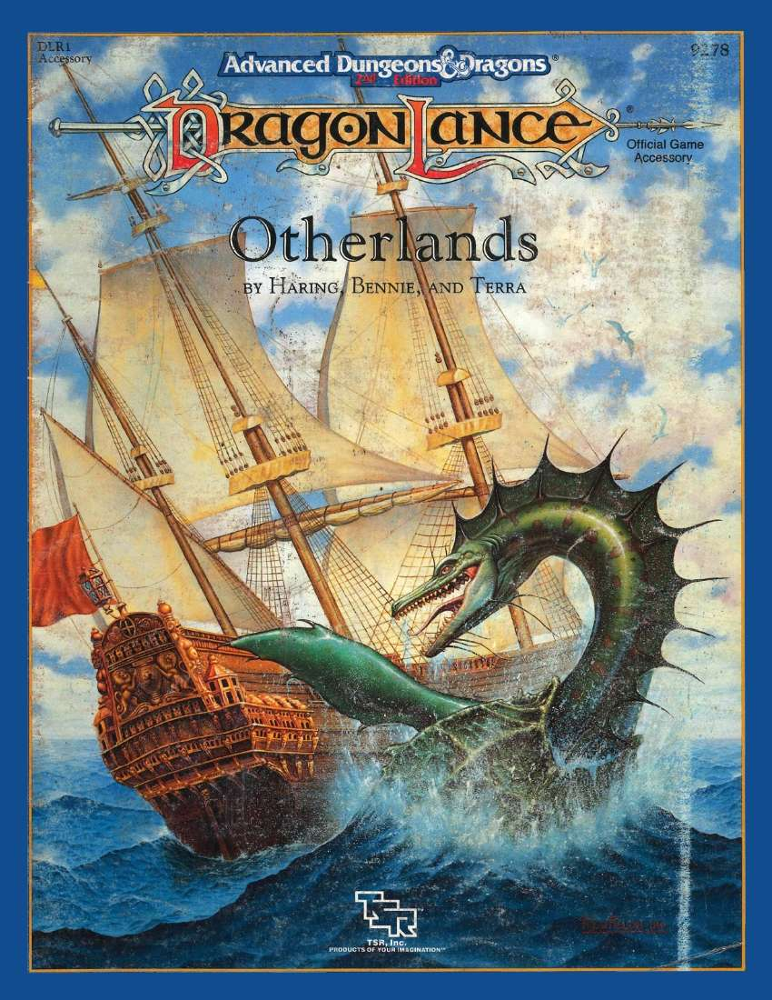

### DLR1 - Otherlands

Otherlands is a 96-page sourcebook detailing three fascinating, never-seen-before areas on the planet of Krynn.

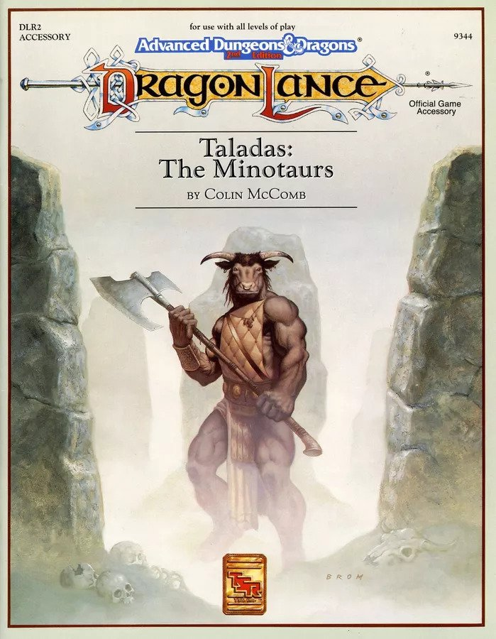

### DLR2 - Taladas: The Minotaurs

Prepare to be enlightened (and perhaps surprised!) as you read this, the first material ever released about these mysterious and misunderstood creatures: the minotaurs of Taladas.

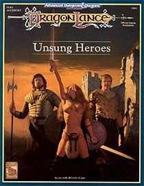

### DLR3 - Unsung Heroes

Add new life to your Dragonlance campaign with these new characters, the Unsung Heroes.

> Dragonlance Supplements

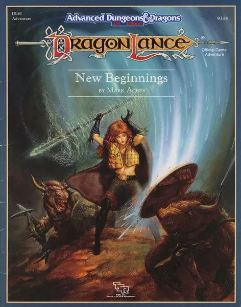

### DLS1 - New Beginnings

This essential adventure provides all the information necessary for new players to begin adventuring in the Taladas campaign setting.

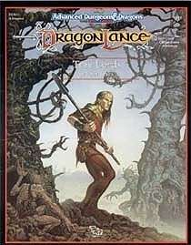

### DLS2 - Tree Lords

In Tree Lords, you will find not only an adventure about and for elves, but also information on a new character class: the Kirath (Silvanesti Scout).

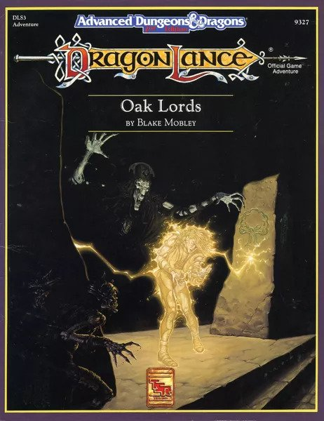

### DLS3 - Oak Lords

This adventure, the second part of a trilogy, will lead the PCs to many ancient secrets and magical wonders, including an excursion into the Astral plane!

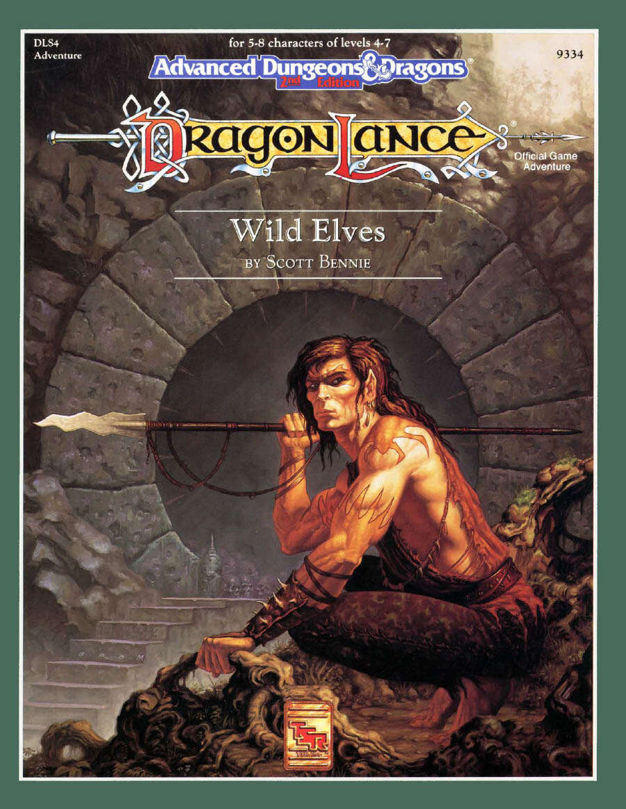

### DLS4 - Wild Elves

Free the Kagonesti elves from their shackles and lead them to safety in the Valley of Perfect Silences.

> Dragonlance Tales

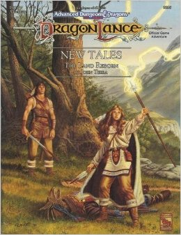

### DLT1 - New Tales: The Land Reborn

The War of the Lance may be over, but the Heroes' jobs have only begun. Return to the time just after the end of the War, when the land is healing and its peoples are struggling to rebuild their lives.

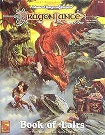

### DLT2 - Dragonlance Book of Lairs

At long last, adventures set in Ansalon that can be played in a single session.

## SAGA System

> Role-playing game system that uses "fate cards" to determine the effects of actions.

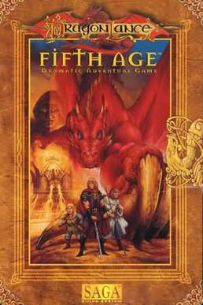

### Fifth Age

The game features the unique SAGA dramatic adventure rules, designed to reproduce the sweeping romance and fantastic epics of the Dragonlance tradition.

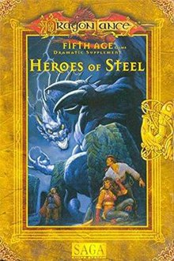

### Heroes of Steel

Heroes of Steel introduces you to heroes of strength and courage, offering hints for playing warriors and an adventure that pits their skills against a horrifying new menace.

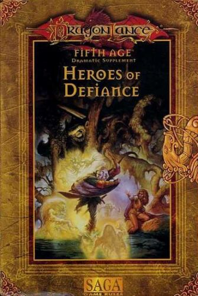

### Heroes of Defiance

Heroes of Defiance introduces you to the rogues, spies, diplomats, and scouts of Ansalon, and an adventure to uncover the truth behind the origin of the terrifying dragonspawn.

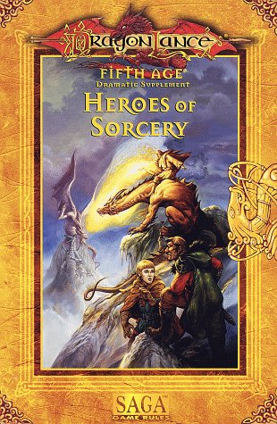

### Heroes of Sorcery

Heroes of Sorcery introduces you to spellcasting, and an adventure to recover a powerful artifact from the legendary Tomb of Huma before it falls into the clutches of Khellendros the Blue.

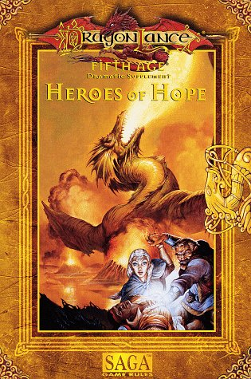

### Heroes of Hope

Heroes of Hope introduces you to shapechangers, healers, necromancers, mentalists, and an epic journey over land and sea to seek the Crown of Tides in a realm of aquatic elves.

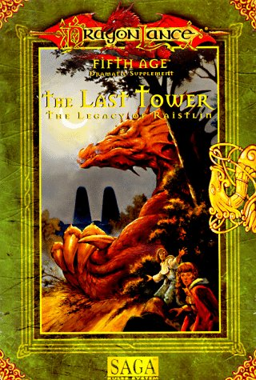

### The Last Tower: The Legacy of Raistlin

The Last Tower includes Adventures in Magic, a book containing scenarios for modern-day Tests of High Sorcery, trips through Wayreth's dreamlike dungeon, and an adventure that pits the heroes against Dark Knights, gully dwarves, and a clever copper dragon.

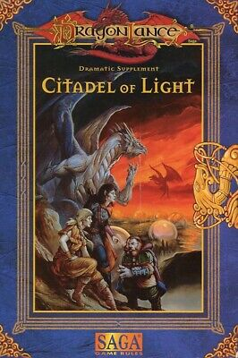

### Citadel of Light

Built by dwarves, protected by Solamnic Knights, and sacred to pilgrims of virtually every race on Krynn, the crystal domes of the Citadel of Light are the Fifth Age's first and greatest center of new magic.

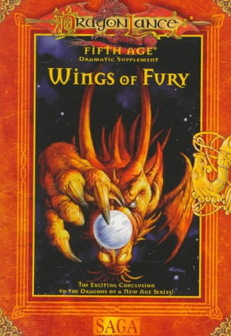

### Wings of Fury

"Wings of Fury" provides a wealth of detail about the mightiest creatures of Krynn. The handbook within this box, "Dragonlore," presents details on all aspects of dragonkind.

> Supplements

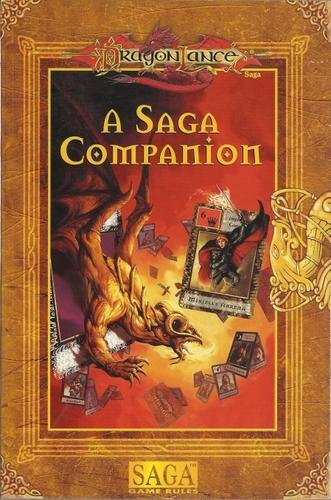

### A Saga Companion

Dragons from the distant past gather to engulf the world of Krynn in war.

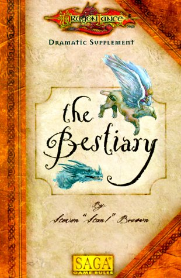

### The Bestiary

The Bestiary provides readers with an ultimate guide to the animals and creatures of the Dragonlance Saga - beasts from the classic tales set during the War of the Lance, as well as newer monsters from the Fifth Age of Krynn.

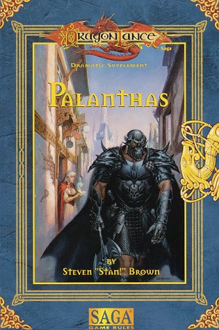

### Palanthas

Explore ancient and wondrous Palanthas, from her bustling waterfront to the cloistered mansions atop Nobles' Hill.

> Battle Lines

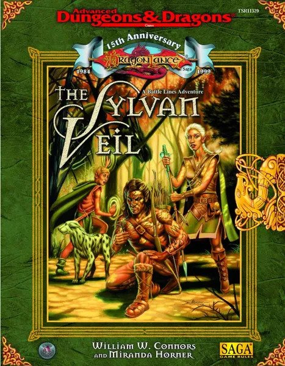

### The Sylvan Veil

More than just an adventure, this book also details Silvanesti culture and politics, geography and places of interest, important individuals, and elven magical items and artifacts.

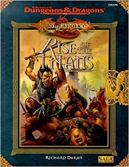

### Rise of the Titans

Rise of the Titans contains details accounts of ogre culture, describes the countries of Blode and Kern, provides new hero roles, and introduces rules for playing ogre heroes.

> Chaos War Adventures

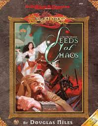

### Seeds of Chaos

The start of a new adventure series that details the epic battles of the Chaos War, described in the novel Dragons of Summer Flame.

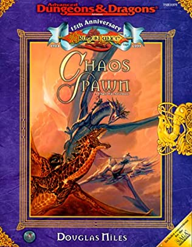

### Chaos Spawn

The great city of Palanthas finds itself under attack by daemon warriors astride ferocious fire dragons, and the heroes are its only hope.

## Dungeons & Dragons 3rd/3.5 Edition

> Sourcebooks

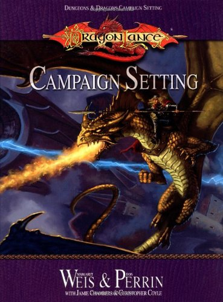

### Dragonlance Campaign Setting

From Solamnic Knights and Dragon Riders to kender, tinker gnomes, and draconians, the rich tapestry of the Dragonlance world comes alive in this campaign setting.

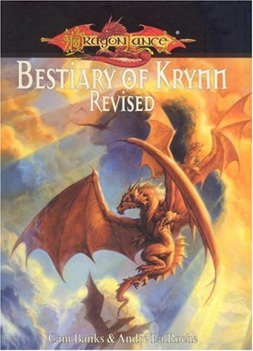

### Bestiary of Krynn

The original artwork that won awards is back, along with creatures useful for Dragonlance campaigns but could be easily ported to other d20 System campaign worlds.

> Setting Books

### Age of Mortals

Enjoy the wealth of information about the struggles, villains, and heroes of the Fifth Age or use the book as a companion to the Dragonlance Campaign Setting and discover endless adventure!

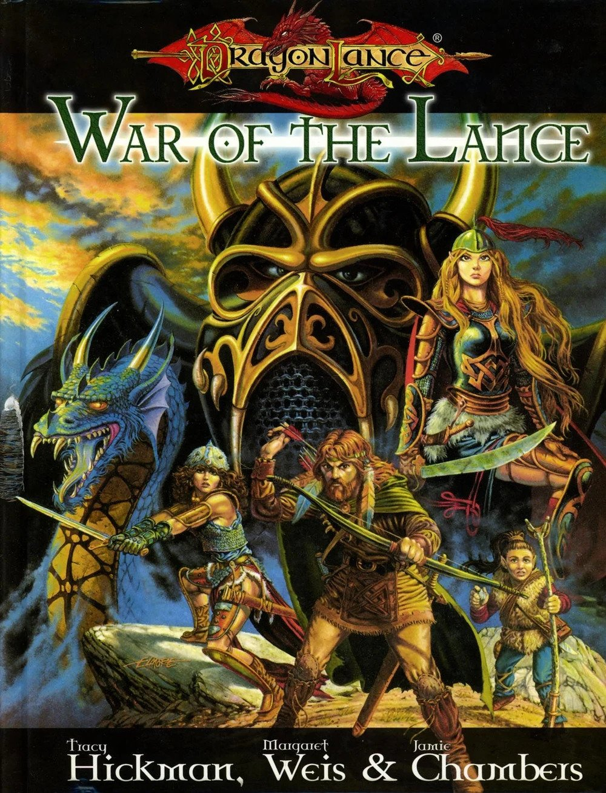

### War of the Lance

The War of the Lance Campaign Book is designed as a companion volume to the Dragonlance Campaign Setting published by Wizards of the Coast.

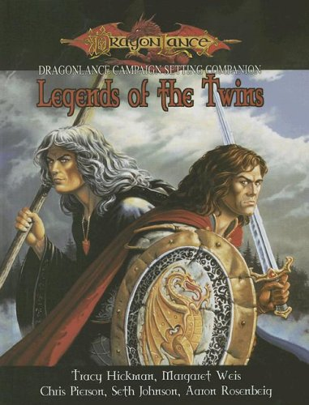

### Legend of the Twins

Legends of the Twins is a resource for games set in the world of Dragonlance. Inside one will find information for players, including variant rules for character traits, new feats, prestige classes. 

> Topic Books

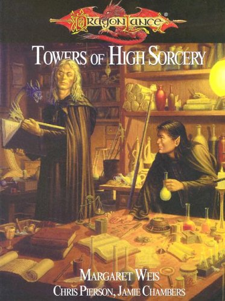

### Towers of High Sorcery

The Towers of Wayreth and Nightlund are explained in great detail, while the "lost" Towers of past ages are presented for the first time anywhere! 

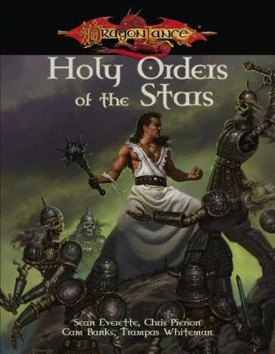

### Holy Order of the Stars

Contained within these pages are resources for players, including information on the gods and the races of Krynn, new prestige classes, spells, and magical items.

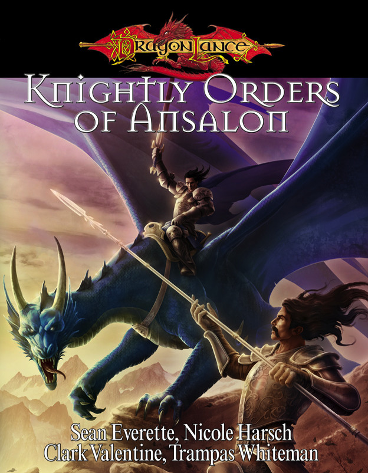

### Knightly Orders of Ansalon

Knightly Orders of Ansalon contains information useful for both players and Dungeon Masters, as well as Dragonlance fans who wish to know even more about the military orders of the world and the characters who belong to them.

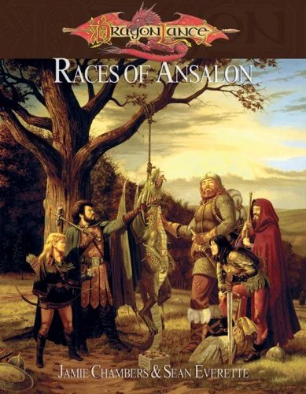

### Races of Ansalon

Races of Ansalon is a resource for games set in the world of Dragonlance. It is an encyclopedia of cultures that details everything from racial relations and psychology to history and language.

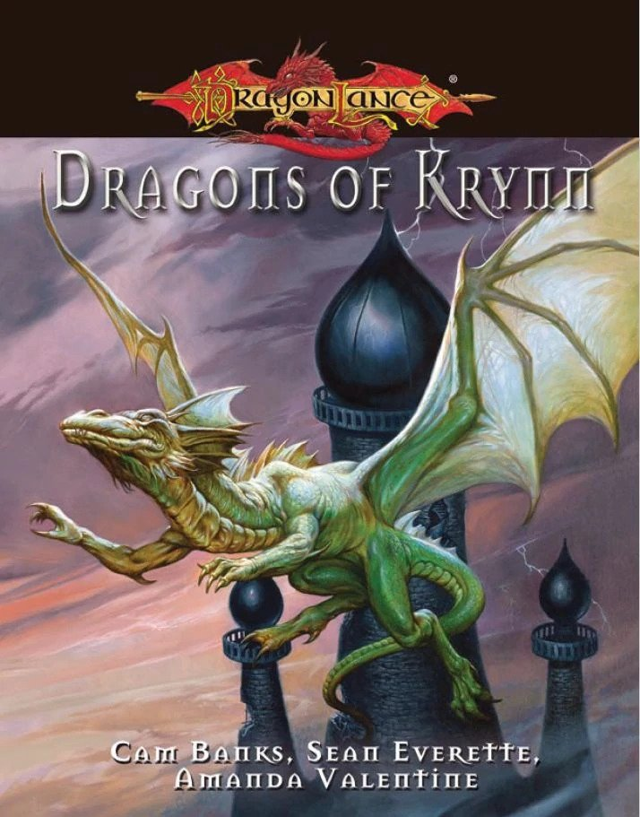

### Dragons of Krynn

This volume offers authorial insights, creative perspectives, cultural legends, and factual accounts of the marvelous wyrms of Krynn from the ten clans of true dragons and their myriad kindred to the indomitable breeds of draconians.

> Age of Mortals Campaign

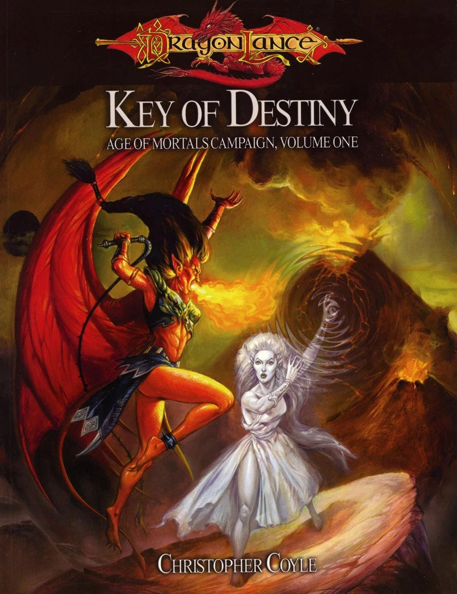

### Key of Destiny

An adventure for characters level 1.

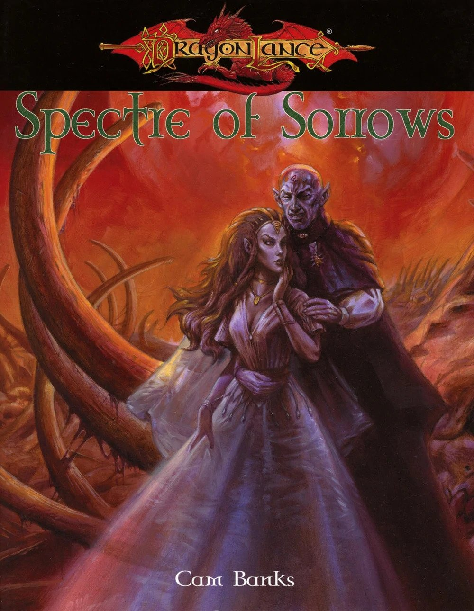

### Spectre of Sorrows

An adventure for characters level 8.

### Price of Courage

An adventure for characters level 14.

> War of the Lance Chronicles

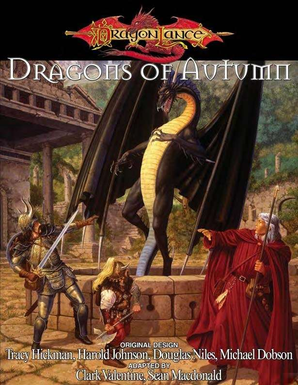

### Dragons of Autumn

An adventure for characters level 5-7.

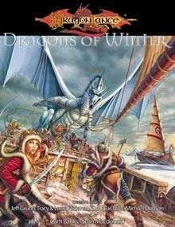

### Dragons of Winter

An adventure for characters level 9-11.

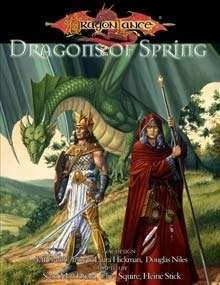

### Dragons of Spring

An adventure for characters level 9-11.

> Tasslehoff's Map Pouches

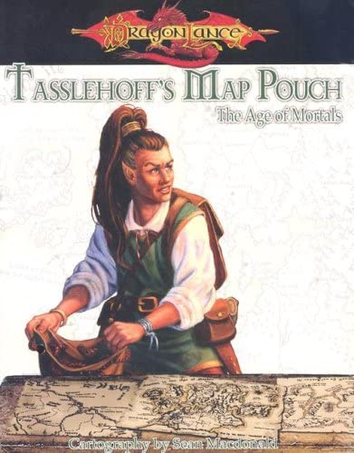

### Tasslehoff's Map Pouch: The Age of Mortals

The collection starts with a full-sized poster map of Ansalon, continues with regional and location maps, and concludes with a pair of "kender"-style maps drawn by the irrepressible adventurer himself. 

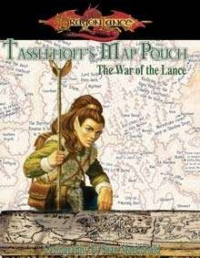

### Tasslehoff's Map Pouch: War of the Lance

"Uncle" Tasslehoff has shared even more of his amazing map collection, this time with maps focusing on the Fourth Age and the War of the Lance

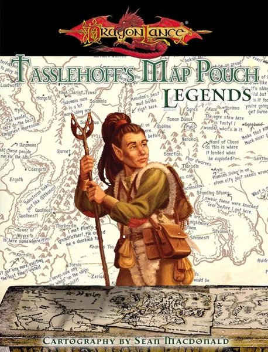

### Tasslehoff's Map Pouch: Legends

Tasslehoff’s Map Pouch: Legends contains one dozen maps, including a poster map of pre-Cataclysm Ansalon during the Age of Might. 

## Dungeons & Dragons 5th Edition

> Sourcebook/Campaign

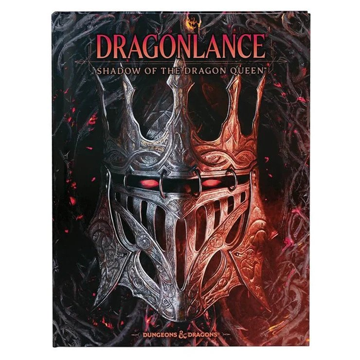

### Shadow of the Dragon Queen

Create characters from Krynn, the world of the Dragonlance setting, then march them to the front lines of battle against the terrifying Dragon Armies.

> Board Games

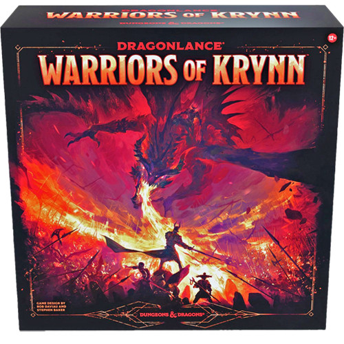

### Warriors of Krynn

Warriors of Krynn is a battle game which allows you to play out massive military battles in the world of Krynn.

