Everyone needs an __easier__ ride. Here are some great recovery options in zone 2.

> Times are Australian East Standard Time. Some classes might be a day off. Use "Ride Link".

## 30 Min PZE - Erik Jager - 12/27/23

[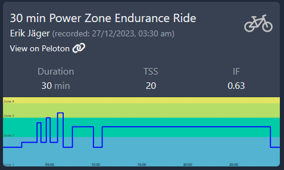](https://members.onepeloton.com/classes/cycling?modal=classDetailsModal&classId=2862332a247f47da9d8d4813f8d7c010)

[Ride Link](https://members.onepeloton.com/classes/cycling?modal=classDetailsModal&classId=2862332a247f47da9d8d4813f8d7c010)

## 30 Min PZE Motown - Sam Yo - 10/18/23

[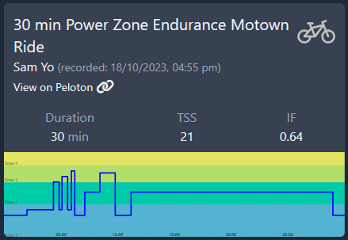](https://members.onepeloton.com/classes/cycling?modal=classDetailsModal&classId=c2b534980f354b58b9edf0bdb83b7a90)

[Ride Link](https://members.onepeloton.com/classes/cycling?modal=classDetailsModal&classId=c2b534980f354b58b9edf0bdb83b7a90)

## 75 Min PZE - Matt Wilpers - 5/8/23

[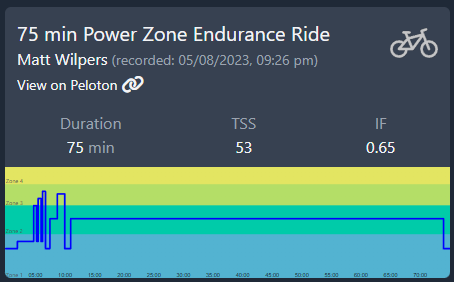](https://members.onepeloton.com/classes/cycling?modal=classDetailsModal&classId=bc9063f426a2418b86b645ed5fc0ea93)

[Ride Link](https://members.onepeloton.com/classes/cycling?modal=classDetailsModal&classId=bc9063f426a2418b86b645ed5fc0ea93)

## 60 Min PZE - Christine D'Ercole - 7/17/23

[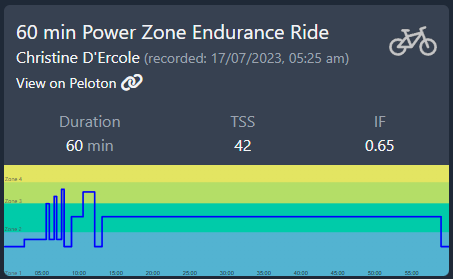](https://members.onepeloton.com/classes/cycling?modal=classDetailsModal&classId=bbbadd18b5284525a1e2bac5597e5cc8)

[Ride Link](https://members.onepeloton.com/classes/cycling?modal=classDetailsModal&classId=bbbadd18b5284525a1e2bac5597e5cc8)

## 45 Min PZE - Matt Wilpers - 7/8/23

[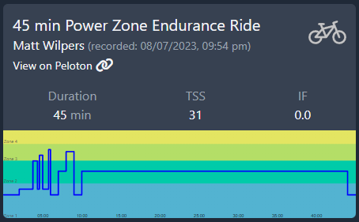](https://members.onepeloton.com/classes/cycling?modal=classDetailsModal&classId=7721cefa7a0d4aa58d2166452dbedbd3)

[Ride Link](https://members.onepeloton.com/classes/cycling?modal=classDetailsModal&classId=7721cefa7a0d4aa58d2166452dbedbd3)

## 45 Min PZE - Christine D'Ercole - 5/22/23

[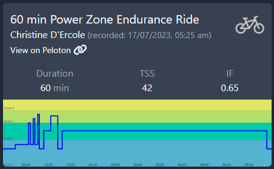](https://members.onepeloton.com/classes/cycling?modal=classDetailsModal&classId=dd102809054b4b879f578134dde466a3)

[Ride Link](https://members.onepeloton.com/classes/cycling?modal=classDetailsModal&classId=dd102809054b4b879f578134dde466a3)

## 45 Min PZE - Matt Wilpers - 5/20/23

[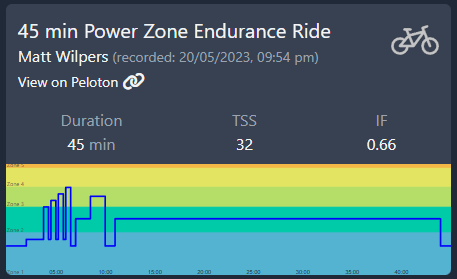](https://members.onepeloton.com/classes/cycling?modal=classDetailsModal&classId=a1518ac6a0a94e3a8e12dd8306b885de)

[Ride Link](https://members.onepeloton.com/classes/cycling?modal=classDetailsModal&classId=a1518ac6a0a94e3a8e12dd8306b885de)

## 45 Min PZE - Matt Wilpers - 5/4/23

[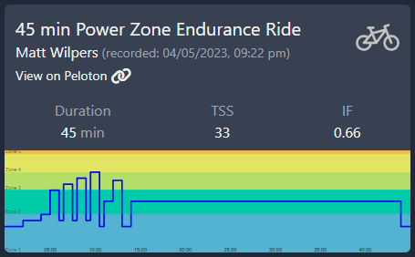](https://members.onepeloton.com/classes/cycling?modal=classDetailsModal&classId=000f4e9c77274cfb89e8a5394ecd37a5)

[Ride Link](https://members.onepeloton.com/classes/cycling?modal=classDetailsModal&classId=000f4e9c77274cfb89e8a5394ecd37a5)

## 45 Min PZE - Christine D'Ercole - 3/28/23

[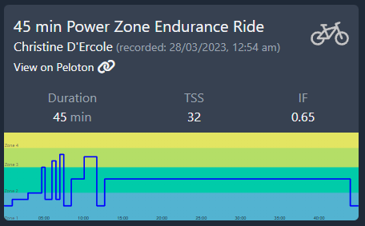](https://members.onepeloton.com/classes/cycling?modal=classDetailsModal&classId=bf9a8d27671c4dc1a44d10f07a422769)

[Ride Link](https://members.onepeloton.com/classes/cycling?modal=classDetailsModal&classId=bf9a8d27671c4dc1a44d10f07a422769)

## 60 Min PZE - Christine D'Ercole - 2/21/22

[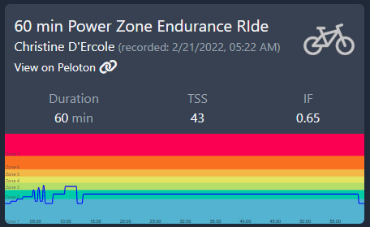](https://members.onepeloton.com/classes/cycling?modal=classDetailsModal&classId=3c8873ecac12439f8eaea74437ac849a)

[Ride Link](https://members.onepeloton.com/classes/cycling?modal=classDetailsModal&classId=3c8873ecac12439f8eaea74437ac849a)

## 60 Min PZE - Matt Wilpers - 9/25/21

[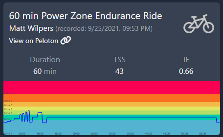](https://members.onepeloton.com/classes/cycling?modal=classDetailsModal&classId=ff799ecab4d34c27896f11f7b8e5559c)

[Ride Link](https://members.onepeloton.com/classes/cycling?modal=classDetailsModal&classId=ff799ecab4d34c27896f11f7b8e5559c)

## 45 Min PZE - Christine D'Ercole - 9/10/21

[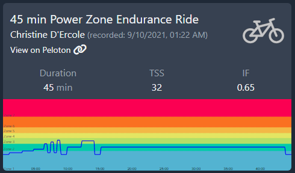](https://members.onepeloton.com/classes/cycling?modal=classDetailsModal&classId=e8a6f9f7939d4596ac722674ab30fc5f)

[Ride Link](https://members.onepeloton.com/classes/cycling?modal=classDetailsModal&classId=e8a6f9f7939d4596ac722674ab30fc5f)

## 45 Min PZE - Matt Wilpers - 8/25/21

[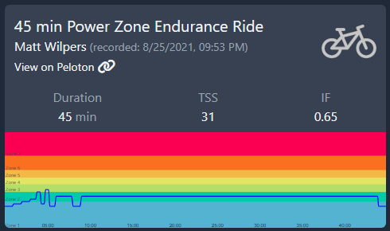](https://members.onepeloton.com/classes/cycling?modal=classDetailsModal&classId=cbc2511e69814502a0a5862ccbb69c03)

[Ride Link](https://members.onepeloton.com/classes/cycling?modal=classDetailsModal&classId=cbc2511e69814502a0a5862ccbb69c03)

## 30 Min PZE - Christine D'Ercole - 7/19/21

[Ride Link](https://members.onepeloton.com/classes/cycling?modal=classDetailsModal&classId=6044084fc9cb4814a88c1cf1163b19e1)

## 75 Min PZE - Christine D'Ercole - 6/7/21

[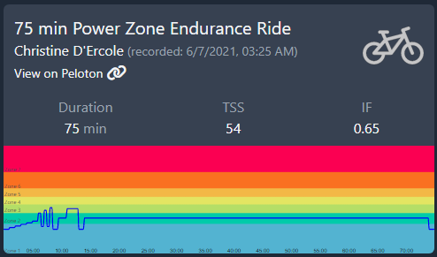](https://members.onepeloton.com/classes/cycling?modal=classDetailsModal&classId=26960c3d51654446b8412d8e95cd739d)

[Ride Link](https://members.onepeloton.com/classes/cycling?modal=classDetailsModal&classId=26960c3d51654446b8412d8e95cd739d)

## 45 Min PZE - Christine D'Ercole - 5/31/21

[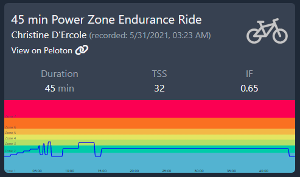](https://members.onepeloton.com/classes/cycling?modal=classDetailsModal&classId=58997596e1fc446dbc845fe33dc34fd0)

[Ride Link](https://members.onepeloton.com/classes/cycling?modal=classDetailsModal&classId=58997596e1fc446dbc845fe33dc34fd0)

## 60 Min PZE - Matt Wilpers - 5/22/21

[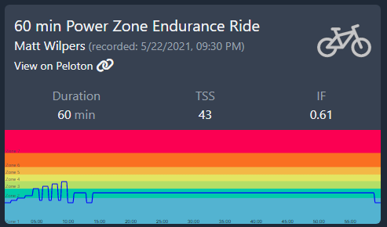](https://members.onepeloton.com/classes/cycling?modal=classDetailsModal&classId=a28a794e187744ceb4ceeb7537c5fea0)

[Ride Link](https://members.onepeloton.com/classes/cycling?modal=classDetailsModal&classId=a28a794e187744ceb4ceeb7537c5fea0)

## 30 Min PZE - Christine D'Ercole - 6/28/20

[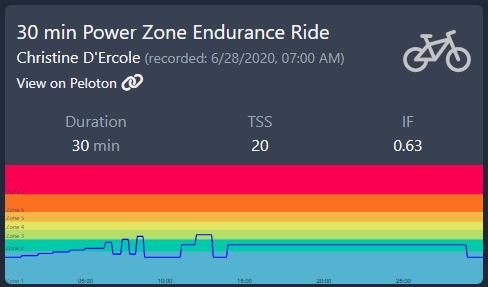](https://members.onepeloton.com/classes/cycling?modal=classDetailsModal&classId=0cc5325202d34b558470b48f989de9b0)

[Ride Link](https://members.onepeloton.com/classes/cycling?modal=classDetailsModal&classId=0cc5325202d34b558470b48f989de9b0)

## 30 Min PZE - Christine D'Ercole - 6/15/20

[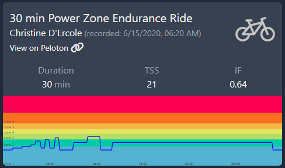](https://members.onepeloton.com/classes/cycling?modal=classDetailsModal&classId=33169b5a55924212bbcfe6c93ba08c77)

[Ride Link](https://members.onepeloton.com/classes/cycling?modal=classDetailsModal&classId=33169b5a55924212bbcfe6c93ba08c77)

## 30 Min PZE - Matt Wilpers - 6/14/20

[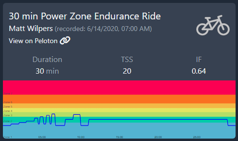](https://members.onepeloton.com/classes/cycling?modal=classDetailsModal&classId=ac70dca40f214040b0b10532f5a4140d)

[Ride Link](https://members.onepeloton.com/classes/cycling?modal=classDetailsModal&classId=ac70dca40f214040b0b10532f5a4140d)

## 30 Min PZE - Christine D'Ercole - 6/1/21

[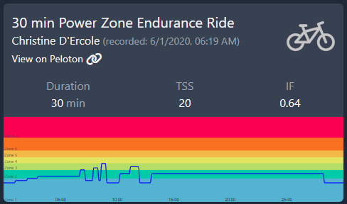](https://members.onepeloton.com/classes/cycling?modal=classDetailsModal&classId=233c8afc5cdb4713b09e4392a9694da2)

[Ride Link](https://members.onepeloton.com/classes/cycling?modal=classDetailsModal&classId=233c8afc5cdb4713b09e4392a9694da2)

