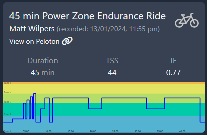
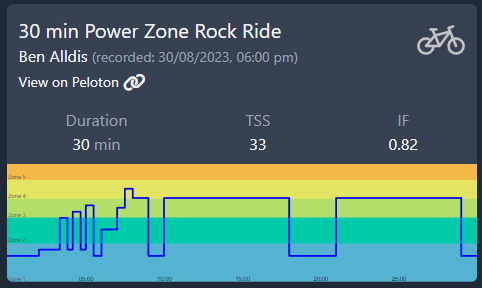
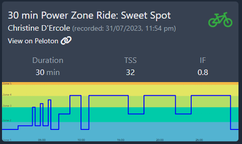
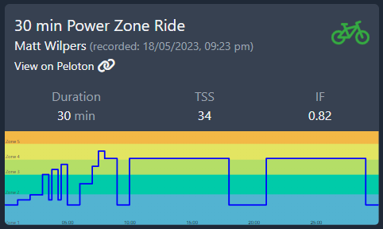
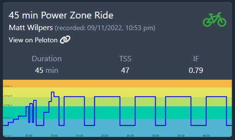
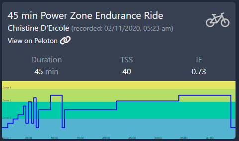

Sweet Spot training is a series of workouts containing intervals near your Functional Threshold Power (FTP). It’s hard enough that it works but easy enough that you can do it several times a week.

> Times are Australian East Standard Time. Some classes might be a day off. Use "Ride Link".

## 45 Min PZ - Matt Wilpers - 12/14/23

[Ride Link](https://members.onepeloton.com/classes/cycling?modal=classDetailsModal&classId=d45be192480a44bd904eafdeb2598de1)

## 30 Min PZ - Ben Alldis - 08/30/23

[Ride Link](https://members.onepeloton.com/classes/cycling?modal=classDetailsModal&classId=30c79b2db6124b66b8ad57db668c2c95)

## 30 Min PZ - Christine D'Ercole - 07/31/23

[Ride Link](https://members.onepeloton.com/classes/cycling?modal=classDetailsModal&classId=a00fedd588dc471d9bf017de9b5b47bf)

## 30 Min PZ - Matt Wilpers - 05/18/23

[Ride Link](https://members.onepeloton.com/classes/cycling?modal=classDetailsModal&classId=268bfe9fd227493599ed342afb25fdcf)

## 45 Min PZ - Matt Wilpers - 11/09/23

[Ride Link](https://members.onepeloton.com/classes/cycling?modal=classDetailsModal&classId=04e8e5e451f448fcadef51ec478762fc)

## 45 Min PZ - Christine D'Ercole - 11/02/20

[Ride Link](https://members.onepeloton.com/classes/cycling?modal=classDetailsModal&classId=68a0efc458b54d2aac4ad64e493e2cf7)

